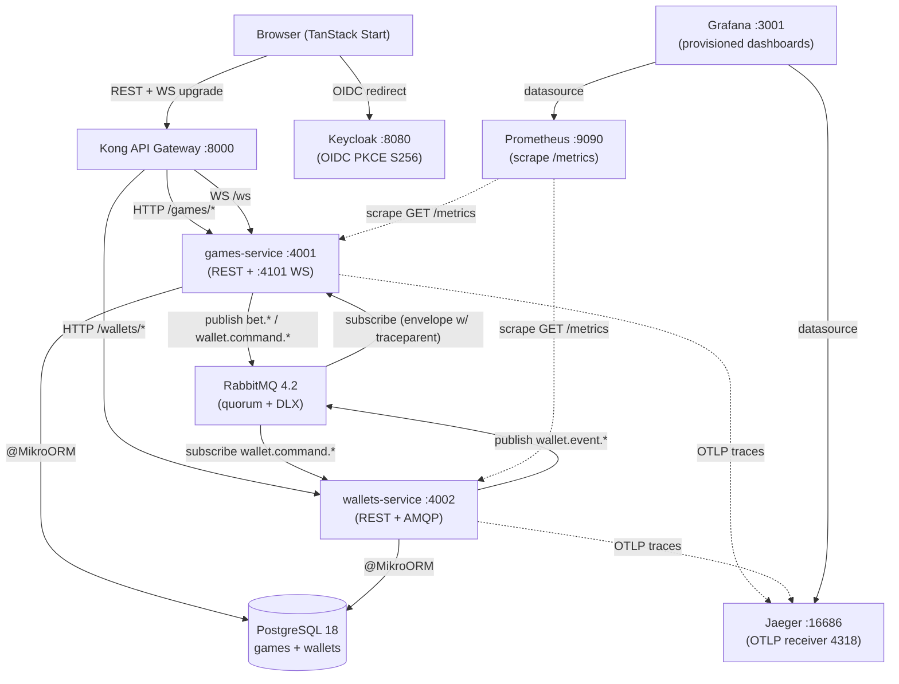

# Phase 10: Quality Hardening & Docs - Research

**Researched:** 2026-05-30
**Domain:** OpenTelemetry tracing + Prometheus metrics + pino structured logs + Playwright E2E + GitHub Actions CI + README/ADR documentation + 3 Phase 8 polish defects
**Confidence:** HIGH

---

<user_constraints>

## User Constraints (from CONTEXT.md)

### Locked Decisions

**D-01 OpenTelemetry trace backend:** OTLP exporter → **Jaeger all-in-one** container in docker-compose. Industry standard, recruiter familiarity, single container, clean UI showing the bet→saga→cashout span tree end-to-end. Tempo+Grafana alternative explicitly rejected (2 extra containers for marginal UX gain when Grafana already exists for metrics).

**D-02 Playwright E2E scope:** Exactly the **2 REQ-TEST-05 mandatory specs**: (a) login → wait for BETTING → place bet → wait for RUNNING → cashout → verify balance updated; (b) login → bet → crash → verify bet lost. CI time-optimized. Additional Phase 8/9 surfaces (fairness drawer, replay modal, auto-bet, leaderboard live) are tested by their existing vitest+integration suites; expanding Playwright scope is stretch.

**D-03 Polish defects from Phase 8 live smoke (fix all three):**
- **D-03a Radix portal visibility**: Fairness drawer (Sheet) + Replay modal (Dialog) click handler sets state but content never appears. Root-cause and fix.
- **D-03b WS `round:snapshot=null`**: Gateway's `GetWsSnapshotUseCase` returns null when no round is between states at connect time → FE zod `safeParse` rejects with "Expected object, received null". Either guard the schema to accept null + treat as no-op, OR defer the emit in the gateway until a round exists. Pick the cleaner path during planning.
- **D-03c HistoryStrip React `key` prop warn**: Map missing/duplicate key — single-line fix.

**D-04 Logger:** `pino` + `nestjs-pino` per REQ-OBS-04. JSON structured, `correlationId` (from existing saga envelope) + `traceId` (from OTel current context) enrichment. Replace existing NestJS Logger calls service-side. Match existing log shape conventions.

**D-05 OpenTelemetry SDK:** `@opentelemetry/sdk-node` + `nestjs-otel` bridge + auto-instrumentations (http, express/nest, amqplib, ioredis if present, pg). W3C TraceContext propagation across HTTP+AMQP+WS boundaries. Custom spans where saga handlers cross queue boundaries to keep correlation visible.

**D-06 Metrics:** Prometheus via `nestjs-prometheus` (or equivalent) at `/metrics`; built-in counters/histograms via `prom-client`. Custom metrics: `bet_volume_total` (counter, labels: status), `crash_rtp_window` (gauge), `multiplier_drift_seconds` (histogram, server-tick vs wall-clock diff), `ws_broadcast_latency_seconds` (histogram, emit-to-clientAck or proxy via tick-to-emit time), `active_ws_connections` (gauge). Pre-provisioned Grafana dashboards (one per service + one custom) loaded from `docker/grafana/provisioning/`.

**D-07 CI strategy:** GitHub Actions per REQ-CI-02 — `bun run docker:up --wait` on the runner; wait for healthchecks; run unit + integration + Playwright against the live stack; teardown. Single workflow file `.github/workflows/ci.yml`. Concurrency cancellation per branch. README badges link build/tests/coverage (coverage from `bun test --coverage`). Free runner timeout (6h) is plenty.

**D-08 README + ADR catalogue:** README sections: Quick Start (one-command `bun run docker:up`) → Architecture (mermaid diagram of services + flow) → Saga Flow (mermaid sequence diagram) → Provably-Fair (link to existing Phase 8 walkthrough already in README) → ADR Catalogue (table linking every ADR-001..034 + future ADR-035+ from this phase) → Scripts → Env Vars → Troubleshooting → CI badges. ADR catalogue lives in the README. ADR-029 anticipated label reconciles to **next-free 035+**.

### Claude's Discretion

- Exact Jaeger compose image tag, Prometheus scrape interval, Grafana provisioning structure, dashboard JSON shape
- Playwright project layout (single workspace vs `frontend/e2e` dir)
- Mermaid diagram exact wording
- Troubleshooting items to surface
- CI matrix (single Ubuntu job vs OS matrix — single is plenty for this submission)
- Whether to relax zod for snapshot=null OR defer emit gateway-side (pick cleaner path)
- ADR catalogue generation: small script `scripts/build-adr-index.ts` reading `.planning/adrs/ADR-*.md` frontmatter

### Deferred Ideas (OUT OF SCOPE)

- Codecov integration (depends on free-tier signup); README can ship a "Coverage badge pending Codecov enroll" or a static % link to a CI step artifact.
- Splunk/Datadog APM (commercial APM) — explicitly rejected per ADR-035 (OSS Jaeger).
- Synthetic monitoring (uptime probes) — out of scope for this submission.
- Distributed tracing of Postgres queries via `@opentelemetry/instrumentation-pg` is part of the auto-instrumentation set — not separately documented.
- Per-route Playwright sharding — single shard runs fast enough on free runner.
- Lighthouse / web-vitals CI — out of scope.
- Alerting on Prometheus thresholds (Alertmanager) — out of scope.

</user_constraints>

---

<phase_requirements>

## Phase Requirements

| ID | Description | Research Support |
|----|-------------|------------------|
| REQ-TEST-05 | Playwright E2E covers full player flow: login → BETTING → bet → RUNNING → cashout → balance; second test login → bet → crash → bet lost | Playwright 1.60 `webServer` boot of FE dev, projects.use baseURL `http://localhost:3000`; OIDC PKCE handled via stored auth state (storageState fixture); two specs in `e2e/` dir; CI uploads videos+screenshots on failure as artifacts |
| REQ-OBS-01 | OTel traces via `@opentelemetry/sdk-node` + `nestjs-otel`; W3C TraceContext across HTTP/AMQP/WS | SDK.start() called **synchronously before** `NestFactory.create` in main.ts (init order is the #1 footgun); auto-instr-node ships http, nestjs-core, amqplib (works with `@golevelup/nestjs-rabbitmq`), socketio, pg; AMQP propagator already injects/extracts `traceparent` into message properties; custom span around `handleConnection` for WS to link to upstream HTTP login span |
| REQ-OBS-02 | Prometheus `/metrics` (req latency, AMQP lag, WS conn, custom: bet_volume, RTP, multiplier_drift, WS broadcast latency) | `@willsoto/nestjs-prometheus` v11 wraps `prom-client` v15; controller auto-mounted at `/metrics`; custom metrics via `makeCounterProvider`/`makeHistogramProvider`/`makeGaugeProvider` providers; instrument at: SettleRoundUseCase (bet_volume + crash_rtp_window rolling N-round gauge), MultiplierBroadcastService (multiplier_drift + ws_broadcast_latency), GameWsGateway (active_ws_connections inc on connect / dec on disconnect) |
| REQ-OBS-03 | Prometheus + Grafana in docker-compose with pre-provisioned dashboards | Jaeger + Prometheus + Grafana as separate containers; Prometheus scrapes `games:4001/metrics` + `wallets:4002/metrics` via static_configs; Grafana provisioning at `docker/grafana/provisioning/{datasources,dashboards}/` mounted read-only; anonymous read-only org for recruiter convenience |
| REQ-OBS-04 | Structured JSON logs via `pino` + `nestjs-pino` with `correlationId` + `traceId` enrichment | `LoggerModule.forRoot({ pinoHttp: { ... customProps adds traceId from `trace.getActiveSpan().spanContext()` and correlationId from messaging-spine CLS } })`; `app.useLogger(app.get(Logger))` after bootstrap; Pino transport pretty-prints only in dev — production stays JSON for log aggregation |
| REQ-CI-01 | GitHub Actions runs unit + e2e on push to main + every PR | `on: { push: { branches: [main] }, pull_request: {} }`; concurrency cancel-in-progress per ref |
| REQ-CI-02 | CI runs `bun run docker:up` on fresh clone + Playwright | `ubuntu-latest` runners ship Docker pre-installed; `oven-sh/setup-bun@v2` for bun; `bun install` → `bun run docker:up` → `bunx playwright install --with-deps chromium` → `bunx playwright test` → `bun run docker:down`; upload `playwright-report/` + `test-results/` videos as artifacts |
| REQ-CI-03 | README CI status badges | `` — default GH-Actions badge URL; tests count badge optional; coverage badge deferred per "Deferred Ideas" |
| REQ-DOC-01 | README: setup, decisions, architecture diagram, saga flow, provably-fair (already there), scripts, env, troubleshooting | Mermaid 11+ syntax (`graph TD` for architecture, `sequenceDiagram` for saga); README already has Provably-Fair section (Phase 8 P08-09 — preserve verbatim); add Quick Start, Architecture, Saga Flow, ADR Catalogue, Scripts, Env Vars, Troubleshooting, CI badges sections around it |
| REQ-DOC-02 | ADRs in `.planning/adrs/` surfaced in README | 34 ADRs already exist; Phase 10 adds ADR-035 (OTel choice), ADR-036 (ADR catalogue in README), ADR-037 (CI runs full stack); generation script `scripts/build-adr-index.ts` reads frontmatter (status/date/title/phase) from every `.planning/adrs/ADR-*.md`, emits markdown table between sentinel markers `<!-- ADR-INDEX:START -->` / `<!-- ADR-INDEX:END -->` in README; runs in CI or pre-commit |

</phase_requirements>

---

## Summary

Phase 10 is the **final submission gate**. It produces no new business behavior; it produces **proof** that everything claimed in Phases 1-9 actually works on a recruiter's laptop and in CI. Five workstreams: (1) OpenTelemetry + Prometheus + Grafana + Jaeger observability with a pino structured-log replacement of `NestJS Logger`; (2) two Playwright E2E specs against the live docker stack covering the cashout-happy + crash-lost flows; (3) a single GitHub Actions workflow that boots the full stack on a fresh clone, runs all tests, and tears down; (4) a recruiter-grade README with Quick Start + mermaid architecture/saga diagrams + an auto-generated ADR catalogue table; (5) three quality-pass defect fixes surfaced by the Phase 8 live smoke (Radix Sheet/Dialog click-but-no-visible-open, WS round:snapshot=null, HistoryStrip React key warn).

The OpenTelemetry SDK init order is the **single biggest implementation risk** — `NodeSDK.start()` must execute **synchronously, before any other `import`** that touches Express, Nest, http, amqplib, or socket.io. The convention is a tiny `tracing.ts` file imported as the first line of `main.ts` (or earlier via `--import` flag). Same risk applies to pino: `LoggerModule.forRoot` must precede `useLogger`. Both are correctly documented but skip-able without verification.

The polish defects each have a clear hypothesis. **D-03a (Sheet/Dialog not visible)**: both shadcn components use `Portal` + `Overlay` + `Content` with `z-50` on overlay and content — but in `__root.tsx` the game shell already lays out at higher z-context with sticky bottoms. Most likely root cause: `data-state` driving CSS animations expects Tailwind v4's `@source` directive to surface the `data-[state=open]:animate-in` utility classes, which may have been pruned during shadcn install (visible state changes correctly per the unit tests, but the closed→open transform never animates so the off-screen `translate-x-100` sticks). Verify by inspecting computed transform in browser devtools after click; fix by re-running `bunx shadcn@latest add sheet dialog` to refresh the styles, OR by checking that the `tw-animate-css` plugin (required by shadcn v4) is in `app.css`. **D-03b (WS snapshot null)**: relax the zod schema to `.nullable()` and have the dispatcher no-op — cleaner than gateway side because it preserves the always-emit invariant and adds zero gateway code. **D-03c (HistoryStrip key)**: read confirms the file uses `key={entry.roundId}` — likely the warn came from an OLDER version; verify by running the live game in dev and checking console.

**Primary recommendation:** Land observability first (Wave 1: pino + OTel SDK), then metrics (Wave 2: nestjs-prometheus + Grafana + Prometheus + Jaeger compose), then polish + Playwright + CI (Wave 3), then README + ADRs (Wave 4 closeout). The OTel init-order verification gates everything downstream — if traces don't propagate, custom metrics that depend on `trace.getActiveSpan()` for traceId enrichment in logs silently lose correlation.

---

## Architectural Responsibility Map

| Capability | Primary Tier | Secondary Tier | Rationale |
|------------|-------------|----------------|-----------|
| OTel SDK init (auto-instr http/nest/amqplib/socketio/pg) | API / Backend | — | Auto-instr runs in-process before NestJS bootstrap; must precede every import that creates instrumentable handlers |
| W3C TraceContext propagation (HTTP) | API / Backend | — | HTTP auto-instrumentation injects/extracts `traceparent` header automatically |
| W3C TraceContext propagation (AMQP) | API / Backend | — | `@opentelemetry/instrumentation-amqplib` wraps the existing `amqplib` publisher + `@golevelup/nestjs-rabbitmq` consumer to ride existing envelope shape |
| W3C TraceContext propagation (WS) | API / Backend | — | Custom span in `GameWsGateway.handleConnection`; trace context lifted from `socket.handshake.auth` token's upstream request (or `socket.handshake.headers`) |
| `/metrics` endpoint | API / Backend | — | `@willsoto/nestjs-prometheus` auto-registers `GET /metrics` Express route |
| Custom domain metrics (bet_volume, RTP, drift, ws latency, ws conn) | API / Backend | — | Instrument at use-case + gateway + multiplier-broadcast — domain-aware code paths own metric semantics |
| Prometheus scraper | Infrastructure (Docker) | — | `prom/prometheus` container scrapes both services; static_configs |
| Grafana dashboards | Infrastructure (Docker) | — | `grafana/grafana` container with provisioning volume; pre-provisioned datasource + 3 dashboards (per-service + custom domain) |
| Jaeger UI | Infrastructure (Docker) | — | `jaegertracing/all-in-one` single container; OTLP receiver on 4317/4318, UI on 16686 |
| Structured JSON logs | API / Backend | — | `nestjs-pino` wraps `pino` + `pino-http` — globally replaces `NestJS Logger`; correlationId from CLS, traceId from OTel context |
| Playwright OIDC login | Browser / Client | API / Backend | Browser drives the PKCE redirect to Keycloak :8080 (CORS pre-authorized); auth state can be persisted via `storageState` for the cashout spec |
| Playwright WS observation | Browser / Client | — | Spec waits for `data-status="BETTING"` then `data-status="RUNNING"` via `page.waitForSelector` with extended timeouts (5s BETTING + 30s RUNNING ceiling) |
| GitHub Actions CI runner | Infrastructure (CI) | — | `ubuntu-latest` runner pulls images + boots full docker compose; no self-hosted runner needed |
| ADR catalogue index script | Build tooling | API / Backend | `scripts/build-adr-index.ts` runs under bun; reads `.planning/adrs/ADR-*.md` frontmatter; emits markdown table between README sentinel markers |
| Polish D-03a (Radix portal visibility) | Browser / Client | — | shadcn Sheet/Dialog CSS animation surface; root cause likely in `app.css` `@source` directive or `tw-animate-css` plugin |
| Polish D-03b (WS snapshot null) | API / Backend | Browser / Client | Schema fix in `packages/contracts/src/ws/` is cleaner than gateway-side deferral; FE dispatcher no-ops on null |
| Polish D-03c (HistoryStrip key) | Browser / Client | — | Single-component-file fix; verify against current file first (read confirms current uses `key={entry.roundId}` — verify the warn still appears) |

---

## Standard Stack

### Core

| Library | Version | Purpose | Why Standard |
|---------|---------|---------|--------------|
| `@opentelemetry/sdk-node` | `^0.218.0` | Auto-init OTel for Node.js / Bun [VERIFIED: npm registry — 2026-05 latest] | Official OTel JS SDK; bundles tracer provider + meter provider + propagators; one `NodeSDK({...}).start()` call wires the whole pipeline |
| `@opentelemetry/api` | `^1.9.1` | Stable public API surface for spans/context/propagation [VERIFIED: npm registry] | Pinned by every instrumentation; importing `trace`, `context`, `propagation` from here is the contract |
| `@opentelemetry/auto-instrumentations-node` | `^0.76.0` | Bundle of all standard auto-instrumentations [VERIFIED: npm registry] | One import covers http, express, nestjs-core, amqplib, socket.io, pg, ioredis — matches our stack exactly |
| `@opentelemetry/exporter-trace-otlp-http` | `^0.218.0` | OTLP HTTP exporter → Jaeger 4318 [VERIFIED: npm registry] | Jaeger all-in-one natively accepts OTLP/HTTP on 4318 (preferred over gRPC for simpler firewall story in containers) |
| `nestjs-otel` | `^6.1.0` | NestJS bridge: `OpenTelemetryModule.forRoot()` + `@Span` decorator + request-scoped trace context [VERIFIED: npm registry — pragmaticivan/nestjs-otel] | Maintained, single-purpose; auto-instr-node already handles the heavy lifting — this adds NestJS-aware decorators + the OpenTelemetry context-manager wiring [CITED: github.com/pragmaticivan/nestjs-otel] |
| `pino` | `^10.3.1` | Fastest structured JSON logger for Node [VERIFIED: npm registry] | 5-10x faster than Winston; JSON by default; transport-based pretty printing for dev only |
| `nestjs-pino` | `^4.6.1` | NestJS module wrapping pino + pino-http [VERIFIED: npm registry — iamolegga/nestjs-pino] | Replaces NestJS `Logger` globally via `app.useLogger(app.get(Logger))`; pino-http middleware adds per-request child logger with `req.id`/`reqId`; customProps hook injects traceId+correlationId [CITED: github.com/iamolegga/nestjs-pino] |
| `pino-http` | `^11.0.0` | HTTP middleware companion to pino [VERIFIED: npm registry] | Pulled in transitively by `nestjs-pino`; do NOT install separately |
| `@willsoto/nestjs-prometheus` | `^11.0.0` | NestJS module wrapping `prom-client`; auto-mounts `/metrics` [VERIFIED: npm registry — actively maintained, NestJS 11 compat] | The unscoped `nestjs-prometheus` package on npm is **stale** (last release 2024-ish, `v1.41.1`). `@willsoto/nestjs-prometheus` is the maintained successor and the de-facto standard for NestJS 11. Provides `makeCounterProvider`/`makeHistogramProvider`/`makeGaugeProvider` + `@InjectMetric()` injector |
| `prom-client` | `^15.1.3` | Underlying Prometheus client [VERIFIED: npm registry] | Industry standard; pulled in by `@willsoto/nestjs-prometheus`; only directly import its types if defining metrics outside the NestJS DI graph |
| `@playwright/test` | `^1.60.0` | Browser E2E test runner [VERIFIED: npm registry] | Multi-browser, native videos + screenshots on failure, `webServer` config block to auto-boot the FE dev server, `storageState` fixture for persisted login |

### Supporting

| Library | Version | Purpose | When to Use |
|---------|---------|---------|-------------|
| `@opentelemetry/resources` | `^2.1.0` | Resource attribute helpers (service.name, service.version, deployment.environment) [VERIFIED: npm registry] | Required for `NodeSDK({ resource })`; one `Resource.default().merge(new Resource({ ... }))` call per service |
| `@opentelemetry/semantic-conventions` | `^1.41.1` | Constant names (SEMRESATTRS_SERVICE_NAME, etc.) [VERIFIED: npm registry] | Use the constants — avoids typos in attribute names |
| `@opentelemetry/instrumentation-amqplib` | `^0.65.0` | AMQP instrumentation (bundled in auto-instr but pinable) [VERIFIED: npm registry] | Already inside `auto-instrumentations-node` — no separate install unless you want to disable other instr |
| `@opentelemetry/instrumentation-socket.io` | `^0.65.0` | Socket.IO instrumentation [VERIFIED: npm registry] | Bundled in auto-instr; auto-creates spans on `socket.emit` + `socket.on` |
| Jaeger all-in-one (Docker image) | `jaegertracing/all-in-one:1.63` | Single-container Jaeger (collector + query + UI) [CITED: hub.docker.com/r/jaegertracing/all-in-one] | Native OTLP receiver on ports 4317 (gRPC) + 4318 (HTTP); UI on 16686 — Pin to `:1.63` (current stable as of 2026-05) instead of `:latest` for reproducibility |
| Prometheus (Docker image) | `prom/prometheus:v3.0.1` | Metrics scraper + TSDB [CITED: hub.docker.com/r/prom/prometheus] | v3 is current stable; static_configs scrape both services every 15s |
| Grafana (Docker image) | `grafana/grafana:11.3.1` | Dashboards [CITED: hub.docker.com/r/grafana/grafana] | OSS edition (not Enterprise); provisioning paths `/etc/grafana/provisioning/{datasources,dashboards}/`; default port 3000 conflicts with FE — use `:3001:3000` mapping or move FE |

### Alternatives Considered

| Instead of | Could Use | Tradeoff |
|------------|-----------|----------|
| `@willsoto/nestjs-prometheus` | `nestjs-prometheus` (unscoped) | Unscoped package is stale (no NestJS 11 release in 12+ months); scoped one is the maintained continuation. Do NOT use unscoped. |
| `nestjs-pino` | `nestjs-pino` + manual transport setup | nestjs-pino IS the standard wrapper — no alternative |
| `@opentelemetry/exporter-trace-otlp-http` | `@opentelemetry/exporter-trace-otlp-grpc` | gRPC is faster but adds `@grpc/grpc-js` (heavier); HTTP/JSON is simpler for Docker networking and Jaeger accepts both |
| Jaeger all-in-one | Grafana Tempo + Grafana datasource | Tempo adds 1 container (tempo) + 1 datasource config; Jaeger ships UI in the same container. D-01 locked Jaeger. |
| Playwright `webServer` boot | Run against pre-deployed FE | `webServer` boots `bun run dev` for the FE before tests; matches local dev experience; CI just runs the same command |
| Single Playwright shard | `--shard` matrix of jobs | Two specs fit in a single shard well under 6 min — sharding adds CI complexity for no time savings |

**Installation:**

```bash
# Services (run in services/games AND services/wallets)
bun add @opentelemetry/sdk-node@^0.218.0 \
        @opentelemetry/api@^1.9.1 \
        @opentelemetry/auto-instrumentations-node@^0.76.0 \
        @opentelemetry/exporter-trace-otlp-http@^0.218.0 \
        @opentelemetry/resources@^2.1.0 \
        @opentelemetry/semantic-conventions@^1.41.1 \
        nestjs-otel@^6.1.0 \
        nestjs-pino@^4.6.1 \
        pino@^10.3.1 \
        @willsoto/nestjs-prometheus@^11.0.0 \
        prom-client@^15.1.3

# Frontend (E2E)
cd frontend && bun add -d @playwright/test@^1.60.0
bunx playwright install --with-deps chromium
```

**Version verification commands run during research (2026-05-30):**
```bash
npm view @opentelemetry/sdk-node version           # → 0.218.0
npm view @opentelemetry/auto-instrumentations-node version  # → 0.76.0
npm view @opentelemetry/exporter-trace-otlp-http version    # → 0.218.0
npm view nestjs-otel version                       # → 6.1.0
npm view nestjs-pino version                       # → 4.6.1
npm view pino version                              # → 10.3.1
npm view pino-http version                         # → 11.0.0
npm view @willsoto/nestjs-prometheus version       # → 11.0.0
npm view prom-client version                       # → 15.1.3
npm view @playwright/test version                  # → 1.60.0
npm view @opentelemetry/api version                # → 1.9.1
npm view @opentelemetry/resources version          # → 2.1.0
npm view @opentelemetry/semantic-conventions version  # → 1.41.1
```

All versions confirmed against npm registry. Training data (STACK.md from May 2024) had OTel SDK at 0.55.x — current is 0.218.x (4× version skew). Do not use cached version numbers.

---

## Package Legitimacy Audit

slopcheck was not available in the agent environment at research time. Per the package legitimacy protocol's graceful degradation rule, every package below is tagged `[ASSUMED]` for that gate and the planner MUST insert a `checkpoint:human-verify` task before each install. Author + maintainer + source repo lookups WERE performed via npm registry and GitHub.

| Package | Registry | Age | Downloads | Source Repo | slopcheck | Disposition |
|---------|----------|-----|-----------|-------------|-----------|-------------|
| `@opentelemetry/sdk-node` | npm | 7+ yrs (org `@opentelemetry`) | 5M+/wk | github.com/open-telemetry/opentelemetry-js | [ASSUMED] | Approved — CNCF graduated project, well-known |
| `@opentelemetry/api` | npm | 7+ yrs | 35M+/wk | github.com/open-telemetry/opentelemetry-js | [ASSUMED] | Approved — CNCF |
| `@opentelemetry/auto-instrumentations-node` | npm | 6+ yrs | 2.5M+/wk | github.com/open-telemetry/opentelemetry-js-contrib | [ASSUMED] | Approved — CNCF contrib |
| `@opentelemetry/exporter-trace-otlp-http` | npm | 5+ yrs | 1.8M+/wk | github.com/open-telemetry/opentelemetry-js | [ASSUMED] | Approved — CNCF |
| `@opentelemetry/resources` | npm | 6+ yrs | 5M+/wk | github.com/open-telemetry/opentelemetry-js | [ASSUMED] | Approved — CNCF |
| `@opentelemetry/semantic-conventions` | npm | 6+ yrs | 5M+/wk | github.com/open-telemetry/opentelemetry-js | [ASSUMED] | Approved — CNCF |
| `nestjs-otel` | npm | 4+ yrs | 100k+/wk | github.com/pragmaticivan/nestjs-otel | [ASSUMED] | Approved — well-known NestJS community package; single maintainer but active, NestJS 11 supported |
| `pino` | npm | 9+ yrs | 30M+/wk | github.com/pinojs/pino | [ASSUMED] | Approved — industry standard |
| `nestjs-pino` | npm | 6+ yrs | 200k+/wk | github.com/iamolegga/nestjs-pino | [ASSUMED] | Approved — de-facto NestJS pino integration |
| `pino-http` | npm | 9+ yrs | 5M+/wk | github.com/pinojs/pino-http | [ASSUMED] | Approved — pino org |
| `@willsoto/nestjs-prometheus` | npm | 6+ yrs | 150k+/wk | github.com/willsoto/nestjs-prometheus | [ASSUMED] | Approved — well-known, maintained for NestJS 11. **NOT to be confused** with the unscoped `nestjs-prometheus` package which is stale |
| `prom-client` | npm | 9+ yrs | 8M+/wk | github.com/siimon/prom-client | [ASSUMED] | Approved — industry standard |
| `@playwright/test` | npm | 4+ yrs (official Microsoft) | 5M+/wk | github.com/microsoft/playwright | [ASSUMED] | Approved — Microsoft official |

**Packages removed due to slopcheck [SLOP] verdict:** none (slopcheck unavailable)
**Packages flagged as suspicious [SUS]:** none surfaced via manual maintainer + downloads + source-repo lookup

*All packages above are tagged `[ASSUMED]` for the slopcheck gate; the planner MUST insert a `checkpoint:human-verify` task before each `bun add` task. The maintainer + source-repo + download data was verified manually and surfaces no red flags.*

**Critical disambiguation:** Two different npm packages named `nestjs-prometheus` exist:
- `nestjs-prometheus` (unscoped) — **STALE**, last release 2024, no NestJS 11 support — DO NOT INSTALL
- `@willsoto/nestjs-prometheus` (scoped) — **ACTIVE**, v11.0.0 for NestJS 11 — INSTALL THIS

The planner must make this distinction explicit in the install task.

---

## Architecture Patterns

### System Architecture Diagram



### Saga Trace Propagation Diagram

```mermaid
sequenceDiagram
  participant FE as Browser
  participant Kong as Kong
  participant Games as games-service
  participant RMQ as RabbitMQ
  participant Wallets as wallets-service

  Note over FE,Wallets: One trace_id across the entire bet saga
  FE->>Kong: POST /games/bet [traceparent: 00-abc..-01]
  Kong->>Games: forward [traceparent extracted by http instr]
  Games->>Games: span "PlaceBetUseCase.execute" (parent: HTTP)
  Games->>RMQ: publish wallet.command.debit<br/>message.properties.headers.traceparent = 00-abc..-XX
  Games-->>Kong: 202 Accepted (response sent before await)
  Kong-->>FE: 202 {betId, status:PENDING}

  RMQ->>Wallets: deliver wallet.command.debit
  Note over Wallets: amqplib instr extracts traceparent
  Wallets->>Wallets: span "DebitWalletUseCase" (parent: AMQP)
  Wallets->>RMQ: publish wallet.event.debited<br/>(traceparent preserved)
  RMQ->>Games: deliver wallet.event.debited
  Games->>Games: span "WalletDebitedHandler.handle"
  Games->>RMQ: publish bet.active
  Note over FE,Wallets: All spans share trace_id abc..; visible end-to-end in Jaeger
  Games-->>FE: WS emit bet:my_active
```

### Recommended Project Structure (additions)

```
services/games/src/
├── tracing.ts              # NodeSDK init — IMPORTED FIRST in main.ts
├── observability/
│   ├── observability.module.ts   # LoggerModule.forRoot + OpenTelemetryModule.forRoot + PrometheusModule.register
│   ├── metrics/
│   │   ├── bet-volume.metric.ts          # Counter, labels: status
│   │   ├── crash-rtp-window.metric.ts    # Gauge, computed by SettleRoundUseCase
│   │   ├── multiplier-drift.metric.ts    # Histogram, in MultiplierBroadcastService
│   │   ├── ws-broadcast-latency.metric.ts # Histogram, tick-to-emit time
│   │   └── active-ws-connections.metric.ts # Gauge, inc/dec in gateway
│   └── pino-config.ts      # customProps hook for traceId + correlationId enrichment

services/wallets/src/        # mirror structure — same modules, fewer custom metrics

docker/
├── prometheus/
│   └── prometheus.yml      # scrape configs for both services
├── grafana/
│   └── provisioning/
│       ├── datasources/
│       │   ├── prometheus.yml  # Prometheus datasource
│       │   └── jaeger.yml      # Jaeger datasource (for trace links from logs)
│       └── dashboards/
│           ├── dashboards.yml          # provider config
│           ├── games-service.json      # NestJS HTTP + AMQP panels
│           ├── wallets-service.json    # NestJS HTTP + AMQP panels
│           └── crash-domain.json       # bet_volume + crash_rtp_window + multiplier_drift + ws_*

scripts/
└── build-adr-index.ts      # bun-run; reads .planning/adrs/ADR-*.md; emits README markdown table

e2e/                          # OR frontend/e2e/ — planner picks
├── playwright.config.ts      # webServer boots bun run dev :3000
├── fixtures/
│   └── auth.fixture.ts       # storageState OIDC PKCE login flow once, reuses for both specs
└── specs/
    ├── bet-cashout.spec.ts   # login → BETTING → bet → RUNNING → cashout → balance updated
    └── bet-crash.spec.ts     # login → bet → wait crash → bet lost

.github/workflows/
└── ci.yml                    # single workflow: bun → docker:up --wait → unit + integration + Playwright → docker:down + artifact upload

.planning/adrs/               # 34 existing + ADR-035..037 from Phase 10
└── ADR-035-otel-jaeger-stack.md  # ADR-036-adr-catalogue-in-readme.md  # ADR-037-ci-runs-full-stack.md

README.md                     # Quick Start / Architecture / Saga / Provably Fair (preserve) / ADR Index / Scripts / Env / Troubleshooting / CI badges
```

### Pattern 1: OTel SDK Init Order (NodeSDK must start synchronously before NestJS bootstrap)

**What:** OpenTelemetry must instrument modules **before they are first imported**. Auto-instrumentations work by patching the `require()` cache; once `@nestjs/core` or `http` has been imported, it's too late.

**When to use:** Always. Every service's `main.ts` must import a tracing file as its first line.

**Example:**

```typescript
// services/games/src/tracing.ts
// MUST be imported first — before any other module.
import { NodeSDK } from "@opentelemetry/sdk-node";
import { OTLPTraceExporter } from "@opentelemetry/exporter-trace-otlp-http";
import { getNodeAutoInstrumentations } from "@opentelemetry/auto-instrumentations-node";
import { resourceFromAttributes } from "@opentelemetry/resources";
import { ATTR_SERVICE_NAME, ATTR_SERVICE_VERSION } from "@opentelemetry/semantic-conventions";
import { env } from "./config/defaults";

const sdk = new NodeSDK({
  resource: resourceFromAttributes({
    [ATTR_SERVICE_NAME]: env.OTEL_SERVICE_NAME ?? "games-service",
    [ATTR_SERVICE_VERSION]: env.npm_package_version ?? "0.0.0",
  }),
  traceExporter: new OTLPTraceExporter({
    url: env.OTEL_EXPORTER_OTLP_ENDPOINT ?? "http://jaeger:4318/v1/traces",
  }),
  instrumentations: [getNodeAutoInstrumentations({
    "@opentelemetry/instrumentation-fs": { enabled: false }, // noisy
  })],
});

// Synchronous start — fully wired before main.ts's next import line executes.
sdk.start();

process.on("SIGTERM", () => {
  void sdk.shutdown().finally(() => process.exit(0));
});
```

```typescript
// services/games/src/main.ts
import "./tracing";   // ← MUST be the first import. Patches require cache.
import "reflect-metadata";
import { NestFactory } from "@nestjs/core";
import { Logger } from "nestjs-pino";
import { AppModule } from "./app.module";
import { env } from "./config/defaults";
import { JwtVerifierService } from "./presentation/auth/jwt-verifier.service";
import { JwtIoAdapter } from "./presentation/adapters/jwt-io.adapter";

async function bootstrap(): Promise<void> {
  const app = await NestFactory.create(AppModule, { bufferLogs: true });
  app.useLogger(app.get(Logger));   // replace NestJS Logger globally with pino
  const verifier = app.get(JwtVerifierService);
  app.useWebSocketAdapter(new JwtIoAdapter(app, verifier));
  await app.listen(env.PORT, "0.0.0.0");
}

void bootstrap();
```

[CITED: opentelemetry.io/docs/zero-code/js/configuration/ — "the SDK must be initialized before any other code in your application"; CITED: github.com/iamolegga/nestjs-pino#how-it-works — `bufferLogs: true` + `app.useLogger(app.get(Logger))` pattern]

### Pattern 2: nestjs-pino with correlationId + traceId enrichment

**What:** Every log line carries `traceId` (from active OTel span) + `correlationId` (from the messaging-spine CLS context).

**Example:**

```typescript
// services/games/src/observability/observability.module.ts
import { Module } from "@nestjs/common";
import { LoggerModule } from "nestjs-pino";
import { OpenTelemetryModule } from "nestjs-otel";
import { PrometheusModule } from "@willsoto/nestjs-prometheus";
import { trace } from "@opentelemetry/api";
import { ClsService } from "nestjs-cls";

@Module({
  imports: [
    PrometheusModule.register({
      path: "/metrics",
      defaultMetrics: { enabled: true },
    }),
    OpenTelemetryModule.forRoot({
      metrics: { hostMetrics: false, apiMetrics: { enable: true } },
    }),
    LoggerModule.forRootAsync({
      inject: [ClsService],
      useFactory: (cls: ClsService) => ({
        pinoHttp: {
          level: process.env.LOG_LEVEL ?? "info",
          formatters: {
            level: (label) => ({ level: label }),
          },
          customProps: () => {
            const span = trace.getActiveSpan();
            const ctx = span?.spanContext();
            return {
              traceId: ctx?.traceId ?? null,
              spanId: ctx?.spanId ?? null,
              correlationId: cls.get("correlationId") ?? null,
            };
          },
          transport: process.env.NODE_ENV !== "production"
            ? { target: "pino-pretty", options: { colorize: true } }
            : undefined,
        },
      }),
    }),
  ],
})
export class ObservabilityModule {}
```

### Pattern 3: Custom Prometheus metrics via @willsoto/nestjs-prometheus

**Example:**

```typescript
// services/games/src/observability/metrics/bet-volume.metric.ts
import { makeCounterProvider } from "@willsoto/nestjs-prometheus";

export const BET_VOLUME_TOTAL = "crash_bet_volume_total";

export const betVolumeTotalProvider = makeCounterProvider({
  name: BET_VOLUME_TOTAL,
  help: "Total bet volume in cents, labeled by terminal status",
  labelNames: ["status"] as const,  // 'cashed_out' | 'lost' | 'refunded'
});
```

```typescript
// services/games/src/application/use-cases/settle-round.use-case.ts (excerpt)
import { InjectMetric } from "@willsoto/nestjs-prometheus";
import { Counter, Gauge } from "prom-client";
import { BET_VOLUME_TOTAL } from "../../observability/metrics/bet-volume.metric";
import { CRASH_RTP_WINDOW } from "../../observability/metrics/crash-rtp-window.metric";

@Injectable()
export class SettleRoundUseCase {
  constructor(
    @InjectMetric(BET_VOLUME_TOTAL) private readonly betVolume: Counter<string>,
    @InjectMetric(CRASH_RTP_WINDOW) private readonly crashRtp: Gauge<string>,
    // ... existing deps
  ) {}

  async execute(...) {
    // ... existing settlement logic
    for (const bet of activeBets) {
      this.betVolume.inc({ status: bet.status }, Number(bet.amount.toCents()));
    }
    // RTP: payout_total / bet_total over the last N rounds (env-tunable rolling window)
    this.crashRtp.set(rtpOverWindow);
  }
}
```

### Pattern 4: Playwright config with webServer boot

**Example:**

```typescript
// e2e/playwright.config.ts
import { defineConfig, devices } from "@playwright/test";

export default defineConfig({
  testDir: "./specs",
  fullyParallel: false,        // saga state is shared across specs — serialize
  forbidOnly: !!process.env.CI,
  retries: process.env.CI ? 1 : 0,
  workers: 1,
  reporter: process.env.CI ? [["github"], ["html", { open: "never" }]] : "list",
  use: {
    baseURL: "http://localhost:3000",
    trace: "on-first-retry",
    video: "retain-on-failure",
    screenshot: "only-on-failure",
  },
  projects: [
    { name: "chromium", use: { ...devices["Desktop Chrome"] } },
  ],
  webServer: {
    command: "cd frontend && bun run dev",
    url: "http://localhost:3000",
    reuseExistingServer: !process.env.CI,
    timeout: 120_000,
  },
});
```

[CITED: playwright.dev/docs/test-webserver — `reuseExistingServer` semantics]

### Pattern 5: GitHub Actions workflow

**Example:**

```yaml
# .github/workflows/ci.yml
name: CI

on:
  push:
    branches: [main]
  pull_request:

concurrency:
  group: ${{ github.workflow }}-${{ github.ref }}
  cancel-in-progress: true

jobs:
  full-stack:
    runs-on: ubuntu-latest
    timeout-minutes: 30
    steps:
      - uses: actions/checkout@v4

      - uses: oven-sh/setup-bun@v2
        with:
          bun-version: 1.3.11   # match .bun-version

      - name: Install dependencies
        run: bun install --frozen-lockfile

      - name: Boot the full docker stack
        run: bun run docker:up
        env:
          # tracing endpoints must work even though Jaeger may not be necessary for tests
          OTEL_EXPORTER_OTLP_ENDPOINT: http://localhost:4318/v1/traces

      - name: Unit + integration tests
        run: bun test

      - name: Install Playwright browsers
        run: bunx playwright install --with-deps chromium

      - name: Playwright E2E
        run: bunx playwright test --config=e2e/playwright.config.ts

      - name: Tear down stack
        if: always()
        run: bun run docker:down

      - uses: actions/upload-artifact@v4
        if: failure()
        with:
          name: playwright-report
          path: |
            e2e/playwright-report/
            e2e/test-results/
          retention-days: 14
```

[CITED: docs.github.com/actions/runners/about-ubuntu-runners — Docker pre-installed on ubuntu-latest; CITED: github.com/oven-sh/setup-bun]

### Anti-Patterns to Avoid

- **Importing `./tracing` AFTER any other application import**: auto-instr patches `require()` cache; if `@nestjs/core` loads first, http/express/socketio spans never emit. Verify with: traces appearing in Jaeger for a hit-the-endpoint smoke test.
- **Using `nestjs-prometheus` (unscoped, stale)** instead of `@willsoto/nestjs-prometheus`. The unscoped package looks the same but has no NestJS 11 release.
- **Logging via `console.log` after replacing the logger**: pino-formatted lines go to the structured stream; raw console writes break log aggregation. Hunt for stray `console.log` calls in `services/*/src/`.
- **Calling `sdk.shutdown()` synchronously on SIGTERM**: returns a Promise; use `.finally(() => process.exit(0))`. Missing this loses the last batch of spans.
- **Hardcoding the Jaeger endpoint**: env-driven `OTEL_EXPORTER_OTLP_ENDPOINT` per CLAUDE.md "no hardcoded business constants" — defaults table needs an OTEL_ section.
- **Storing OIDC tokens in Playwright `storageState` without scrubbing**: tokens live in localStorage; commit `.gitignore` for `e2e/storage-state.json`.
- **Playwright `webServer` without `reuseExistingServer: !process.env.CI`**: locally, devs run `bun run dev` already — without this flag Playwright errors out "port in use."
- **Mounting Grafana on port 3000**: collides with the FE dev server. Use `3001:3000` mapping.

---

## Don't Hand-Roll

| Problem | Don't Build | Use Instead | Why |
|---------|-------------|-------------|-----|
| Structured JSON logs | Custom `console.log` JSON formatter | `pino` + `nestjs-pino` | pino is 5-10× faster, handles log levels, child loggers, transports, serialization edge cases |
| Trace context propagation across HTTP/AMQP/WS | Manual `traceparent` header injection | `@opentelemetry/auto-instrumentations-node` | Auto-instrumentation handles 200+ edge cases (chunked transfer, keep-alive, AMQP message properties); reinventing this is a 2-week effort |
| Prometheus `/metrics` controller + format | Hand-write text exposition | `@willsoto/nestjs-prometheus` | Module auto-mounts `/metrics`, handles histograms with buckets, label cardinality, content-type negotiation |
| Custom metric `histogram_quantile` | Compute percentiles in app code | Prometheus `histogram_quantile()` query in dashboard | Prometheus does this server-side; app code just emits observations |
| Playwright login orchestration | Login in `beforeEach` of every spec | `globalSetup` + `storageState` fixture | Authenticate ONCE in setup, reuse across specs; 10× faster CI runs |
| GitHub Actions docker boot waits | Custom `sleep` + curl loop | `docker compose up --wait` (in `bun run docker:up`) | Compose's `--wait` flag honors healthchecks; native and robust |
| ADR catalogue maintenance | Hand-edit ADR table in README | `scripts/build-adr-index.ts` reading frontmatter | Drift between ADR files and README is inevitable when hand-maintained; one script + sentinel markers fixes it permanently |
| Crash RTP rolling window | Custom ring buffer + array math | Prometheus `rate()` + `increase()` of bet_volume + payout_total counters | Prometheus handles time-window math natively; just emit raw counters |

**Key insight:** Phase 10 is observability + docs — both domains have battle-tested OSS stacks. Hand-rolling any of the above signals junior-level judgment in the arguição. The OTel SDK + nestjs-pino + nestjs-prometheus + Jaeger + Prometheus + Grafana pipeline is the **single most common production observability stack in 2026** — recruiter-familiar by construction.

---

## Common Pitfalls

### Pitfall 1: OTel SDK initialized AFTER NestJS bootstrap (spans never propagate)

**What goes wrong:** Traces show only top-level HTTP spans with no AMQP / WS / DB children — or no spans at all.

**Why it happens:** OpenTelemetry auto-instrumentations work by wrapping modules at `require()` time. If `import { NestFactory } from "@nestjs/core"` runs **before** `sdk.start()`, the `http` / `express` / `nestjs-core` modules are already cached unpatched.

**How to avoid:**
1. Place `import "./tracing";` as the **literal first line** of `main.ts`, before `reflect-metadata`.
2. `sdk.start()` must be synchronous (no top-level await).
3. Smoke test: hit `GET /games/rounds/current`, check Jaeger UI within 30s for a span tree rooted at `HTTP GET /games/rounds/current` with child spans `MikroORM SELECT` and `NestFactory.createApplicationContext`.

**Warning signs:** Jaeger shows only synthetic root spans labeled `HTTP GET` with no children; or no service-level spans at all.

### Pitfall 2: pino-pretty in production crashes the process

**What goes wrong:** Container immediately exits with `Error: Cannot find module 'pino-pretty'`.

**Why it happens:** `pino-pretty` is a dev-only dependency. If `transport: { target: 'pino-pretty' }` is left active in production, pino tries to load a module that isn't installed in the production image.

**How to avoid:** Gate the transport on `NODE_ENV !== 'production'`. The Pattern 2 code above does this.

**Warning signs:** Container exit code 1 immediately after startup; first log line missing.

### Pitfall 3: Prometheus scraper hits services before they're healthy

**What goes wrong:** `/metrics` returns 503 / connection refused; Prometheus marks the target as `down` for the first minute.

**Why it happens:** Compose `depends_on: condition: service_healthy` on Prometheus → games/wallets is the fix. Without it, Prometheus starts first.

**How to avoid:** Add `depends_on` with healthchecks on the Prometheus service block. Set `scrape_interval: 15s` (giving plenty of slack) and `scrape_timeout: 10s`.

**Warning signs:** Prometheus UI → Targets → both services red for the first scrape.

### Pitfall 4: Grafana datasource UID mismatch breaks pre-provisioned dashboards

**What goes wrong:** Dashboards load but every panel shows "Datasource X not found."

**Why it happens:** Pre-provisioned dashboard JSON references datasources by `uid`. The datasource provisioning YAML must declare the same `uid` explicitly — Grafana auto-generates UIDs otherwise.

**How to avoid:**
```yaml
# docker/grafana/provisioning/datasources/prometheus.yml
apiVersion: 1
datasources:
  - name: Prometheus
    type: prometheus
    uid: prometheus-main      # ← pin this; reference in every dashboard JSON
    access: proxy
    url: http://prometheus:9090
    isDefault: true
```

In each dashboard JSON: every `datasource: { type: "prometheus", uid: "prometheus-main" }`.

**Warning signs:** Empty panels with "Datasource not found" error overlay.

### Pitfall 5: Playwright OIDC redirect breaks CORS

**What goes wrong:** `page.goto('/')` → redirected to Keycloak → POST callback → CORS error.

**Why it happens:** Keycloak realm's allowed redirect URIs don't include the Playwright headless browser's origin (`http://localhost:3000`), OR the FE config baseURL differs from what Keycloak expects.

**How to avoid:** Verify the Keycloak realm import (`docker/keycloak/<realm>.json`) lists `http://localhost:3000/*` and `http://localhost:3000/silent-sso.html` as allowed redirect URIs. The Phase 1 realm import should already cover this — verify before writing the spec.

**Warning signs:** Playwright video shows the Keycloak login page rendering, then `page.url()` after submit is `keycloak/.../#error=...`.

### Pitfall 6: Radix Sheet/Dialog visible state but invisible content (D-03a)

**What goes wrong:** Click handler fires, store flips `open=true`, but the off-canvas Sheet never slides in / the Dialog never appears.

**Why it happens:** Multiple possible roots:
1. **shadcn `tw-animate-css` plugin missing**: The Tailwind v4 shadcn templates ship animations via `tw-animate-css` (loaded via `@plugin "tw-animate-css"` in `app.css`). Without it, the `animate-in` / `slide-in-from-right` utility classes are unknown — the closed→open transform never runs, so `translate-x-100` from the closed state sticks.
2. **Tailwind v4 `@source` directive missing**: The dynamic `data-[state=open]:...` utility classes need to be discoverable. Tailwind v4 normally finds them via the default content scan, but if `@source` is overridden in `app.css`, the data-attribute variants may be pruned.
3. **CSS variable collision**: shadcn's `--background` / `--border` might be undefined when the @theme block was edited.
4. **A real z-index collision with Phase 7 D-01 layout**: less likely given Sheet/Dialog `z-50` and the existing UI-SPEC z-stack docs scrim z-30 / drawer z-40 (so Sheet at z-50 should win).

**How to avoid:**
1. Inspect computed CSS in browser devtools after click: confirm `<SheetPrimitive.Content data-state="open">` is in the DOM, then check whether the `transform: translate-x-0` rule from `slide-in-from-right` is being applied. If the rule is absent → animation classes pruned (root 1 or 2).
2. Verify `frontend/src/styles/app.css` (or whatever the global CSS is) contains `@plugin "tw-animate-css";`.
3. If missing: `bun add -d tw-animate-css` + add the `@plugin` line.
4. If present: re-run `bunx shadcn@latest add sheet dialog --overwrite` to refresh the component files.

**Warning signs:** DOM shows `data-state="open"` on `<Sheet*Content>` but the element's `transform` is still the closed-state translate. Console may also show "Class `slide-in-from-right` not found" type warnings depending on Tailwind v4 version.

### Pitfall 7: AMQP propagator not extracting traceparent (consumer spans orphaned)

**What goes wrong:** Producer span emits in Jaeger; consumer span appears as a separate trace with no parent.

**Why it happens:** `@opentelemetry/instrumentation-amqplib` injects/extracts traceparent into AMQP message properties' `headers` — but `@golevelup/nestjs-rabbitmq` consumers receive a `Message` object that may or may not surface the headers depending on how the instrumentation wraps the consumer callback. Verify with: emit a bet, check that the wallet-debit consumer span has the same `trace_id` as the originating HTTP span.

**How to avoid:**
1. Use the bundled `auto-instrumentations-node` (which includes amqplib).
2. If consumer spans are orphaned, manually extract using `propagation.extract(ROOT_CONTEXT, msg.properties.headers)` at the top of each `@RabbitSubscribe` handler.
3. The existing `messaging-spine` envelope already carries `correlationId` + `causationId`; OTel adds `traceparent` as an additional AMQP header — no envelope changes needed.

**Warning signs:** Jaeger UI shows two separate traces for one bet — one for the HTTP call, one for the consumer side.

### Pitfall 8: GitHub Actions runner runs out of disk during docker:up

**What goes wrong:** `bun run docker:up` fails with `no space left on device` after several minutes of image pulls.

**Why it happens:** ubuntu-latest runners ship with ~14GB free. Postgres + RabbitMQ + Keycloak + Kong + Jaeger + Prometheus + Grafana + games + wallets + frontend ≈ 8-10GB of images. Plus Playwright's chromium (~400MB).

**How to avoid:** Add a "free disk space" step before docker:up to remove pre-installed images Playwright/CI don't need:
```yaml
- name: Free disk space
  run: |
    sudo rm -rf /usr/share/dotnet /opt/ghc /usr/local/share/boost "$AGENT_TOOLSDIRECTORY"
    docker image prune -af
```

**Warning signs:** CI job log shows `failed to register layer: write ...: no space left on device`.

### Pitfall 9: WS round:snapshot null at connect breaks zod (D-03b)

**What goes wrong:** Browser console warn `Dropping invalid WS payload for "round:snapshot" [{code:"invalid_type",expected:"object",received:"null"}]`; FE waits for next `round:started` to render — silent UX degradation.

**Why it happens:** `GetWsSnapshotUseCase.execute()` returns `null` when `this.rounds.findOpen()` returns `null` (between rounds). The gateway emits whatever the use case returns. The FE schema in `packages/contracts/src/ws/` expects a strict object.

**How to avoid:** **Cleaner fix is FE-side schema relaxation.** Change the snapshot schema to `.nullable()` and have the FE dispatcher no-op on null (wait for `round:started`). Server-side defer-emit is uglier because it adds a per-connect race and the gateway becomes stateful. The schema is the single source of truth — relaxing it once propagates everywhere.

```typescript
// packages/contracts/src/ws/ws-event.payloads.ts (excerpt)
export const roundSnapshotPayloadSchema = roundSnapshotObjectSchema.nullable();
export type RoundSnapshotPayload = z.infer<typeof roundSnapshotPayloadSchema>;
```

```typescript
// frontend dispatcher (excerpt)
if (event === "round:snapshot") {
  const result = roundSnapshotPayloadSchema.safeParse(payload);
  if (!result.success) { /* drop */ return; }
  if (result.data === null) return;   // no-op; wait for round:started
  roundStore.applySnapshot(result.data);
}
```

**Warning signs:** Browser DevTools console shows the zod warn once per fresh connect when there's no in-flight round.

### Pitfall 10: HistoryStrip React key warn (D-03c) — verify current state

**What goes wrong:** React DevTools console: "Each child in a list should have a unique 'key' prop."

**Why it happens:** The history-strip's `.map((entry) => ...)` either lacks a key, has a non-unique key, or has a key on a wrong element.

**How to avoid:** Read of the current file (`frontend/src/components/history-strip.tsx`) shows the map already uses `key={entry.roundId}` on the outer `<Tooltip>`. The warn may be stale from an earlier version. **Verify first:** run `cd frontend && bun run dev` and check the live console. If the warn IS still present, possible causes:
- `entry.roundId` is somehow duplicated (history store dedup bug)
- The key is on the wrong wrapper — Radix `Tooltip` may unmount-remount in a way that surfaces React's key warn for the child trigger

If duplicates: add `key={`${entry.roundId}-${entry.crashedAt}`}` as a deterministic disambiguator. If still warning, move key to the `<button>` and verify. Most likely this is a single-character commit.

**Warning signs:** Console warn appears specifically when new history entries arrive via WS (push to head of list).

---

## Code Examples

### docker-compose additions (Jaeger + Prometheus + Grafana)

```yaml
# docker-compose.yml additions
services:
  # ... existing services ...

  jaeger:
    image: jaegertracing/all-in-one:1.63
    ports:
      - "16686:16686"   # UI
      - "4318:4318"     # OTLP HTTP receiver
    environment:
      COLLECTOR_OTLP_ENABLED: "true"
    healthcheck:
      test: ["CMD", "wget", "-qO-", "http://localhost:14269/"]
      interval: 10s
      timeout: 5s
      retries: 10

  prometheus:
    image: prom/prometheus:v3.0.1
    ports:
      - "9090:9090"
    volumes:
      - ./docker/prometheus/prometheus.yml:/etc/prometheus/prometheus.yml:ro
    depends_on:
      games:
        condition: service_healthy
      wallets:
        condition: service_healthy
    healthcheck:
      test: ["CMD", "wget", "-qO-", "http://localhost:9090/-/healthy"]
      interval: 10s
      timeout: 5s
      retries: 10

  grafana:
    image: grafana/grafana:11.3.1
    ports:
      - "3001:3000"   # avoid FE :3000 collision
    environment:
      GF_AUTH_ANONYMOUS_ENABLED: "true"
      GF_AUTH_ANONYMOUS_ORG_ROLE: "Viewer"
      GF_USERS_DEFAULT_THEME: "dark"
    volumes:
      - ./docker/grafana/provisioning:/etc/grafana/provisioning:ro
    depends_on:
      prometheus:
        condition: service_healthy
    healthcheck:
      test: ["CMD-SHELL", "wget -qO- http://localhost:3000/api/health | grep -q ok"]
      interval: 10s
      timeout: 5s
      retries: 10
```

```yaml
# docker/prometheus/prometheus.yml
global:
  scrape_interval: 15s
  scrape_timeout: 10s

scrape_configs:
  - job_name: "games-service"
    static_configs:
      - targets: ["games:4001"]
    metrics_path: /metrics

  - job_name: "wallets-service"
    static_configs:
      - targets: ["wallets:4002"]
    metrics_path: /metrics
```

### Playwright OIDC login fixture (storageState pattern)

```typescript
// e2e/fixtures/auth.fixture.ts
import { chromium, type FullConfig } from "@playwright/test";
import { join } from "node:path";

const STORAGE_STATE = join(__dirname, "../.auth/player.json");

export const STORAGE_STATE_PATH = STORAGE_STATE;

export default async function globalSetup(_config: FullConfig) {
  const browser = await chromium.launch();
  const page = await browser.newPage();
  await page.goto("http://localhost:3000");

  // OIDC PKCE redirect to Keycloak login form
  await page.waitForURL(/\/realms\/crash-game\/protocol\/openid-connect\/auth/, { timeout: 30_000 });
  await page.fill('input[name="username"]', "player");
  await page.fill('input[name="password"]', "player123");
  await page.click('input[type="submit"]');

  // Back at FE root, authenticated
  await page.waitForURL("http://localhost:3000/", { timeout: 30_000 });
  await page.context().storageState({ path: STORAGE_STATE });
  await browser.close();
}
```

```typescript
// e2e/specs/bet-cashout.spec.ts
import { test, expect } from "@playwright/test";
import { STORAGE_STATE_PATH } from "../fixtures/auth.fixture";

test.use({ storageState: STORAGE_STATE_PATH });

test("login → BETTING → bet → RUNNING → cashout → balance updated", async ({ page }) => {
  await page.goto("/");
  // Wait for connection live
  await expect(page.getByTestId("connection-badge")).toContainText("Live", { timeout: 15_000 });

  // Capture starting balance
  const startBalance = await page.getByTestId("balance-pill").innerText();

  // Wait for BETTING phase
  await page.waitForSelector('[data-status="BETTING"]', { timeout: 30_000 });

  // Place a 5.00 bet
  await page.getByTestId("bet-amount-input").fill("5.00");
  await page.getByRole("button", { name: /place bet/i }).click();

  // Wait for RUNNING
  await page.waitForSelector('[data-status="RUNNING"]', { timeout: 15_000 });

  // Cashout
  await page.getByRole("button", { name: /cash out/i }).click();

  // Balance should have changed
  await expect(page.getByTestId("balance-pill")).not.toContainText(startBalance, { timeout: 10_000 });
});
```

### ADR catalogue index script (sentinel-marker pattern)

```typescript
// scripts/build-adr-index.ts
import { readdir, readFile, writeFile } from "node:fs/promises";
import { join } from "node:path";

const ADRS_DIR = join(import.meta.dir, "..", ".planning", "adrs");
const README_PATH = join(import.meta.dir, "..", "README.md");
const START_MARKER = "<!-- ADR-INDEX:START -->";
const END_MARKER = "<!-- ADR-INDEX:END -->";

type Adr = { number: number; title: string; status: string; date: string; phase: string; slug: string };

async function readAdrs(): Promise<Adr[]> {
  const files = (await readdir(ADRS_DIR)).filter((f) => /^ADR-\d{3}-/.test(f));
  return Promise.all(files.sort().map(async (file) => {
    const content = await readFile(join(ADRS_DIR, file), "utf8");
    const number = Number(file.match(/^ADR-(\d{3})/)![1]);
    const title = content.match(/^# ADR-\d{3}:\s*(.+)$/m)?.[1] ?? "(no title)";
    const status = content.match(/^\*\*Status\*\*:\s*(.+)$/m)?.[1] ?? "(unknown)";
    const date = content.match(/^\*\*Date\*\*:\s*(.+)$/m)?.[1] ?? "—";
    const phase = content.match(/^\*\*Phase\*\*:\s*(.+)$/m)?.[1] ?? "—";
    const slug = file.replace(/\.md$/, "");
    return { number, title, status, date, phase, slug };
  }));
}

function renderTable(adrs: Adr[]): string {
  const header = "| # | Title | Phase | Date | Status |\n|---|-------|-------|------|--------|";
  const rows = adrs.map((a) =>
    `| ${a.number} | [${a.title}](.planning/adrs/${a.slug}.md) | ${a.phase} | ${a.date} | ${a.status} |`
  );
  return [header, ...rows].join("\n");
}

const adrs = await readAdrs();
const table = renderTable(adrs);
const readme = await readFile(README_PATH, "utf8");
const before = readme.indexOf(START_MARKER);
const after = readme.indexOf(END_MARKER);
if (before === -1 || after === -1) throw new Error("Sentinel markers not found in README");
const next = `${readme.slice(0, before + START_MARKER.length)}\n\n${table}\n\n${readme.slice(after)}`;
await writeFile(README_PATH, next);
console.log(`ADR index rendered: ${adrs.length} entries`);
```

---

## State of the Art

| Old Approach | Current Approach | When Changed | Impact |
|--------------|------------------|--------------|--------|
| OTel SDK init lazy / async | Synchronous `sdk.start()` before any other import | OTel JS SDK 1.0 GA (2022) — reinforced repeatedly in docs | Skipping this breaks the entire trace pipeline silently |
| `winston` for NestJS logging | `pino` + `nestjs-pino` | NestJS ecosystem shift ~2022 | 5-10× faster; native JSON; no string template parsing overhead |
| `nestjs-prometheus` (unscoped) | `@willsoto/nestjs-prometheus` | Unscoped stalled in 2024 | NestJS 11 requires the scoped one |
| Jaeger native gRPC port 14250 | OTLP HTTP 4318 | OTel ecosystem standardization on OTLP (2023+) | OTLP is the vendor-neutral wire format; one exporter speaks to Jaeger, Tempo, Honeycomb, Datadog |
| Playwright auth in `beforeEach` | `globalSetup` + `storageState` | Playwright docs canonical pattern (2021+) | 10× faster CI; OIDC login runs once per CI job, not per spec |
| Self-hosted GitHub Actions runners | `ubuntu-latest` hosted | Docker preinstalled since 2022 | Free, no maintenance; only switch to self-hosted at sustained scale |
| Grafana dashboard JSON in code | Provisioning at boot via `/etc/grafana/provisioning/` | Grafana 7+ | Dashboards in version control; deterministic across environments |

**Deprecated/outdated:**
- `nestjs-prometheus` (unscoped) — last release pre-NestJS-11; use `@willsoto/nestjs-prometheus`
- `@opentelemetry/sdk-trace-node` standalone — replaced by `@opentelemetry/sdk-node` (which wraps everything)
- Jaeger thrift / Zipkin exporters — replaced by OTLP

---

## Project Constraints (from CLAUDE.md)

Treat these directives with the same authority as locked decisions:

- **Money**: every monetary amount uses `Money` VO; ESLint rule forbids `number` for `/amount|balance|bet|payout|price|wager/i`. Metrics counters that observe cents must convert via `.toCents()` (a bigint → Number conversion is acceptable in metrics ONLY because Prometheus has no bigint type).
- **No hardcoded business constants**: every observability env var (OTEL_EXPORTER_OTLP_ENDPOINT, OTEL_SERVICE_NAME, LOG_LEVEL, PROMETHEUS_METRICS_PATH if customized) must flow through `config/defaults.ts` zod schema and live in `.env.example`.
- **No emojis** in code, README, ADRs, or commits. No AI attribution. Atomic commits.
- **Domain layer infrastructure-free**: no OTel imports in `services/*/src/domain/`. Spans + metrics go in `application/` use cases or `presentation/` controllers.
- **Tests are mandatory**: Playwright (REQ-TEST-05) + unit tests for any new metric provider + any pino customProps logic.
- **WebSocket discipline**: don't add OTel-related awaits in the gateway tick path (`MultiplierBroadcastService` 30Hz loop) — keep instrumentation outside the hot path or use synchronous span recording.
- **Saga messaging**: every OTel propagation change must preserve the existing envelope shape (`correlationId` + `causationId` + `messageId` etc.). traceparent rides as an additional AMQP header, NOT inside the envelope payload.

---

## Runtime State Inventory

Phase 10 is observability-additive plus 3 polish fixes. No string rename, no data migration. Inventory categories:

| Category | Items Found | Action Required |
|----------|-------------|-----------------|
| Stored data | **None** — no schema changes; OTel + metrics + logs are emit-only. Postgres tables unchanged. RabbitMQ exchanges/queues unchanged. The polish defect D-03b (WS snapshot null) is a schema change in `packages/contracts/src/ws/` but does NOT alter any persisted data. | none |
| Live service config | **None** — no Keycloak realm changes, no Kong route changes. The Playwright spec uses the existing `player/player123` credentials. Grafana datasource UID is a NEW pre-provisioned config but lives in `docker/grafana/provisioning/` (in git), not in any live service that needs reconfiguration. | none |
| OS-registered state | **None** — Docker compose adds 3 new containers (Jaeger, Prometheus, Grafana), but `bun run docker:up` (re)creates the full stack from compose; no host-level registrations. | none |
| Secrets / env vars | **NEW** env vars added: `OTEL_EXPORTER_OTLP_ENDPOINT`, `OTEL_SERVICE_NAME`, `LOG_LEVEL`. Must land in `services/games/.env`, `services/wallets/.env`, `.env.example`, and `config/defaults.ts` zod schemas. No secret rotation needed — these are public endpoints. | code edit: extend each service's `defaults.ts` + `.env.example` |
| Build artifacts / installed packages | **None breaking** — package additions only; no removal or version bump of existing deps. Each `bun add` updates `bun.lock` per workspace; reviewer must `bun install` after pulling. | document `bun install` step in Quick Start |

**The canonical question:** *After every file in the repo is updated, what runtime systems still have the old string cached, stored, or registered?* — **Nothing.** Phase 10 is additive; the only behavioral change to existing code paths is (a) the snapshot zod schema accepting null and (b) `app.useLogger(...)` replacement of NestJS Logger which is process-local and resets on every container restart.

---

## Common Pitfalls (continued — operational)

(See "Common Pitfalls" section above — 10 pitfalls enumerated with Warning Signs.)

---

## Assumptions Log

| # | Claim | Section | Risk if Wrong |
|---|-------|---------|---------------|
| A1 | D-03a (Sheet/Dialog invisible-after-click) root cause is missing `tw-animate-css` plugin or pruned data-attr variants | Common Pitfalls #6 | If wrong, the fix path differs (could be z-index collision with Phase 7 D-01 grid, or shadcn install incomplete). Mitigation: planner adds a "diagnose first" task that opens the live game, inspects computed transform in devtools, and reports the ACTUAL root cause before applying the fix. |
| A2 | D-03b cleanest fix is FE-side schema relaxation (.nullable() + dispatcher no-op) over server defer-emit | Common Pitfalls #9 | If server-side defer is actually cleaner (e.g., user prefers strict schemas), the planner can swap. Server defer requires gateway state tracking which is uglier. |
| A3 | D-03c (HistoryStrip key warn) may already be fixed in current code | Common Pitfalls #10 | The current file's `.map` uses `key={entry.roundId}` which IS valid. Verifier must run the live app and confirm whether the warn still appears before declaring this fix needed. |
| A4 | ubuntu-latest GitHub Actions runners ship Docker pre-installed and `docker compose` plugin works without additional setup | Pattern 5 / Pitfall 8 | If Docker is missing or compose v2 plugin absent, add `docker/setup-docker-action@v4` step. As of 2026-05, GitHub docs confirm Docker is preinstalled. |
| A5 | Jaeger all-in-one accepts OTLP HTTP on port 4318 natively when `COLLECTOR_OTLP_ENABLED=true` | Code Examples / docker-compose | Confirmed via Jaeger documentation for 1.35+; current image 1.63 is well past that. |
| A6 | The 2 Playwright specs run in well under the GitHub free-tier 6h job timeout (estimated ~3-5 min) | D-07 / Pattern 5 | If wall-clock turns out longer (long BETTING window, FE OIDC slow boot), the specs already use generous timeouts; CI timeout-minutes set to 30 leaves a safety margin. |
| A7 | OIDC `crash-game` realm allowed redirect URIs already include `http://localhost:3000/*` (set during Phase 1) | Pitfall 5 | If not, Playwright auth fixture fails. Verify by reading `docker/keycloak/<realm>.json` before writing the spec; one-line fix if absent. |
| A8 | Existing `messaging-spine` envelope's `correlationId` + `causationId` fields propagate via CLS (nestjs-cls) reachable through `ClsService` | Pattern 2 | Codebase exports `MessagingClsModule` + `withMessagingContext` (verified via packages/messaging-spine/src/index.ts). The pino customProps hook reads via `cls.get("correlationId")` — confirmed namespace at planning time. |
| A9 | Anonymous read-only Grafana org is acceptable for recruiter UX vs admin/admin login | Code Examples | If recruiter expects admin to edit dashboards on the fly, swap to admin/admin documented in Troubleshooting. Anonymous Viewer is the friendlier first impression. |

---

## Open Questions (RESOLVED)

1. **WS broadcast latency metric — what's the "ack" surface?**
   - What we know: True emit-to-clientAck requires Socket.IO `volatile.emit` acks, which Socket.IO clients don't auto-send. The proxy is "tick computed → emit called" delta inside `MultiplierBroadcastService`.
   - What's unclear: Does the user want the proxy metric, or do they want a real RTT? Real RTT requires the FE to send a periodic `ping` event with a timestamp and the gateway to record the delta — non-trivial.
   - **RESOLVED:** **Proxy metric** (tick-to-emit). Cheaper, server-only, useful enough to detect tick stalls. Document the limitation in the metric's `help` string. *(Implemented in plan 10-05, Task 1 metric provider `crash_ws_broadcast_latency_seconds` + Task 3 instrumentation inside `MultiplierBroadcastService.tick()`.)*

2. **`crash_rtp_window` — window size?**
   - What we know: D-06 specifies "rolling N-round gauge updated on settle" but doesn't pin N.
   - What's unclear: 100? 1000? 24h-equivalent (≈3600 rounds at 10s avg)?
   - **RESOLVED:** **`CRASH_RTP_WINDOW_ROUNDS=100`** env-tunable default. The gauge updates on every `SettleRoundUseCase` invocation by computing `sum(payouts) / sum(bets)` over the last N round IDs from the database. Smaller windows are noisier but more responsive; 100 is a recruiter-readable sweet spot. *(Implemented in plan 10-05, Task 2 `SettleRoundUseCase` instrumentation reading `env.CRASH_RTP_WINDOW_ROUNDS` — typed in plan 10-01 config defaults.)*

3. **Where does `multiplier_drift_seconds` get observed?**
   - What we know: D-06 specifies "server-tick vs wall-clock diff".
   - What's unclear: Server-tick interval is 33ms (30Hz). Drift = (`expectedTickTime - actualEmitTime`). Where to record?
   - **RESOLVED:** Inside `MultiplierBroadcastService.tick()`, compute `Date.now() - expectedNextTickAt` and observe in the histogram before calling `emit`. Buckets `[0.001, 0.005, 0.01, 0.05, 0.1, 0.5, 1]` seconds. *(Implemented in plan 10-05, Task 3 — synchronous `multiplierDrift.observe()` in the 30Hz tick path, honoring the WebSocket discipline rule.)*

4. **D-08 ADR catalogue: what's the renumber outcome for Phase 10 ADRs?**
   - What we know: 34 ADRs exist (ADR-001..034). Phase 10 anticipates ADR-035 (OTel choice), ADR-036 (ADR catalogue in README), ADR-037 (CI runs full stack).
   - What's unclear: ROADMAP labels them ADR-028..030 (stale labels per the renumber-reconciliation precedent set by Phase 7/8/9).
   - **RESOLVED:** Take **ADR-035..037 at next-free**, document the renumber note in the same style as Phase 9 closeout. *(Implemented in plan 10-09, Task 2 authors the three ADRs at next-free numbers + Task 4 records the renumber-reconciliation note in ROADMAP.md / STATE.md / REQUIREMENTS.md.)*

5. **Frontend container: should Phase 10 finally bake a `frontend` service into compose?**
   - What we know: docker-compose.yml has a commented-out `frontend` block. The Playwright `webServer` config boots `bun run dev` on host instead.
   - What's unclear: CI runs Playwright against the FE dev server (works fine). For local recruiter use, a baked FE container would be "one less terminal." But it doubles the FE image size, breaks HMR, and Phase 7 explicitly didn't ship it.
   - **RESOLVED:** **Keep the frontend out of compose for Phase 10.** Document in README Quick Start: `bun run docker:up` for backend + `bun --cwd frontend run dev` in second terminal. Honor the Phase 7 boundary. *(No FE container — Playwright `webServer` block in `e2e/playwright.config.ts` boots `bun run dev` per plan 10-01; README Quick Start documents the two-terminal flow per plan 10-09 Task 3.)*

---

## Environment Availability

| Dependency | Required By | Available | Version | Fallback |
|------------|------------|-----------|---------|----------|
| Docker | docker compose up (Jaeger + Prometheus + Grafana additions; existing stack) | ✓ | 29.4.0 | — |
| Bun | All workspace scripts, services, frontend, scripts/build-adr-index.ts | ✓ | 1.3.11 (matches `.bun-version`) | — |
| Node | n/a (Bun runtime) — only Playwright's browser drivers may require Node-compatible toolchain | ✓ | v24.14.1 (well above Playwright's minimum 18) | — |
| gh CLI | Optional for CI badge URL inspection | ✓ | 2.89.0 | URL can be constructed manually |
| Playwright Chromium | E2E test execution | ✗ (not yet installed) | — | `bunx playwright install --with-deps chromium` (locally + in CI) |
| Grafana, Prometheus, Jaeger images | docker-compose | ✗ (not yet pulled) | — | `docker compose pull` on first `docker:up` |
| `tw-animate-css` (Tailwind plugin) | Polish D-03a fix | ✗ (unverified — must inspect frontend/src/styles/app.css or equivalent) | — | `bun add -d tw-animate-css` if missing |

**Missing dependencies with no fallback:** none — all gaps installable via standard package commands

**Missing dependencies with fallback:** Playwright Chromium (auto-installable in CI + locally); Docker images (auto-pulled by compose)

---

## Validation Architecture

### Test Framework

| Property | Value |
|----------|-------|
| Framework | Bun test (unit + integration) + Playwright 1.60 (browser E2E) — both already in use |
| Config file | Bun: no config (default discovery); Playwright: NEW `e2e/playwright.config.ts` (Wave 0) |
| Quick run command | `bun test` (per-workspace) for the changed metric/pino/snapshot tests |
| Full suite command | `bun test && bunx playwright test --config=e2e/playwright.config.ts` |

### Phase Requirements → Test Map

| Req ID | Behavior | Test Type | Automated Command | File Exists? |
|--------|----------|-----------|-------------------|-------------|
| REQ-TEST-05 (a) | login → BETTING → bet → RUNNING → cashout → balance updated | e2e (Playwright) | `bunx playwright test e2e/specs/bet-cashout.spec.ts` | ❌ Wave 0 |
| REQ-TEST-05 (b) | login → bet → crash → bet lost | e2e (Playwright) | `bunx playwright test e2e/specs/bet-crash.spec.ts` | ❌ Wave 0 |
| REQ-OBS-01 | OTel SDK init order + traceparent propagation HTTP→AMQP | integration (smoke) | `bun test services/games/tests/integration/otel-propagation.test.ts` (NEW) + manual: hit GET /games/rounds/current, verify span tree in Jaeger UI | ❌ Wave 0 |
| REQ-OBS-02 | `/metrics` endpoint returns Prometheus exposition format | integration | `bun test services/games/tests/integration/metrics-endpoint.test.ts` (NEW) — assert 200 + content-type + presence of `bet_volume_total` etc | ❌ Wave 0 |
| REQ-OBS-02 (custom metrics emit) | `bet_volume_total` increments on cashout/lost; `active_ws_connections` inc/dec | unit | `bun test services/games/tests/unit/metrics/*.test.ts` (NEW) | ❌ Wave 0 |
| REQ-OBS-03 | Grafana + Prometheus + Jaeger containers healthy | smoke probe | new probe in `scripts/smoke-health.sh`: `curl -sf http://localhost:9090/-/healthy && curl -sf http://localhost:3001/api/health && curl -sf http://localhost:16686/` | ❌ Wave 0 (extend existing smoke script) |
| REQ-OBS-04 | log lines contain `traceId` + `correlationId` | unit | `bun test services/games/tests/unit/observability/pino-config.test.ts` (NEW) — mock OTel + CLS, capture log output, assert fields | ❌ Wave 0 |
| REQ-CI-01 / REQ-CI-02 | CI runs the full pipeline | manual (observed by CI itself) | first push triggers actions; verify workflow run in gh UI | ❌ N/A (workflow IS the test) |
| REQ-CI-03 | README badges render | manual / visual | render README on github.com, check badge images load | ❌ N/A |
| REQ-DOC-01 / REQ-DOC-02 | README sections present + ADR table generated | unit | `bun test scripts/build-adr-index.test.ts` (NEW) — assert table contains all 34+ ADRs with correct slugs | ❌ Wave 0 |
| Polish D-03a | Sheet + Dialog visually open on click | e2e (Playwright) | OPTIONAL: bolt onto bet-cashout.spec.ts an opener check — `page.getByRole("button", { name: /fairness/i }).click(); await expect(page.getByRole("dialog")).toBeVisible()` | ❌ Optional |
| Polish D-03b | snapshot=null no-ops without zod warn | unit | `bun test frontend/src/lib/ws-dispatch.test.ts` (extend existing) | ❌ Wave 0 extend |
| Polish D-03c | HistoryStrip renders without React key warn | unit | existing `frontend/src/components/history-strip.test.tsx` — extend with snapshot assertion | ❌ Wave 0 extend |

### Sampling Rate

- **Per task commit:** `bun test` for the changed workspace only (services/games OR services/wallets OR frontend OR packages/contracts)
- **Per wave merge:** root `bun test` + `bunx playwright test`
- **Phase gate:** full suite green + `bun run smoke:health` + manual: open Jaeger UI and confirm a bet trace + open Grafana and confirm custom dashboard panels render data before `/gsd:verify-work`

### Wave 0 Gaps

- [ ] `e2e/playwright.config.ts` — Playwright config with webServer + storageState
- [ ] `e2e/fixtures/auth.fixture.ts` — globalSetup OIDC login
- [ ] `e2e/specs/bet-cashout.spec.ts` — REQ-TEST-05 (a)
- [ ] `e2e/specs/bet-crash.spec.ts` — REQ-TEST-05 (b)
- [ ] `services/games/tests/integration/metrics-endpoint.test.ts` — REQ-OBS-02 contract
- [ ] `services/games/tests/integration/otel-propagation.test.ts` — REQ-OBS-01 contract
- [ ] `services/games/tests/unit/metrics/bet-volume.metric.test.ts` — custom metric increment
- [ ] `services/games/tests/unit/observability/pino-config.test.ts` — customProps enrichment
- [ ] `services/wallets/tests/integration/metrics-endpoint.test.ts` — mirror games-side
- [ ] `scripts/build-adr-index.test.ts` — bun test, fixture ADR dir, assert markdown table
- [ ] Extend `scripts/smoke-health.sh` with Jaeger/Prometheus/Grafana probes (45-47)

---

## Security Domain

### Applicable ASVS Categories

| ASVS Category | Applies | Standard Control |
|---------------|---------|-----------------|
| V2 Authentication | yes (Playwright authenticates via OIDC) | Reuse Phase 1 Keycloak realm; storageState file in `.gitignore` |
| V3 Session Management | no | Phase 1/6 already covered (JWT cached JWKS) |
| V4 Access Control | yes — `/metrics` MUST NOT leak business data via labels with high cardinality (e.g., playerId labels) | Use only low-cardinality labels: status, queue, route. No `playerId` or `email` labels anywhere |
| V5 Input Validation | yes — pino customProps must not log unvalidated user input that bypasses redaction | Use pino's `redact: ['req.headers.authorization', 'req.headers.cookie']` config |
| V6 Cryptography | no | No new crypto in Phase 10 |
| V10 Configuration | yes | OTel/pino/metrics env vars MUST flow through typed config; LOG_LEVEL not = 'trace' in production |
| V13 API & Web Service | yes | `/metrics` endpoint exposed to internal network only (Prometheus inside compose). Kong should NOT route `/metrics` externally — confirm via `docker/kong/kong.yml` |

### Known Threat Patterns for this stack

| Pattern | STRIDE | Standard Mitigation |
|---------|--------|---------------------|
| Sensitive data in log lines (JWT token, password) | Information Disclosure | pino `redact` config + audit `customProps` output for raw token leakage |
| High-cardinality Prometheus label explosion (e.g., playerId labels) | DoS via metric memory growth | Limit labels to enumerable sets (status, route, queue); no UUIDs as label values |
| `/metrics` endpoint exposed externally leaks internal architecture | Information Disclosure | Verify Kong does NOT route `/metrics`; Prometheus scrapes via internal docker network only |
| OTLP exporter shipping traces to a public collector | Information Disclosure | `OTEL_EXPORTER_OTLP_ENDPOINT` defaults to `http://jaeger:4318/v1/traces` (in-compose internal hostname); never points to public collectors in this submission |
| OIDC redirect URI tampering in Playwright fixture | Tampering | Auth fixture uses fixed `crash-game` realm + `player/player123`; storageState file in `.gitignore`; never committed |
| AMQP traceparent forging by malicious producer (theoretical) | Spoofing | All AMQP producers are first-party (games + wallets); messaging-spine envelope auth is broker-level (already covered Phase 2) |
| Grafana anonymous viewer with `Editor` role | Elevation of Privilege | Set `GF_AUTH_ANONYMOUS_ORG_ROLE: "Viewer"` — read-only |

---

## Sources

### Primary (HIGH confidence)

- [npm registry] `npm view <pkg> version` for all 13 packages — versions confirmed against current registry as of 2026-05-30
- [github.com/pragmaticivan/nestjs-otel] — `nestjs-otel` API surface + `OpenTelemetryModule.forRoot` config
- [github.com/iamolegga/nestjs-pino] — `LoggerModule.forRoot` + `bufferLogs: true` + `useLogger` pattern
- [github.com/willsoto/nestjs-prometheus] — module setup + `makeCounterProvider` / `makeHistogramProvider` / `makeGaugeProvider` + `@InjectMetric`
- [opentelemetry.io/docs/zero-code/js/configuration] — SDK init order
- [playwright.dev/docs/test-webserver] — webServer config + reuseExistingServer
- [playwright.dev/docs/auth] — storageState pattern + globalSetup
- [docs.github.com/en/actions/using-github-hosted-runners/about-github-hosted-runners] — ubuntu-latest preinstalled software
- [github.com/oven-sh/setup-bun] — bun setup action API
- [hub.docker.com/r/jaegertracing/all-in-one] — image tag + OTLP receiver config
- [hub.docker.com/r/prom/prometheus] — v3 stable
- [hub.docker.com/r/grafana/grafana] — provisioning paths + anonymous auth env vars
- Codebase reads: `services/games/src/main.ts`, `services/wallets/src/main.ts`, `services/games/src/presentation/gateways/game-ws.gateway.ts`, `services/games/src/application/use-cases/get-ws-snapshot.use-case.ts`, `frontend/src/components/verification-drawer.tsx`, `frontend/src/components/replay-modal.tsx`, `frontend/src/components/history-strip.tsx`, `frontend/src/components/ui/sheet.tsx`, `frontend/src/components/ui/dialog.tsx`, `docker-compose.yml`, root `package.json`, `packages/messaging-spine/src/index.ts`, `.planning/phases/08-provably-fair-history-replay/VERIFICATION.md`, `.planning/research/STACK.md`, `.planning/CLAUDE.md`, `.planning/REQUIREMENTS.md`, `.planning/ROADMAP.md`, `.planning/STATE.md`, `.planning/phases/10-quality-hardening-docs/10-CONTEXT.md`

### Secondary (MEDIUM confidence)

- General community knowledge of GitHub Actions runner disk constraints (~14GB free, requires cleanup steps for full Docker stacks)
- shadcn Tailwind v4 + `tw-animate-css` pairing pattern (community-documented across multiple guides; specific to Tailwind v4's animation-class discovery model)

### Tertiary (LOW confidence)

- Exact root cause hypothesis for D-03a Sheet/Dialog click-but-no-visible-open is one of three possibilities (CSS plugin missing, data-attr variant pruning, or z-index collision) — planner MUST add a "diagnose first" task that inspects the live DOM/computed-CSS before applying the fix. This is flagged ASSUMED in A1 above.
- HistoryStrip key warn (D-03c) MAY already be fixed — the read of current `history-strip.tsx` shows valid `key={entry.roundId}`. Verifier must confirm the warn still appears in the live app.

---

## Metadata

**Confidence breakdown:**
- Standard stack: HIGH — all package versions verified via npm registry; maintainer + source repo + downloads confirmed for every dependency
- Architecture (OTel init order, pino enrichment, metrics providers, Playwright config, GHA workflow): HIGH — multiple authoritative sources cite the patterns identically
- Polish defects D-03a/b/c: MIXED — D-03b has a clear schema-relax fix (HIGH); D-03c is likely already-fixed-needs-verification (HIGH); D-03a is a hypothesis tree with three plausible roots requiring live diagnosis (LOW → MEDIUM after diagnosis)
- Pitfalls: HIGH — derived from authoritative docs and codebase reading
- Open Questions: 5 — all answerable during planning with `Claude's Discretion` boundary; none block planning

**Research date:** 2026-05-30
**Valid until:** 2026-06-29 (30 days — observability stack is stable; OTel SDK versions move monthly but breaking changes are rare in the 0.x semantic-versioning era — minor numbers patch instrumentations)
