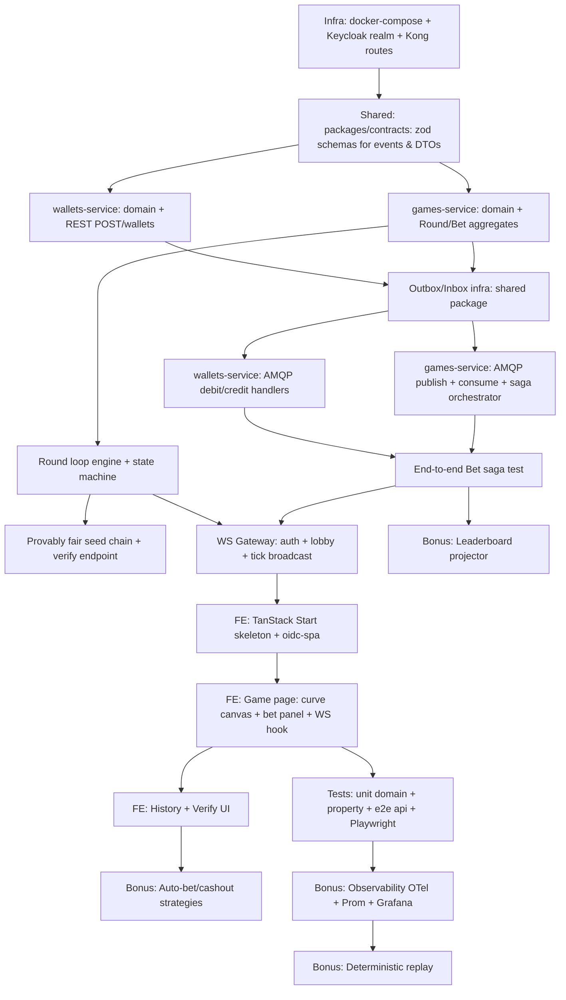

# Architecture Research — Crash Game

**Project:** Jungle Gaming Crash Game (multiplayer real-time casino)
**Researched:** 2026-05-24
**Overall confidence:** HIGH (industry-standard patterns; multiple authoritative sources)
**Scope:** Open architectural decisions inside the locked constraints (NestJS DDD services × 2, Postgres per service, RabbitMQ, Kong, Keycloak, TanStack Start, WS push)

---

## 1. Component Diagram

```
                                  ┌───────────────────────────┐
                                  │       Browser (FE)        │
                                  │   TanStack Start + Zustand│
                                  │   socket.io-client + Query│
                                  └─────────────┬─────────────┘
                                                │ HTTPS + WSS
                                                ▼
                                       ┌────────────────┐
                                       │  Kong Gateway  │  (DB-less, JWT plugin OFF
                                       │   :8000 / :443 │   — JWT validated at services)
                                       └───┬────────┬───┘
                          /games/*, /ws    │        │   /wallets/*
                                           ▼        ▼
            ┌─────────────────────────────────┐    ┌─────────────────────────────────┐
            │ games-service  (NestJS, :4001)  │    │ wallets-service (NestJS, :4002) │
            │ ┌─ presentation ────────────┐   │    │ ┌─ presentation ───────────┐    │
            │ │ REST + WS Gateway         │   │    │ │ REST controllers         │    │
            │ ├─ application ─────────────┤   │    │ ├─ application ────────────┤    │
            │ │ Saga orchestrator         │   │    │ │ Command handlers         │    │
            │ │ Round loop engine         │   │    │ │ Debit / Credit usecases  │    │
            │ ├─ domain ──────────────────┤   │    │ ├─ domain ─────────────────┤    │
            │ │ Round, Bet aggregates     │   │    │ │ Wallet, Transaction agg. │    │
            │ │ Provably fair seed chain  │   │    │ │ Money value object       │    │
            │ ├─ infrastructure ──────────┤   │    │ ├─ infrastructure ─────────┤    │
            │ │ MikroORM repos            │   │    │ │ MikroORM repos           │    │
            │ │ Outbox publisher          │   │    │ │ Outbox publisher         │    │
            │ │ Inbox consumer            │   │    │ │ Inbox consumer           │    │
            │ │ amqplib client            │   │    │ │ amqplib client           │    │
            │ └───────────────────────────┘   │    │ └──────────────────────────┘    │
            └──┬───────────────┬──────────────┘    └───┬──────────────┬──────────────┘
               │ pg            │ amqp                  │ amqp         │ pg
               ▼               ▼                       ▼              ▼
       ┌──────────────┐  ┌─────────────────────────────────┐  ┌──────────────┐
       │ Postgres 18  │  │       RabbitMQ 4.2              │  │ Postgres 18  │
       │   `games` DB │  │ Exchanges:                      │  │ `wallets` DB │
       │  outbox/inbox│  │   wallet.commands (direct)      │  │ outbox/inbox │
       └──────────────┘  │   wallet.events    (topic)      │  └──────────────┘
                         │   game.events      (topic)      │
                         │ Queues:                         │
                         │   wallet.commands.q             │
                         │   games.wallet-events.q         │
                         │   games.dlq / wallet.dlq        │
                         └─────────────────────────────────┘
                                          ▲
                                          │ JWKS validation
       ┌─────────────────────────────────┐│
       │     Keycloak 26.5 (:8080)       ├┘  realm: crash-game
       │   client: crash-game-client     │   user:  player / player123
       └─────────────────────────────────┘
```

**Key observations:**
- Kong **routes only** (no JWT plugin). Each NestJS service validates JWT via JWKS itself — keeps domain auth logic close to the aggregate and avoids gateway-coupled identity.
- WebSocket endpoint (`/ws`) is owned by `games-service`. Kong proxies WS upgrade verbs.
- `wallets-service` exposes only `POST /wallets` (provisioning) and `GET /wallets/me` via REST. **All credit/debit mutations come from RabbitMQ** (REQ-WALL-02).
- Each service has its own DB (no cross-DB FKs). Outbox and inbox tables live inside each service's DB and participate in the same transaction as aggregate changes.

---

## 2. Bounded Contexts

### 2.1 Game Context (`games-service`)

**Ubiquitous language:** Round, Bet, Crash Point, Multiplier, Seed, Cashout, Betting Window.

| Aggregate | Root invariants | Entities/VOs inside |
|-----------|-----------------|---------------------|
| **Round** | Status transitions only BETTING→RUNNING→CRASHED→SETTLED; `crashPoint` immutable once set; `runningStartedAt` immutable; bets accepted only while BETTING; cashouts allowed only while RUNNING and `multiplier < crashPoint` | `RoundId`, `Seed` (server seed, hash, nonce), `CrashPoint`, `Multiplier`, `BettingWindow`, `RoundStatus` |
| **Bet** (separate aggregate) | One ACTIVE bet per (playerId, roundId); status transitions PENDING→ACTIVE→CASHED_OUT \| LOST \| REFUNDED; amount within `[min, max]`; cashout only while bet ACTIVE | `BetId`, `PlayerId`, `RoundId`, `Money` (amount), `Multiplier` (cashout target / actual), `BetStatus` |
| **SeedChain** (singleton repo) | Hash chain pre-generated; `revealedSeed[N]` exposed only after round N closes | `SeedChainId`, `Seed[]`, `currentIndex` |

**Aggregate-boundary decision — Bet is its own aggregate, NOT a child of Round:**
- **Why:** A single Round can have hundreds of concurrent bets. If `Bet` were inside `Round`, every cashout would lock the entire Round aggregate row (`SELECT ... FOR UPDATE`), serializing all players. By making `Bet` its own aggregate, each cashout transaction touches one Bet row + one outbox row.
- **Cross-aggregate reference:** `Bet.roundId` is a value object reference, never a navigation property (per Vernon's "Reference other aggregates by identity only").
- **Invariant enforcement across aggregates:** "one active bet per (playerId, roundId)" is enforced by a Postgres unique partial index (`UNIQUE (player_id, round_id) WHERE status IN ('PENDING','ACTIVE')`). Domain invariants Postgres can enforce, Postgres SHOULD enforce.

**Value Objects:**
- `Money` — `{ amountCents: bigint, currency: 'COIN' }`; no float; all ops return new instance.
- `Multiplier` — `{ value: bigint }` stored as integer with scale 10000 (1.00x = 10000); display = value/10000.
- `CrashPoint` extends `Multiplier` with `≥ 1.00`.
- `Seed` — `{ value: Buffer(32), hash: Buffer(32) }`.
- `PlayerId`, `RoundId`, `BetId` — branded UUIDs.

### 2.2 Wallet Context (`wallets-service`)

**Ubiquitous language:** Wallet, Balance, Debit, Credit, Transaction, Reservation.

| Aggregate | Root invariants | Entities/VOs inside |
|-----------|-----------------|---------------------|
| **Wallet** | `balance ≥ 0` always; balance changes only via Transaction emission; one wallet per player; idempotent on `correlationId` | `WalletId`, `PlayerId`, `Money` (balance) |
| **Transaction** (separate aggregate) | Append-only; immutable once written; `type ∈ {DEBIT, CREDIT}`; tied to `correlationId` (one-to-one with saga step) | `TransactionId`, `WalletId`, `Money`, `TransactionType`, `correlationId`, `causationId` |

**Decision — Transaction is its own aggregate (ledger model):**
- Wallet holds current balance (snapshot). Transactions are the ledger.
- `Wallet.balance` is materialized from sum of transactions OR maintained in same TX as transaction insert. We choose **maintained snapshot** for simplicity + Postgres CHECK (`balance ≥ 0`).
- This is **NOT** event sourcing — events go to outbox, but Wallet state is mutated in place. Event sourcing was considered and rejected: it adds complexity (snapshots, projections) without paying for itself in a 5-day challenge.

**Value Objects:**
- `Money` (duplicate of Game's `Money` per DDD — same name, same shape, different context, no shared type).
- `WalletId`, `TransactionId`, `CorrelationId`.

**Wallet provisioning:** `POST /wallets` creates a Wallet on first authenticated call. Idempotent by `playerId`. Initial balance from configurable seed (e.g., `INITIAL_BALANCE_CENTS=100000` for 1000.00 play coins). The seed amount must come from env, **not hardcoded** (per global rules).

---

## 3. Data Flow (Mermaid Sequence Diagrams)

### 3.1 Place Bet — Reservation Saga

```mermaid
sequenceDiagram
    autonumber
    participant C as Client (FE)
    participant G as games-service (REST + Saga)
    participant GDB as games DB
    participant MQ as RabbitMQ
    participant W as wallets-service
    participant WDB as wallets DB
    participant WS as WS Gateway

    C->>G: POST /games/bet { roundId, amountCents }
    G->>GDB: BEGIN TX
    G->>GDB: INSERT Bet (status=PENDING, correlationId)
    G->>GDB: INSERT outbox (BetReservationRequested)
    G->>GDB: COMMIT
    G-->>C: 202 Accepted { betId, status: PENDING }
    Note over G,GDB: Outbox poller publishes async
    G->>MQ: publish BetReservationRequested
    MQ->>W: deliver to wallet.commands.q
    W->>WDB: BEGIN TX
    W->>WDB: SELECT wallet FOR UPDATE
    alt sufficient funds
        W->>WDB: UPDATE balance -= amount
        W->>WDB: INSERT transaction (DEBIT)
        W->>WDB: INSERT inbox (correlationId)
        W->>WDB: INSERT outbox (WalletDebited)
        W->>WDB: COMMIT
        W->>MQ: WalletDebited
        MQ->>G: deliver
        G->>GDB: INSERT inbox; UPDATE Bet→ACTIVE
        G->>WS: emit bet:active to room round:{id} + user:{playerId}
        WS-->>C: bet:active
    else insufficient
        W->>WDB: INSERT outbox (InsufficientFunds)
        W->>WDB: COMMIT
        W->>MQ: InsufficientFunds
        MQ->>G: deliver
        G->>GDB: UPDATE Bet→REFUNDED (compensation)
        G->>WS: emit bet:rejected to user:{playerId}
    end
```

**HTTP response policy — return 202 Accepted immediately, confirm via WS.**

Rationale:
- Round loop has hard real-time deadlines (the betting window may close mid-saga). A blocking HTTP call that waits for the wallet round-trip can exceed the window.
- WS connection already exists for multiplier broadcast; cost of pushing bet-confirmation is zero.
- 202 + WS is the standard pattern for "command accepted, result pending" flows (CQRS-ish, microservices.io Command pattern).
- **Tradeoff:** Worse DX for plain REST clients (need to poll `GET /games/bets/me`). Mitigated by exposing both paths.

### 3.2 Cashout — Settlement Saga

```mermaid
sequenceDiagram
    autonumber
    participant C as Client
    participant G as games-service
    participant GDB as games DB
    participant MQ as RabbitMQ
    participant W as wallets-service
    participant WS as WS Gateway

    C->>G: POST /games/bet/cashout { betId }
    G->>GDB: BEGIN TX
    G->>GDB: SELECT Bet, Round FOR UPDATE
    Note over G: Validate: Round=RUNNING, Bet=ACTIVE, multiplier<crashPoint
    G->>G: payout = Money(bet.amount * currentMultiplier)
    G->>GDB: UPDATE Bet→CASHED_OUT (cashoutMultiplier, payout)
    G->>GDB: INSERT outbox (CashoutRequested {payout, correlationId})
    G->>GDB: COMMIT
    G-->>C: 200 OK { multiplier, payoutCents }
    G->>WS: broadcast cashout:committed to room round:{id}
    G->>MQ: CashoutRequested (via outbox)
    MQ->>W: deliver
    W->>WDB: BEGIN; INSERT inbox; UPDATE balance+=payout; INSERT transaction (CREDIT); INSERT outbox(WalletCredited); COMMIT
    W->>MQ: WalletCredited
    MQ->>G: deliver (for audit; no Bet state change needed)
```

**Cashout response policy — synchronous 200 OK** (different from bet placement).

Rationale:
- Cashout authority is **entirely owned by Game context** (multiplier × bet amount = payout, computed atomically with Bet state mutation). The Wallet credit is downstream bookkeeping; user already "won."
- Game can compute the result without Wallet, so the saga is a one-way fire-and-forget post-commit.
- If Wallet credit fails, the audit/outbox retries (at-least-once). Idempotency on `correlationId` makes retries safe.

### 3.3 Round Tick & Crash

```mermaid
sequenceDiagram
    autonumber
    participant L as Round Loop (in-process)
    participant G as Game Service
    participant GDB as games DB
    participant WS as WS Gateway
    participant C as Clients

    Note over L: tick @ 30 Hz
    L->>L: multiplier = computeMultiplier(elapsedMs)
    L->>WS: broadcast tick { roundId, m, serverTime } [unreliable, no persist]
    WS->>C: tick
    Note over L: when elapsed reaches crashPoint
    L->>GDB: BEGIN; UPDATE Round→CRASHED (finalMultiplier, endedAt); SELECT all ACTIVE bets FOR UPDATE; UPDATE bets→LOST; INSERT outbox(RoundCrashed); COMMIT
    L->>WS: broadcast round:crashed { roundId, finalMultiplier, revealedSeed }
    WS->>C: round:crashed
    Note over L: betting window for next round
    L->>GDB: BEGIN; INSERT Round(status=BETTING, seedHash=nextHash); COMMIT
    L->>WS: broadcast round:betting { roundId, hash, bettingEndsAt }
```

### 3.4 Round Settlement Compensation

If `Round→CRASHED` transaction fails partially (e.g., bet update succeeds but outbox insert fails), the entire TX rolls back and the loop retries on the next tick (idempotent via `WHERE status='RUNNING'`). The outbox guarantees no double-settle: each Round has at most one `RoundCrashed` event keyed by `roundId`.

---

## 4. Saga Pattern — Decision: Orchestration via Game Service

**Decision:** Game service orchestrates. Wallet service is a **passive participant** that responds to commands.

**Why orchestration over choreography:**
- Bet placement is a 2-step saga with branching (success vs insufficient funds vs timeout). microservices.io recommends orchestration for 3+ steps OR conditional branching.
- Single source of truth for saga state (the `Bet` aggregate's status field IS the saga state machine).
- Easier to observe & debug (one service has the full flow trace).
- Game context already owns Bet lifecycle — keeping saga coordination there avoids leaking domain knowledge to Wallet.

### 4.1 Message Catalog

| Type | Direction | Exchange | Routing Key | Payload (key fields) |
|------|-----------|----------|-------------|----------------------|
| Command | Game → Wallet | `wallet.commands` (direct) | `wallet.debit` | `correlationId, playerId, amountCents, betId, roundId` |
| Command | Game → Wallet | `wallet.commands` (direct) | `wallet.credit` | `correlationId, playerId, amountCents, betId, roundId` |
| Event | Wallet → Game | `wallet.events` (topic) | `wallet.debited` | `correlationId, walletId, newBalanceCents` |
| Event | Wallet → Game | `wallet.events` (topic) | `wallet.debit.rejected` | `correlationId, reason: 'INSUFFICIENT_FUNDS'` |
| Event | Wallet → Game | `wallet.events` (topic) | `wallet.credited` | `correlationId, walletId, newBalanceCents` |
| Event | Game → world | `game.events` (topic) | `round.betting`, `round.running`, `round.crashed`, `bet.placed`, `bet.cashed_out` | depends on event |

**Envelope:** every message wrapped in:
```json
{
  "messageId": "uuid",
  "correlationId": "uuid",
  "causationId": "uuid",
  "type": "wallet.debit",
  "occurredAt": "ISO-8601",
  "version": 1,
  "payload": { ... }
}
```

### 4.2 Compensation Paths

| Failure | Compensation |
|---------|--------------|
| Wallet returns `InsufficientFunds` | Game marks Bet→REFUNDED (was PENDING, never debited; no money to refund) |
| Wallet timeout (no reply in 5s) | Game marks Bet→TIMEOUT; saga emits `BetReservationTimeout`; Wallet's idempotent inbox prevents double-debit on late arrival; if Wallet eventually debits, a compensating `wallet.credit` is issued |
| Game crashes after Wallet debited but before Bet→ACTIVE | On restart, recovery worker scans `Bet WHERE status=PENDING AND createdAt < now()-30s`, queries Wallet via correlationId, reconciles (mark ACTIVE if debit happened; mark REFUNDED + send `wallet.credit` if not — using inbox check) |
| Cashout: Wallet credit fails permanently | Outbox keeps retrying; if exhausted, dead-letter queue + admin alert. Bet remains CASHED_OUT (player already credited in game state) — manual reconciliation required (acceptable for play-money) |

---

## 5. Outbox / Inbox Pattern

### 5.1 Schema (per service DB)

```sql
CREATE TABLE outbox (
  id             BIGSERIAL PRIMARY KEY,
  message_id     UUID NOT NULL UNIQUE,
  aggregate_type TEXT NOT NULL,
  aggregate_id   TEXT NOT NULL,
  type           TEXT NOT NULL,
  exchange       TEXT NOT NULL,
  routing_key    TEXT NOT NULL,
  payload        JSONB NOT NULL,
  occurred_at    TIMESTAMPTZ NOT NULL DEFAULT now(),
  processed_at   TIMESTAMPTZ,
  attempts       INT NOT NULL DEFAULT 0,
  last_error     TEXT,
  locked_by      TEXT,
  locked_until   TIMESTAMPTZ
);
CREATE INDEX outbox_pending_idx ON outbox (occurred_at) WHERE processed_at IS NULL;

CREATE TABLE inbox (
  message_id   UUID PRIMARY KEY,
  type         TEXT NOT NULL,
  received_at  TIMESTAMPTZ NOT NULL DEFAULT now(),
  processed_at TIMESTAMPTZ,
  payload      JSONB NOT NULL
);
```

### 5.2 Outbox Publisher Strategy

**Recommendation: Polling with `FOR UPDATE SKIP LOCKED` + `LISTEN/NOTIFY` wake-up.**

- Polling baseline every 1s prevents permanent stalls.
- `pg_notify('outbox_new', '')` on insert (via Postgres trigger) wakes the publisher immediately for low latency.
- `SELECT ... WHERE processed_at IS NULL ORDER BY id LIMIT 50 FOR UPDATE SKIP LOCKED` — enables horizontal scaling later without re-architecting.
- After successful `channel.publish` + `confirmSelect` ACK from RabbitMQ, mark `processed_at = now()`.
- On failure: increment `attempts`, log `last_error`. If `attempts > 10`, move to dead-letter outbox table for manual review.

**Why not logical replication / Debezium:** Operational overhead (CDC) doesn't pay for itself at this scale. Worth flagging in an ADR as deliberately rejected.

### 5.3 Inbox Consumer Strategy

```typescript
// pseudo-code
@RabbitSubscribe({ exchange: 'wallet.events', routingKey: 'wallet.*' })
async handle(envelope: Envelope, msg: amqplib.Message) {
  await this.em.transactional(async (em) => {
    const existing = await em.findOne(InboxEntry, { messageId: envelope.messageId });
    if (existing?.processedAt) {
      return; // duplicate — already processed
    }
    if (!existing) {
      em.persist(em.create(InboxEntry, { messageId: envelope.messageId, type: envelope.type, payload: envelope.payload }));
    }
    await this.dispatcher.dispatch(envelope); // domain handler (mutates aggregates, may insert outbox)
    await em.nativeUpdate(InboxEntry, { messageId: envelope.messageId }, { processedAt: new Date() });
  });
  this.channel.ack(msg);
}
```

**Key invariants:**
- Inbox dedupe row is inserted in the **same TX** as the aggregate mutation + any outbox writes — exactly-once *processing* semantics.
- ACK only after TX commits. Crash before ACK → broker redelivers → inbox check short-circuits.
- This is the **Idempotent Consumer** pattern (microservices.io) layered over **Transactional Inbox**.

---

## 6. Round Loop Design

### 6.1 State Machine

```
            ┌─────────────────────────────────────────┐
            │                                         │
            ▼                                         │
       ┌─────────┐ (window expires)  ┌─────────┐ (multiplier
       │ BETTING │ ────────────────▶ │ RUNNING │  ≥ crashPoint)
       └─────────┘                   └────┬────┘
                                          │
                                          ▼
                                     ┌─────────┐  (settle bets,
                                     │ CRASHED │   reveal seed,
                                     └────┬────┘   cooldown 2s)
                                          │
                              ┌───────────┘
                              ▼
                         [new BETTING round]
```

| State | Duration (configurable env) | Allowed actions |
|-------|------------------------------|-----------------|
| BETTING | 5s | POST /bet, POST /cashout=403, tick broadcast=countdown only |
| RUNNING | until crash | POST /bet=403, POST /cashout, tick broadcast=multiplier |
| CRASHED | 2s cooldown | both 403, broadcast=final result + seed reveal |

### 6.2 Where the Loop Lives — `RoundLoopService` (application layer)

```typescript
@Injectable()
export class RoundLoopService implements OnModuleInit, OnApplicationShutdown {
  private timer?: NodeJS.Timeout;
  private running = false;

  async onModuleInit() {
    await this.recoverInFlightRound();   // crash recovery
    this.scheduleNextTick();
  }

  async onApplicationShutdown(signal?: string) {
    this.running = false;
    if (this.timer) clearTimeout(this.timer);
    await this.persistCurrentStateForRecovery();
  }

  private scheduleNextTick() {
    if (!this.running) return;
    this.timer = setTimeout(() => this.tick().catch(this.handleError), 33); // ~30Hz
  }

  private async tick() {
    const result = await this.tickUseCase.execute(); // pure application service
    this.gameGateway.broadcastTick(result);
    this.scheduleNextTick();
  }
}
```

**Why `setTimeout` recursive instead of `setInterval`:**
- `setInterval` drifts under load (queues up missed ticks).
- Recursive `setTimeout` self-paces and skips gracefully if a tick takes longer than the interval.
- Easy to stop cleanly via shutdown hook (avoids the "setInterval not cleared" footgun documented in NestJS lifecycle docs).

**NOT a worker thread** for this scope:
- Single-process simplicity wins for a 5-day challenge.
- Worker thread adds IPC complexity, breaks transaction sharing.
- Document in ADR as "MVP choice; scale-out path = move loop to dedicated game-loop service with Postgres advisory lock leader election."

### 6.3 Multi-Instance Leader Election (out of scope, but designed for)

If scaled to N instances of `games-service`, only ONE may run the loop:

```sql
-- on tick start
SELECT pg_try_advisory_lock(hashtext('round-loop')) AS is_leader;
```

If `is_leader = false`, skip the tick (passive replica handling REST/WS only).

### 6.4 Recovery on Restart

```typescript
async recoverInFlightRound() {
  const open = await this.roundRepo.findOpen(); // BETTING or RUNNING
  if (!open) { await this.startNewRound(); return; }
  const now = Date.now();
  if (open.status === 'BETTING' && open.bettingEndsAt < now) {
    await this.transitionToRunning(open);  // window expired during downtime
  }
  if (open.status === 'RUNNING') {
    const elapsed = now - open.runningStartedAt;
    const multiplierNow = computeMultiplier(elapsed);
    if (multiplierNow >= open.crashPoint) {
      await this.crashRound(open); // crashed during downtime, settle retroactively
    }
    // else just resume ticking from where elapsed says
  }
}
```

---

## 7. WebSocket Gateway Design

### 7.1 Auth at Handshake (Socket.io Custom Adapter)

```typescript
// JwtIoAdapter extends IoAdapter — applied in main.ts
io.use(async (socket, next) => {
  const token = socket.handshake.auth?.token ?? socket.handshake.headers.authorization?.replace('Bearer ', '');
  if (!token) return next(new Error('UNAUTHORIZED'));
  try {
    const payload = await jwksJwtVerifier.verify(token); // cached JWKS
    socket.data.playerId = payload.sub;
    socket.data.tokenExp = payload.exp;
    next();
  } catch { next(new Error('UNAUTHORIZED')); }
});
```

**Token refresh handling:** Client listens for `auth:expiring` event (server emits 30s before exp). Client refreshes via OIDC, then `socket.emit('auth:refresh', { token })`. Server re-verifies, updates `socket.data.tokenExp`. If client ignores refresh, server disconnects on expiry.

### 7.2 Rooms

| Room | Members | Used for |
|------|---------|----------|
| `lobby` | all connected | round lifecycle events (`round:betting`, `round:crashed`), live bet feed, public cashout feed, history updates |
| `round:{roundId}` | (collapsed into `lobby`) | not used — single global room is sufficient at challenge scale |
| `user:{playerId}` | one socket per tab for that user | private events — `bet:active`, `bet:rejected`, `wallet:balance`, `bet:cashed_out` (own bet) |

**Why single global "lobby" instead of per-round rooms:**
- Only one round runs at a time. Per-round room adds no scoping benefit, adds join/leave churn every 7-15s.
- Auto-join `lobby` and `user:{playerId}` in `handleConnection`.

### 7.3 Multi-Tab Sync

- Each tab opens its own socket. Server emits to `user:{playerId}` → reaches ALL tabs.
- Tabs share no client state by design. Server is the single source of truth.
- Round state is derivable from latest `round:*` event + server time → tabs converge naturally on reconnect by re-sending `round:current` on connection.

### 7.4 Message Catalog

| Direction | Event | Payload | Frequency |
|-----------|-------|---------|-----------|
| S→C | `round:current` | full snapshot on connect | once per connect |
| S→C | `round:betting` | `{ roundId, seedHash, bettingEndsAt }` | every round start |
| S→C | `round:running` | `{ roundId, startedAt }` | every round |
| S→C | `tick` | `{ m: int, t: serverMs }` (compact) | 30 Hz |
| S→C | `round:crashed` | `{ roundId, finalMultiplier, revealedSeed, nextRoundHash }` | every round |
| S→C | `bet:placed` (lobby) | `{ playerName, amount }` (anonymized) | per bet |
| S→C | `bet:active` (user) | `{ betId, amount, roundId }` | per own bet |
| S→C | `bet:rejected` (user) | `{ betId, reason }` | rare |
| S→C | `bet:cashed_out` (lobby + user) | `{ playerName, multiplier, payout }` | per cashout |
| S→C | `wallet:balance` (user) | `{ balanceCents }` | on change |
| C→S | `auth:refresh` | `{ token }` | on token expiry |

### 7.5 Backpressure & Compression

- **Tick payload is tiny** (~30 bytes JSON). At 30Hz × N clients, throughput is trivial for hundreds of clients on one node.
- **Disable per-message-deflate compression for ticks** — Socket.io docs are explicit: compression hurts for sub-1KB payloads (CPU > bandwidth savings).
- **Enable compression for `round:current` snapshot** (>1KB).
- **Use `volatile: true` for ticks** (`io.to('lobby').volatile.emit('tick', ...)`) — if client is backed up, drop ticks instead of buffering. Multiplier interpolation on client absorbs gaps.
- For >1k clients later: introduce Redis adapter for horizontal Socket.io scaling. Not in scope for challenge.

---

## 8. Multiplier Synchronization Strategy

### 8.1 Multiplier Formula (deterministic from elapsed ms)

Standard Aviator-style growth:

```
multiplier(t) = e^(growthRate * t / 1000)
```

Where `growthRate` is tuned so the median round lasts ~5-7s (e.g., 0.06). Capped at `crashPoint`.

The CLIENT computes this locally given `startedAt` (from `round:running` event). The SERVER emits ticks for **reconciliation only**, not as the source of truth for animation frames.

### 8.2 Client Interpolation + Reconciliation

```typescript
// in Zustand store, requestAnimationFrame loop
function renderFrame() {
  const { round, serverOffsetMs } = state;
  if (round?.status === 'RUNNING') {
    const elapsedMs = (Date.now() + serverOffsetMs) - round.startedAt;
    const m = Math.exp(GROWTH_RATE * elapsedMs / 1000);
    setRenderedMultiplier(Math.min(m, round.maxDisplayMultiplier ?? Infinity));
  }
  requestAnimationFrame(renderFrame);
}

// on each server `tick` event, reconcile clock offset
function onTick({ m: serverM, t: serverT }) {
  serverOffsetMs = serverT - Date.now(); // exponential moving average smoothing
  // Optional: if |clientM - serverM| > 0.05, snap to server value
}
```

**On `round:crashed`:**
```typescript
function onCrashed({ finalMultiplier }) {
  state.round.status = 'CRASHED';
  state.round.crashedAt = finalMultiplier; // freeze display at this exact value
  // animation curve "snaps" to final value, then plays explosion FX
}
```

**Why this works:**
- Render is silky (60fps from rAF), but values are server-derived (not user-clock-derived).
- Server tick at 30 Hz reconciles clock drift between rounds (~ms-level).
- Final crash value is canonical from server, not the client's last interpolation — no "I saw 2.50x but server says 2.49x" disputes.
- Reference: Gabriel Gambetta's Fast-Paced Multiplayer series (canonical text on this pattern).

### 8.3 Clock Sync at Connection

On `round:current`:
```json
{ "round": {...}, "serverTime": 1716537600123 }
```

Client computes initial `serverOffsetMs = serverTime - Date.now()`. Each `tick` refines via EMA.

---

## 9. Provably Fair Architecture

### 9.1 Pre-Generated Hash Chain (Bustabit Model)

**Setup (one-time, at first boot):**
```typescript
const CHAIN_LENGTH = 10_000_000;
let seed = crypto.randomBytes(32); // final seed (the "secret seed")
const chain: Buffer[] = [seed];
for (let i = 1; i < CHAIN_LENGTH; i++) {
  seed = crypto.createHash('sha256').update(seed).digest();
  chain.unshift(seed); // chain[0] = first seed used, chain[CHAIN_LENGTH-1] = revealed last
}
// store chain[0]'s SHA-256 as "terminalHash" in DB; publish in README
// store the chain itself in seeds table, indexed by position
```

Chain is consumed left-to-right (`position = 0, 1, 2, ...`). After round N:
- `revealedSeed = chain[N]`
- Player can hash `chain[N+1]` → must equal `chain[N]` (parent hash)
- After all rounds run, hashing `chain[0]` once = `terminalHash` (published commitment proves chain wasn't tampered)

### 9.2 Crash Point Derivation (per round)

Modified Bustabit formula with client-seed contribution:

```typescript
function deriveCrashPoint(serverSeed: Buffer, clientSeed: string, nonce: number): number {
  const hmac = crypto.createHmac('sha256', serverSeed).update(`${clientSeed}:${nonce}`).digest('hex');
  // 13 hex chars = 52 bits
  const intVal = parseInt(hmac.slice(0, 13), 16);
  const TWO_52 = 2 ** 52;
  // 1% house edge → return 1.00 on ~1% of rounds (instant crash)
  if (intVal % 33 === 0) return 1.00;
  const crash = Math.floor((100 * TWO_52 - intVal) / (TWO_52 - intVal)) / 100;
  return Math.max(1.00, crash);
}
```

**Client seed:**
- Per-round, derived from `SHA256(round.id || playerCountAtBettingClose || ...)` OR explicitly contributed by next-round bettor. Simplest defensible approach: derive from a public, unpredictable-at-commit-time value (e.g., the hash of the last 10 bet IDs in the previous round). Document the algorithm in `/games/rounds/:id/verify`.
- Why not pure server seed? Without client contribution, a malicious operator could pre-compute every crash point and choose to delay/skip seeds. Client contribution makes that infeasible.

### 9.3 Reveal Cadence

| When | What is exposed |
|------|-----------------|
| Round.BETTING starts | `seedHash = SHA256(chain[N])` (the commitment) |
| Round.CRASHED | `revealedSeed = chain[N]`, `clientSeedSource`, `nonce`, `crashPoint`, full algorithm version |

### 9.4 Verify Endpoint

```
GET /games/rounds/:id/verify
→ {
    "roundId": "...",
    "serverSeed": "hex64",
    "serverSeedHash": "hex64",
    "clientSeed": "string",
    "nonce": 0,
    "crashPoint": 2.34,
    "algorithm": "v1-hmac-sha256-52bit-1pct-edge",
    "previousServerSeed": "hex64",   // proof of chain integrity
    "verifyInstructions": "url-to-readme-or-inline-pseudo-code"
}
```

Frontend Verification panel hashes `serverSeed` client-side → confirms it equals `serverSeedHash` (and `previousServerSeed` after one more hash). Then re-runs `deriveCrashPoint` → confirms `crashPoint`. Pure JS in browser; nothing trusted to server.

---

## 10. CQRS Decision

**Recommendation: Light CQRS — separate read models for two specific surfaces.**

| Use case | Model | Why |
|----------|-------|-----|
| `GET /games/rounds/current` | Read directly from write model (`Round` aggregate) | Single row, fresh data needed, no benefit to projection |
| `GET /games/rounds/history` | **Read model** (`round_history` denormalized view) | List of last N rounds with stats — aggregating bets per round on every request is wasteful |
| `GET /games/bets/me` | Direct query (indexed by playerId) | Cheap |
| Leaderboard (REQ-BONUS-05) | **Read model** (`leaderboard_daily`, `leaderboard_weekly`) updated by projector consuming `bet.cashed_out` + `round.crashed` events from RabbitMQ | High read volume, expensive aggregation, eventual consistency acceptable |

**No full event sourcing.** Write model = mutable Postgres tables. Read models = denormalized views populated by event handlers (projectors) inside the same service. This is **CQRS without ES** — strong tradeoff alignment for the challenge.

**Projector implementation:** `@RabbitSubscribe` consumer on `game.events` exchange writes to `leaderboard_*` tables in their own TX. Inbox dedupe applies. Projector failure does not affect write path.

---

## 11. Service-to-Service Auth

**Decision: Broker-level trust + envelope `causationId`/`correlationId` audit. NO signed payloads.**

- RabbitMQ runs inside the Compose network; only services with valid credentials connect.
- Sensitive operations (debit/credit) are scoped by exchange/routing key, not by message content trust.
- All wallet mutations are append-only in the transaction ledger — even a forged message would be reconstructable post-hoc via `correlationId` lineage.
- Cost/benefit: HMAC-signed envelopes add complexity (key rotation, shared secret distribution) for a closed-network play-money system.

If this were real money: add HMAC-SHA256 signatures with services holding distinct keys, signed against canonical JSON of payload. Document this as a deferred decision in ADR.

---

## 12. Frontend Architecture

### 12.1 Folder Layout

```
frontend/
├── app/                          # TanStack Start app dir
│   ├── routes/
│   │   ├── __root.tsx            # layout (header, wallet pill, connect-state badge)
│   │   ├── index.tsx             # game page (primary)
│   │   ├── login.tsx             # OIDC redirect kick-off
│   │   ├── auth.callback.tsx     # OIDC callback handler
│   │   ├── history.tsx           # past rounds with verify UI
│   │   └── leaderboard.tsx
│   ├── server/                   # server functions (token-protected via oidc-spa)
│   │   └── api-proxy.ts          # if needed; usually direct fetch is fine
│   └── client.ts
├── src/
│   ├── features/                 # feature-first organization
│   │   ├── auth/
│   │   │   ├── oidc-client.ts    # oidc-spa setup with Keycloak
│   │   │   ├── auth-store.ts     # Zustand: tokens, user
│   │   │   └── use-require-auth.ts
│   │   ├── game/
│   │   │   ├── components/       # CrashCurve, BetPanel, Countdown, RoundHeader
│   │   │   ├── hooks/use-game-socket.ts
│   │   │   ├── hooks/use-multiplier-frame.ts  # rAF interpolation
│   │   │   ├── game-store.ts     # Zustand: current round, rendered multiplier
│   │   │   └── domain/multiplier-math.ts      # shared formula with backend
│   │   ├── wallet/
│   │   │   ├── use-wallet.ts     # TanStack Query
│   │   │   └── wallet-store.ts   # Zustand mirror for WS-pushed balance
│   │   ├── bet/
│   │   │   ├── components/AutoBetConfig, AutoCashoutConfig
│   │   │   ├── strategies/martingale.ts, fixed.ts
│   │   │   └── bet-store.ts
│   │   ├── history/
│   │   └── leaderboard/
│   ├── shared/
│   │   ├── api/                  # fetch wrapper with auth, types from backend (zod schemas)
│   │   ├── ws/                   # socket.io client singleton
│   │   ├── ui/                   # shadcn components
│   │   └── lib/format-money.ts, format-multiplier.ts
│   └── styles/
└── public/
```

### 12.2 WS Client Placement — `useGameSocket` hook + Zustand subscription

```typescript
// shared/ws/socket.ts — singleton, lazy
let socket: Socket | undefined;
export function getSocket(token: () => string) {
  if (!socket) {
    socket = io(WS_URL, { auth: (cb) => cb({ token: token() }), transports: ['websocket'] });
  }
  return socket;
}

// features/game/hooks/use-game-socket.ts
export function useGameSocket() {
  const setRound = useGameStore(s => s.setRound);
  const tick = useGameStore(s => s.applyTick);
  const setBalance = useWalletStore(s => s.setBalance);
  useEffect(() => {
    const s = getSocket(() => authStore.getState().accessToken!);
    s.on('round:current', setRound);
    s.on('round:betting', setRound);
    s.on('round:running', setRound);
    s.on('round:crashed', setRound);
    s.on('tick', tick);
    s.on('wallet:balance', setBalance);
    return () => { s.off('round:*'); s.off('tick'); s.off('wallet:balance'); };
  }, []);
}
```

Hook is called once in `__root.tsx`. Components read from stores via selectors — granular re-render.

### 12.3 State Partition

| Slice | Library | Why |
|-------|---------|-----|
| `auth` (tokens, user claims) | Zustand + oidc-spa | persisted to localStorage |
| `wallet.balance` | TanStack Query (fetch) + Zustand mirror (WS push) | Query for hydration, Zustand for live updates |
| `round` (current state, history) | Zustand (live) + TanStack Query (history page) | live data via WS, paginated via Query |
| `renderedMultiplier` | Zustand (rAF-updated) | high-frequency local state, separate slice to scope re-renders to the curve component only |
| `bets.my` | TanStack Query + Zustand for optimistic | mutation cache + WS-pushed confirmations |
| `feed` (lobby bet/cashout feed) | Zustand circular buffer (last 50) | ephemeral, no need to persist |

**Critical rule:** the multiplier rAF loop writes to its OWN Zustand store slice. The curve component subscribes only to `renderedMultiplier`. Other components (header, bet panel) do NOT re-render at 60fps.

### 12.4 Server Functions

Use TanStack Start server functions for:
- OIDC callback exchange (PKCE code → tokens) — done in oidc-spa middleware
- Server-side rendering of initial round state (SSR for SEO/snappier first paint)

Bet placement, cashout, etc. — call REST directly with bearer token. No need to proxy through server functions.

---

## 13. Suggested Build Order



**Dependency notes:**
- Outbox/Inbox infra is foundational — without it, the saga has dual-write bugs from day one. Build BEFORE any saga code.
- Round loop unblocks WS Gateway (gateway needs tick source).
- Saga must work end-to-end (bet → wallet debit → bet active) BEFORE FE bet panel ships, or you'll waste FE time on mocks.
- Provably fair can be parallel to round loop (different files, both inside games domain).
- Observability is last because instrumenting moving targets is wasteful — instrument when shape is stable.

**Phase shape recommendation for roadmapper:**
1. Foundation (infra, contracts, DDD skeletons, outbox/inbox)
2. Wallet service (REST + AMQP debit/credit, idempotency)
3. Game core (Round aggregate, round loop, provably fair, settlement)
4. Saga integration (end-to-end bet + cashout)
5. WebSocket gateway + multiplier sync
6. Frontend (auth, game page, history, verify)
7. Bonuses (auto-bet, leaderboard, observability, replay, Playwright, CI)
8. Polish + ADRs + README

---

## Sources

### Saga / Outbox / Microservices Patterns
- [microservices.io — Saga pattern](https://microservices.io/patterns/data/saga.html) — canonical reference for orchestration vs choreography
- [Saga Orchestration Using the Outbox Pattern — InfoQ](https://www.infoq.com/articles/saga-orchestration-outbox/) — combined pattern reference
- [Inbox & Outbox & Saga in Microservices — Medium](https://medium.com/@mahmoudsallam2111/inbox-outbox-patterns-and-saga-pattern-in-microservices-df65b66bf41d)
- [Implementing Outbox Pattern with NestJS, RabbitMQ, Postgres — Medium](https://medium.com/@sebastian.iwanczyszyn/implementing-the-outbox-pattern-in-distributed-systems-with-nestjs-rabbitmq-and-postgres-65fcdb593f9b)
- [nestjs-outbox library — GitHub](https://github.com/fullstackhouse/nestjs-outbox) — supports LISTEN/NOTIFY with MikroORM driver
- [pg-transactional-outbox — npm](https://www.npmjs.com/package/pg-transactional-outbox)
- [Push-based Outbox with Postgres Logical Replication — event-driven.io](https://event-driven.io/en/push_based_outbox_pattern_with_postgres_logical_replication/)
- [Solving the Dual Write Problem with NestJS Inbox/Outbox — Medium](https://axotion.medium.com/solving-the-dual-write-problem-with-nestjs-implementing-inbox-and-outbox-patterns-3b20a8bd49a1)

### Crash Game / Provably Fair
- [Crash Game Algorithm: Formulas & Hash Math — crashgamesplay.com](https://crashgamesplay.com/guides/crash-game-algorithm/) — Bustabit 52-bit formula
- [Implementing provably fair in crash games — createIT/Medium](https://medium.com/@createitsc/implementing-provably-fair-in-crash-games-d82d2a31157f)
- [Aviator (Spribe) Provably Fair Algorithm — gamblingcalc.com](https://gamblingcalc.com/gambling-guides/aviator-provably-fair-algorithm/)
- [Provably Fair Crash Games guide — crashgamesplay.com](https://crashgamesplay.com/guides/provably-fair-explained/)
- [Hash Verification Guide — crashgamesplay.com](https://crashgamesplay.com/guides/crash-game-hash-verification/)
- [Aviator backend tech infrastructure — culturebully.com](https://culturebully.com/blog/what-backend-tech-infrastructure-reveals-about-timing-in-aviator-crash-mechanics/)
- [The technology behind multiplayer crash games — gadgetlite.com](https://gadgetlite.com/2026/02/multiplayer-crash-games-aviator/)
- [Aviator Crash OSS reference — GitHub akashmahlaz/aviator-crash](https://github.com/akashmahlaz/aviator-crash)

### NestJS / WebSocket / Lifecycle
- [NestJS Lifecycle Events — docs](https://docs.nestjs.com/fundamentals/lifecycle-events) — OnModuleInit / OnApplicationShutdown
- [Graceful Shutdown in NestJS — DEV/Medium](https://dev.to/hienngm/graceful-shutdown-in-nestjs-ensuring-smooth-application-termination-4e5n)
- [WebSocket Authentication in NestJS with JWT — DEV](https://dev.to/mouloud_hasrane_c99b0f49a/websocket-authentication-in-nestjs-handling-jwt-and-guards-4j27)
- [The Best Way to Authenticate WebSockets in NestJS — Preet Mishra](https://preetmishra.com/blog/the-best-way-to-authenticate-websockets-in-nestjs)
- [Socket.IO Performance Tuning — official docs](https://socket.io/docs/v4/performance-tuning/)
- [Scaling Socket.IO — Ably](https://ably.com/topic/scaling-socketio)

### Client-Side Prediction / Multiplier Sync
- [Client-Side Prediction & Server Reconciliation — Gabriel Gambetta](https://www.gabrielgambetta.com/client-side-prediction-server-reconciliation.html) — canonical reference
- [Entity Interpolation — Gabriel Gambetta](https://www.gabrielgambetta.com/entity-interpolation.html)
- [Client-side prediction — Wikipedia](https://en.wikipedia.org/wiki/Client-side_prediction)

### DDD
- [DDD Aggregates & Bounded Contexts (Vaadin)](https://vaadin.com/blog/ddd-part-2-tactical-domain-driven-design)
- [Why DDD & Event Sourcing — Trendyol/Medium](https://medium.com/trendyol-tech/why-domain-driven-design-event-sourcing-and-its-benefits-81da555a5ccc) — wallet aggregate growth example
- [Bounded Contexts Behavior Over Data — Rico Fritzsche](https://ricofritzsche.me/ddd-modularization-concepts-aggregates-part-ii/)
- [DDD CQRS Event Sourcing Whitepaper — AxonIQ](https://www.ergonomics.ch/wp-content/uploads/2021/09/Ergo-white-paper-DDD-CQRS-and-Event-Sourcing-Explained.pdf)

### TanStack Start / OIDC
- [TanStack Start Authentication with OIDC/Keycloak — Medium](https://medium.com/@othmane.outama/tanstack-start-authentication-with-oidc-oauth-2-0-keycloak-example-2a2177824d7c)
- [oidc-spa TanStack Start integration — docs](https://docs.oidc-spa.dev/integration-guides/backend-token-validation/tanstack-start)
- [keycloakify/oidc-spa — GitHub](https://github.com/keycloakify/oidc-spa)
- [TanStack Start Authentication Overview — official docs](https://tanstack.com/start/latest/docs/framework/react/guide/authentication-overview)

### Confidence by Section

| Section | Confidence | Notes |
|---------|------------|-------|
| Component diagram | HIGH | Constrained by spec |
| Bounded contexts / aggregates | HIGH | Direct application of Vernon / microservices.io guidance |
| Data flow / sagas | HIGH | Multiple authoritative sources agree |
| Outbox/Inbox schema | HIGH | Industry-standard schema; verified across multiple references |
| Round loop design | MEDIUM-HIGH | NestJS lifecycle confirmed by docs; recursive setTimeout is well-known pattern |
| WebSocket design | HIGH | Socket.io patterns documented; auth pattern standard |
| Multiplier sync | HIGH | Gambetta's reference is canonical; same algorithm used by every Aviator clone |
| Provably fair | HIGH | Bustabit's algorithm is open and widely replicated; verify formula confirmed by multiple sources |
| CQRS decision | MEDIUM | Judgment call for challenge scope; defensible either way |
| Service-to-service auth | MEDIUM | Broker-trust acceptable for closed network; would harden for real money |
| Frontend architecture | MEDIUM-HIGH | TanStack Start + oidc-spa pattern verified; folder layout opinionated |
