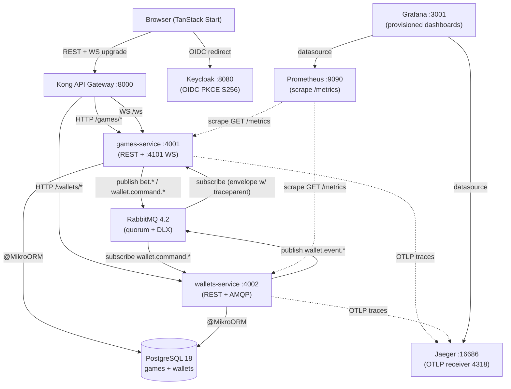

# Crash Game

[](https://github.com/pedropaulobrasca/fullstack-challenge/actions/workflows/ci.yml)

Multiplayer real-time Crash game submitted as the Jungle Gaming fullstack technical challenge. Backend is two NestJS 11 services (`games`, `wallets`) running on Bun 1.3.11, with a RabbitMQ saga, Keycloak 26 OIDC, and PostgreSQL 18 via MikroORM 7. Frontend is TanStack Start with Socket.IO 4.8 for live multiplier push. Money never touches `number` — every amount is a `Money` value object backed by Dinero v2 with bigint cents. Round outcomes are provably fair via a Bustabit-style HMAC-SHA-256 hash chain consumed in reverse, with the pre-round commitment visible before any bet is accepted. The multiplier is server-authoritative; clients interpolate locally and reconcile to server ticks.

## Quick Start

```bash
git clone https://github.com/pedropaulobrasca/fullstack-challenge.git
cd fullstack-challenge
bun install
bun run docker:up
cd frontend && bun run dev
```

That is the complete bootstrap. `bun run docker:up` brings up the full stack (Postgres, RabbitMQ, Keycloak, Kong, the games and wallets services, Jaeger, Prometheus, Grafana) and blocks until every healthcheck passes. The frontend dev server runs on `http://localhost:3000` and the demo user `player` / `player123` is pre-seeded in the Keycloak `crash-game` realm; logging in auto-provisions a wallet at `1000.00 CRD`.

| Surface | URL | Purpose |
|---------|-----|---------|
| Game | http://localhost:3000 | TanStack Start frontend |
| Keycloak | http://localhost:8080 | OIDC realm (`crash-game`), admin `admin/admin` |
| Kong | http://localhost:8000 | API gateway (REST + WS upgrade) |
| Jaeger | http://localhost:16686 | Trace UI — open any bet end-to-end |
| Prometheus | http://localhost:9090 | Scrape targets + custom metrics |
| Grafana | http://localhost:3001 | Pre-provisioned dashboards (anonymous Viewer) |

## Architecture



Two backend services share a Postgres instance (separate databases) and a RabbitMQ broker. Kong is the single ingress for HTTP and WebSocket upgrades. Keycloak holds the OIDC realm; both services validate JWTs against its cached JWKS. The observability triad (Jaeger + Prometheus + Grafana) runs alongside the services with pre-provisioned dashboards — no manual setup after `docker:up`.

## Saga Flow

```mermaid
sequenceDiagram
  participant FE as Browser
  participant Kong as Kong
  participant Games as games-service
  participant RMQ as RabbitMQ
  participant Wallets as wallets-service

  Note over FE,Wallets: One trace_id across the entire bet saga
  FE->>Kong: POST /games/bet [traceparent: 00-abc..-01]
  Kong->>Games: forward [traceparent extracted by http instr]
  Games->>Games: span "PlaceBetUseCase.execute" (parent: HTTP)
  Games->>RMQ: publish wallet.command.debit<br/>message.properties.headers.traceparent = 00-abc..-XX
  Games-->>Kong: 202 Accepted (response sent before await)
  Kong-->>FE: 202 {betId, status:PENDING}

  RMQ->>Wallets: deliver wallet.command.debit
  Note over Wallets: amqplib instr extracts traceparent
  Wallets->>Wallets: span "DebitWalletUseCase" (parent: AMQP)
  Wallets->>RMQ: publish wallet.event.debited<br/>(traceparent preserved)
  RMQ->>Games: deliver wallet.event.debited
  Games->>Games: span "WalletDebitedHandler.handle"
  Games->>RMQ: publish bet.active
  Note over FE,Wallets: All spans share trace_id abc..; visible end-to-end in Jaeger
  Games-->>FE: WS emit bet:my_active
```

The bet saga is orchestrated by `games-service` (ADR-019). The HTTP response returns `202 Accepted` immediately after the outbox row commits (ADR-020); the player learns the saga's terminal state via the WebSocket `bet:my_active` / `bet:my_refunded` emit. Trace context propagates across HTTP, AMQP, and WS boundaries via W3C TraceContext (ADR-035) — a single `trace_id` ties the full saga together in the Jaeger UI.

## Provably Fair: Verify Outside the App

Every settled round can be independently verified from any shell using `curl` + `jq` + `openssl` + `python3` — no app context, no server trust, no Node runtime. The walkthrough below uses the canonical locked-byte fixture (`serverSeed = 0x0...01`, `clientSeed = "test"`, `nonce = 0`, `instantCrashBucket = 101`) so you can confirm the toolchain produces the expected `2.94` before pointing it at a live round. The in-app verifier at `GET /verify/:roundId` (Fairness drawer → "Open verifier" link) runs the same algorithm in the browser via `crypto.subtle`; this section is the third-party-tool re-derivation that proves nobody is reading a number off the server.

### Why this matters

The server commits to a SHA-256 hash chain *before* any round runs (`serverSeedHash` is the next round's commitment, revealed once the round settles). The crash multiplier is `HMAC_SHA-256(serverSeed, "${clientSeed}:${nonce}")` reduced through the Bustabit 52-bit formula with a 1-in-101 instant-crash bucket. Independent verification with off-the-shelf tools is the difference between *trust me* and *verify me*.

### Verify any settled round

Pick a round id from the History strip (or the `/api/games/rounds` listing once the round is `SETTLED`) and run:

```bash
ROUND_ID="<paste-round-id-from-history-strip>"
BASE="http://localhost:8000"

curl -s "$BASE/games/rounds/$ROUND_ID/verify" > round.json

SERVER_SEED=$(jq -r .serverSeed round.json)
SEED_HASH=$(jq -r .serverSeedHash round.json)
CLIENT_SEED=$(jq -r .clientSeed round.json)
NONCE=$(jq -r .nonce round.json)
CRASH_POINT=$(jq -r .crashPoint round.json)

echo "--- Step A: reproduce the seedHash commitment ---"
echo -n "$SERVER_SEED" | xxd -r -p | openssl dgst -sha256
echo "Reported seedHash: $SEED_HASH"

echo "--- Step B: reproduce the crashPoint ---"
HMAC=$(echo -n "$CLIENT_SEED:$NONCE" \
  | openssl dgst -sha256 -hmac "$SERVER_SEED" -hex \
  | awk '{print $NF}')
HEX13=${HMAC:0:13}
INT_H=$(printf '%d' "0x$HEX13")
python3 -c "
H=$INT_H
E=2**52
if H % 101 == 0:
    print('crashPoint = 1.00')
else:
    print('crashPoint =', max(1.0, ((100*E - H)//(E - H))/100))
"
echo "Reported crashPoint: $CRASH_POINT"
```

Step A must print a hex digest identical to `$SEED_HASH`. Step B must print a crashpoint identical to `$CRASH_POINT`. Any mismatch is either a bug in the server or a byte-encoding mistake in your shell pipeline — read "Why two encodings of the same hex string?" below.

### Worked example (no live stack required)

This block hardcodes the Phase 4 oracle tuple, so you can paste and run it on any machine with `openssl` and `python3` — no docker, no curl, no live round needed. The same fixture is locked in source by `packages/contracts/tests/unit/provably-fair.test.ts` (server) and `packages/contracts/src/provably-fair-browser/derive-crash-point.async.test.ts` (browser).

```bash
SERVER_SEED="0000000000000000000000000000000000000000000000000000000000000001"
CLIENT_SEED="test"
NONCE="0"

echo "--- Step A: seedHash commitment (hex-decoded server seed) ---"
echo -n "$SERVER_SEED" | xxd -r -p | openssl dgst -sha256

echo "--- Step B: HMAC with the hex string as the UTF-8 key ---"
HMAC=$(echo -n "$CLIENT_SEED:$NONCE" \
  | openssl dgst -sha256 -hmac "$SERVER_SEED" -hex \
  | awk '{print $NF}')
echo "HMAC      = $HMAC"
HEX13=${HMAC:0:13}
INT_H=$(printf '%d' "0x$HEX13")
echo "first13   = $HEX13"
echo "intH      = $INT_H"
python3 -c "
H=$INT_H
E=2**52
if H % 101 == 0:
    print('crashPoint = 1.00')
else:
    print('crashPoint =', max(1.0, ((100*E - H)//(E - H))/100))
"
```

Expected output (reproduced verbatim on macOS with LibreSSL 3.x):

```
--- Step A: seedHash commitment (hex-decoded server seed) ---
SHA2-256(stdin)= ec4916dd28fc4c10d78e287ca5d9cc51ee1ae73cbfde08c6b37324cbfaac8bc5
--- Step B: HMAC with the hex string as the UTF-8 key ---
HMAC      = a9aa7f591433757689bc898f5167109490f954c4d895901f65042c332b8c050b
first13   = a9aa7f5914337
intH      = 2984795937260343
crashPoint = 2.94
```

The `2.94` on the last line is the same number the server emits for the same `(serverSeed, clientSeed, nonce, instantCrashBucket)` tuple — verified by `packages/contracts/tests/unit/provably-fair.test.ts` and the determinism E2E in `frontend/src/features/replay/determinism.test.ts`.

### Why two encodings of the same hex string?

This trips up almost every first-time implementer of a Bustabit-style chain. The same 64-character `serverSeed` hex string is fed into SHA-256 **two different ways** depending on which proof you are computing:

- **Seed-hash commitment (Step A)** — the server runs `createHash("sha256").update(seed, "hex")`, which **hex-decodes** the string into 32 raw bytes before hashing. That is why Step A pipes the seed through `xxd -r -p` (or the python3 fallback below) before `openssl dgst -sha256`. Hashing the 64-char ASCII string directly yields a different digest and the commitment will not match.
- **Crash-point HMAC (Step B)** — the server runs `createHmac("sha256", serverSeed)`, where a *string* key is consumed by Node as its **UTF-8 bytes** — all 64 ASCII characters, *not* the 32 hex-decoded bytes. That is why Step B passes the seed straight into `openssl dgst -sha256 -hmac "$SERVER_SEED"` with no decoding. Decoding it first (e.g. `openssl ... -mac HMAC -macopt hexkey:$SERVER_SEED`) silently produces a different HMAC and a different crashpoint — for this exact fixture, `3.02` instead of `2.94`.

Reversing these two encodings is the #1 cause of `matches: false` on an otherwise correct implementation. The browser-safe subpath in `packages/contracts/src/provably-fair-browser/` documents the same contract in `CRITICAL` JSDoc headers; the determinism test suite asserts both digests byte-for-byte.

### Portability notes

- **macOS**: `brew install jq`. The system ships LibreSSL 3.x which prints `SHA2-256(stdin)= <hex>` — the `awk '{print $NF}'` filter in the curl walkthrough extracts the digest field regardless of prefix. OpenSSL 3.x prints `SHA256(stdin)= <hex>` (no `2-`); both forms are handled identically.
- **Linux (Debian/Ubuntu)**: `apt-get install -y jq openssl xxd`. The `xxd` binary is in the `xxd` package on recent releases and inside `vim-common` on older ones.
- **Linux (Fedora/RHEL)**: `dnf install jq openssl vim-common` (or `vim` for the full bundle).
- **Busybox / minimal containers** where `xxd` is unavailable, swap the Step A pipeline for the Python fallback — it produces the same digest:

  ```bash
  echo -n "$SERVER_SEED" \
    | python3 -c "import sys, binascii; sys.stdout.buffer.write(binascii.unhexlify(sys.stdin.read().strip()))" \
    | openssl dgst -sha256
  ```

- The `openssl dgst -sha256 -hmac "$KEY"` form interprets `$KEY` as the raw UTF-8 string (matching Node's `createHmac` string-key semantics). Do **not** hex-decode the seed before passing it to `-hmac`, and do **not** swap to `-macopt hexkey:` — that path treats the argument as a hex-encoded key and silently mismatches.

## Observability

`bun run docker:up` brings up the full observability triad alongside the services. No additional setup is needed.

- **Jaeger** at http://localhost:16686 — open any bet end-to-end. Search by service (`games-service` or `wallets-service`) and operation; a placed bet's saga shows one trace spanning the HTTP controller, the `wallet.command.debit` AMQP round-trip, the `WalletDebitedHandler` projector, and the WS `bet:my_active` emit. ADR-035 locks the OTel SDK + Jaeger choice.
- **Prometheus** at http://localhost:9090 — Status → Targets shows both services UP and scraped at the configured interval. The custom Crash-domain metrics live at the `/metrics` endpoint of each service: `bet_volume_total{status}`, `crash_rtp_window`, `multiplier_drift_seconds`, `ws_broadcast_latency_seconds`, `active_ws_connections`. Plan 10-05 SUMMARY documents each metric's emission site.
- **Grafana** at http://localhost:3001 (anonymous Viewer role — no login) — three pre-provisioned dashboards: games-service (HTTP + AMQP + Postgres + Nest provider latencies), wallets-service (mirror), and crash-domain (bet volume, RTP, multiplier drift, WS broadcast latency, active WS connections). Datasource is Prometheus, provisioned from `docker/grafana/provisioning/`.

Structured JSON logs flow through `pino` + `nestjs-pino` with `traceId` + `spanId` + `correlationId` enrichment (ADR-035 + Plan 10-03) — a single grep on `correlationId` returns every log line for a given bet across both services.

## ADR Catalogue

Every significant decision lives in `.planning/adrs/`. The table below is auto-generated from those files by `scripts/build-adr-index.ts` and gated in CI via `bun run docs:adr-index:check` (ADR-036). Regenerate locally with `bun run docs:adr-index`.

<!-- ADR-INDEX:START -->
| # | Title | Phase | Date | Status |
| --- | --- | --- | --- | --- |
| ADR-001 | [ORM selection — MikroORM 7](.planning/adrs/ADR-001-orm-mikroorm.md) | 1 | 2026-05-24 | Accepted |
| ADR-002 | [Money representation — Dinero.js v2 wrapped in local VO](.planning/adrs/ADR-002-money-dinero-vo.md) | 1 | 2026-05-24 | Accepted |
| ADR-003 | [Bun + NestJS pinning strategy](.planning/adrs/ADR-003-bun-pinning.md) | 1 | 2026-05-24 | Accepted |
| ADR-004 | [Configuration source-of-truth shape](.planning/adrs/ADR-004-config-source-of-truth.md) | 1 | 2026-05-24 | Accepted |
| ADR-005 | [Wallet seed strategy — first-login provisioning](.planning/adrs/ADR-005-wallet-seed-strategy.md) | 1 | 2026-05-24 | Accepted |
| ADR-006 | [ESLint money-guard plugin location and authoring approach](.planning/adrs/ADR-006-eslint-plugin-location.md) | 1 | 2026-05-24 | Accepted |
| ADR-007 | [Hand-rolled `@crash/messaging-spine` over `nestjs-outbox` / `pg-transactional-outbox`](.planning/adrs/ADR-007-hand-rolled-outbox-inbox-package.md) | 2 | 2026-05-24 | Accepted |
| ADR-008 | [`amqplib` raw publisher + `@golevelup/nestjs-rabbitmq` consumer split](.planning/adrs/ADR-008-amqplib-publisher-golevelup-consumer-split.md) | 2 | 2026-05-24 | Accepted |
| ADR-009 | [DLX topology with `x-delivery-limit` on the DLQ itself (quorum queues, RabbitMQ 4.2)](.planning/adrs/ADR-009-dlx-with-delivery-limit-on-dlq.md) | 2 | 2026-05-24 | Accepted |
| ADR-010 | [Dedicated `pg.Client` for LISTEN/NOTIFY, separate from MikroORM pool](.planning/adrs/ADR-010-listen-notify-dedicated-pg-client.md) | 2 | 2026-05-24 | Accepted |
| ADR-011 | [Ledger model — Wallet snapshot + immutable Transaction aggregate over event sourcing](.planning/adrs/ADR-011-ledger-model-wallet-snapshot.md) | 3 | 2026-05-25 | Accepted |
| ADR-012 | [JWT validation via `jose` + cached JWKS at each service over passport-jwt + Kong JWT plugin](.planning/adrs/ADR-012-jwt-validation-via-cached-jwks.md) | 3 | 2026-05-25 | Accepted |
| ADR-013 | [`@IdempotentSubscribe` propagates `txEm` to the handler signature](.planning/adrs/ADR-013-idempotent-subscribe-propagates-tx-em.md) | 3 | 2026-05-25 | Accepted |
| ADR-014 | [Bet is its own aggregate — not nested inside Round](.planning/adrs/ADR-014-bet-as-own-aggregate.md) | 4 | 2026-05-25 | Accepted |
| ADR-015 | [Crash-point formula (Bustabit canon) and per-round client-seed derivation](.planning/adrs/ADR-015-crash-point-formula-and-client-seed-derivation.md) | 4 | 2026-05-25 | Accepted |
| ADR-016 | [Hash chain pre-generation at bootstrap (1M rounds) over lazy generation](.planning/adrs/ADR-016-hash-chain-pre-generation-depth.md) | 4 | 2026-05-25 | Accepted |
| ADR-017 | [Round loop — recursive `setTimeout` + `OnApplicationBootstrap` over `setInterval` / worker thread](.planning/adrs/ADR-017-round-loop-recursive-settimeout-and-on-application-bootstrap.md) | 4 | 2026-05-25 | Accepted |
| ADR-018 | [`Money.multiplyRounded` shared-kernel extension for banker's rounding cashout](.planning/adrs/ADR-018-money-multiply-rounded-bankers-extension.md) | 4 | 2026-05-25 | Accepted |
| ADR-019 | [Orchestration over choreography — Game service owns the bet saga FSM](.planning/adrs/ADR-019-orchestration-over-choreography.md) | 5 | 2026-05-27 | Accepted |
| ADR-020 | [Bet placement asymmetry — `202 Accepted` for bet, synchronous `200 OK` for cashout](.planning/adrs/ADR-020-bet-202-cashout-200-asymmetry.md) | 5 | 2026-05-27 | Accepted |
| ADR-021 | [Single global `lobby` room over per-round rooms](.planning/adrs/ADR-021-single-global-lobby-room.md) | 6 | 2026-05-28 | Accepted |
| ADR-022 | [30 Hz server tick + 60 fps client interpolation](.planning/adrs/ADR-022-30hz-server-tick-60fps-client-interpolation.md) | 6 | 2026-05-28 | Accepted |
| ADR-023 | [Server-authoritative `cashoutAcceptedAt` at the HTTP controller's first executable line](.planning/adrs/ADR-023-server-authoritative-cashout-accepted-at.md) | 6 | 2026-05-28 | Accepted |
| ADR-024 | [TanStack Start + `oidc-spa` for OIDC Authorization Code + PKCE (S256)](.planning/adrs/ADR-024-tanstack-start-oidc-spa-pkce.md) | 7 | 2026-05-29 | Accepted |
| ADR-025 | [Canvas 2D (rAF + `devicePixelRatio` + `clearRect`) for the crash curve over SVG / WebGL](.planning/adrs/ADR-025-canvas-2d-crash-curve.md) | 7 | 2026-05-29 | Accepted |
| ADR-026 | [Zustand slice-per-concern with the rAF multiplier loop isolated to its own store](.planning/adrs/ADR-026-zustand-isolated-multiplier-store.md) | 7 | 2026-05-29 | Accepted |
| ADR-027 | [Multi-tab token refresh via `oidc-spa`'s built-in `BroadcastChannel` over hand-rolled cross-tab coordination](.planning/adrs/ADR-027-oidc-spa-broadcastchannel-multi-tab-refresh.md) | 7 | 2026-05-29 | Accepted |
| ADR-028 | [Client-Seed Derivation — Deterministic from Previous Round Close (Reaffirmed)](.planning/adrs/ADR-028-client-seed-derivation-deterministic.md) | 8 | 2026-05-30 | Accepted |
| ADR-029 | [Replay Reuses Production Canvas Renderer via Driver Injection](.planning/adrs/ADR-029-replay-reuses-canvas-renderer.md) | 8 | 2026-05-30 | Accepted |
| ADR-030 | [Browser-Safe `@crash/contracts/provably-fair-browser` Subpath with `crypto.subtle` (HMAC + SHA-256)](.planning/adrs/ADR-030-browser-safe-contracts-subpath-crypto-subtle.md) | 8 | 2026-05-30 | Accepted |
| ADR-031 | [Replay Modal Over Live Game with 1x/2x/4x Speed Selector](.planning/adrs/ADR-031-replay-modal-speed-selector.md) | 8 | 2026-05-30 | Accepted |
| ADR-032 | [Light CQRS Leaderboard Read Model (Projector-Populated, No Event Sourcing)](.planning/adrs/ADR-032-light-cqrs-leaderboard-read-model.md) | 9 | 2026-05-30 | Accepted |
| ADR-033 | [Server-Enforced Auto-Cashout via In-Process ROUND_TICK + AutoCashoutTickService (Ratifies ADR-023)](.planning/adrs/ADR-033-server-enforced-auto-cashout.md) | 9 | 2026-05-30 | Accepted |
| ADR-034 | [Per-Session Auto-Bet Config — Zustand No-Persist + FE-Driven Stops + Server-Stateless](.planning/adrs/ADR-034-per-session-auto-bet-no-persist.md) | 9 | 2026-05-30 | Accepted |
| ADR-035 | [OpenTelemetry SDK + nestjs-otel + Jaeger All-in-One](.planning/adrs/ADR-035-otel-jaeger-stack.md) | 10 | 2026-05-31 | Accepted |
| ADR-036 | [ADR Catalogue Lives in README via Generator Script + CI Sync Gate](.planning/adrs/ADR-036-adr-catalogue-in-readme.md) | 10 | 2026-05-31 | Accepted |
| ADR-037 | [CI Runs Full `docker:up` Stack on Every Push and PR](.planning/adrs/ADR-037-ci-runs-full-stack.md) | 10 | 2026-05-31 | Accepted |
<!-- ADR-INDEX:END -->

## Scripts

| Script | Purpose |
|--------|---------|
| `bun install` | Install dev tooling and link Bun workspaces (`services/*`, `packages/*`, `frontend`). |
| `bun run docker:up` | Bring up the full stack (Postgres, RabbitMQ, Keycloak, Kong, games, wallets, Jaeger, Prometheus, Grafana) and block until every healthcheck passes. |
| `bun run docker:down` | Stop the stack and remove orphan containers without destroying volumes. |
| `bun run docker:prune` | Full reset — remove containers, volumes, and locally-built images. Use when you want a clean slate. |
| `bun run smoke:health` | Run all 47 infra-liveness probes from `scripts/smoke-health.sh`. Exits non-zero if any service is unreachable. |
| `bun run lint` | ESLint across the workspace (including the custom `@crash/no-number-for-money` rule). |
| `bun run typecheck` | TypeScript `--noEmit` across the workspace. |
| `bun test` | Run unit tests across all workspaces. |
| `bun run docs:adr-index` | Regenerate the README ADR catalogue table from `.planning/adrs/`. |
| `bun run docs:adr-index:check` | Verify README ADR table is in sync with `.planning/adrs/`. CI-gated (ADR-036). |

Per-service scripts (run from `services/games/` or `services/wallets/`):

| Script | Purpose |
|--------|---------|
| `bun run start:dev` | Start the service in watch mode against the live docker stack. |
| `bun test tests/unit` | Run the service's unit suite. |
| `INTEGRATION=1 bun test tests/integration` | Run integration suites against the live RabbitMQ + Postgres. |

## Environment Variables

Every business constant lives in env — nothing is hardcoded. Defaults come from each service's `.env.example`; see `.planning/REQUIREMENTS.md` § "Open Configuration Values" for the full table. The Phase 10 observability additions:

| Variable | Default | Service | Description |
|----------|---------|---------|-------------|
| `OTEL_EXPORTER_OTLP_ENDPOINT` | `http://jaeger:4318/v1/traces` | both | OTLP HTTP endpoint for trace export (ADR-035). |
| `OTEL_SERVICE_NAME` | `games-service` / `wallets-service` | both | Resource attribute service name visible in Jaeger. |
| `LOG_LEVEL` | `info` | both | Pino log level (`trace` / `debug` / `info` / `warn` / `error` / `fatal`). |
| `PINO_PRETTY` | `0` | both | Set `1` to enable `pino-pretty` transport in dev (Plan 10-05 fix — defaults off so container boot does not depend on the optional dep). |
| `CRASH_RTP_WINDOW_ROUNDS` | `1000` | games | Rolling window size for the `crash_rtp_window` gauge (Plan 10-05). |

The full Open Configuration surface (initial balance, betting window, growth rate, tick rate, hash chain depth, saga timeout, etc.) lives in each service's `.env.example` and is enumerated in `.planning/REQUIREMENTS.md`. The root `.env.example` is a superset reference — do not load it directly; compose reads `services/<name>/.env`.

## Troubleshooting

- **`bun run docker:up` hangs or fails the first time** — pull images explicitly first: `docker compose pull`, then retry. On macOS the first pull is ~10GB; if disk space is tight, run `bun run docker:prune` to clear old layers (Pitfall 8).
- **Port 3000 already in use** — the frontend dev server listens on `:3000`. Grafana listens on `:3001` to avoid the collision. If you have another process on `:3000`, stop it before `bun run dev`.
- **Jaeger shows no spans for `games-service` or `wallets-service`** — confirm `import "./tracing"` is the literal first line of `services/games/src/main.ts` and `services/wallets/src/main.ts`. The OTel NodeSDK must initialize before any instrumented module loads (Footgun #1 — ADR-035). Run `head -1 services/games/src/main.ts` and verify the import.
- **Grafana panels empty** — open http://localhost:9090/targets and confirm both services are UP. If a target is DOWN, the service may not have exposed `/metrics` yet — check `curl -s http://localhost:4001/metrics | head` and `curl -s http://localhost:4002/metrics | head`.
- **Playwright OIDC redirect fails** — the realm import sets `redirectUris` and `webOrigins` to `http://localhost:3000/*`. If the FE is running on a different host or port, update `docker/keycloak/realm-crash-game.json` and `docker compose restart keycloak` (Pitfall 5).
- **Login succeeds but balance is `0.00` instead of `1000.00 CRD`** — the wallet auto-provisions on first authenticated `POST /wallets`; the frontend issues this call automatically after login. If you authenticated via `curl` only, POST to `/wallets` manually (see the Demo user section below).
- **WebSocket disconnects mid-round** — confirm Kong's `~/ws$` route is loaded (`curl http://localhost:8001/routes | jq '.data[].paths'`). If Kong was restarted without `--reload`, the route may need a fresh load.
- **D-03 polish defects reproduce** — Plan 10-06 closed all three (Radix Sheet/Dialog visibility, WS `round:snapshot=null`, HistoryStrip `key` warn). If you observe a reproduction, file an issue and reference the original VERIFICATION.md notes.

## Demo user

Keycloak's `crash-game` realm is auto-imported on first `docker:up` with the OIDC client `crash-game-client` (public, PKCE S256) and the demo user `player` / `player123`.

The wallet for `player` is not pre-seeded into the wallets database. Instead, it auto-provisions with `INITIAL_BALANCE_CENTS` (1000.00 CRD) on the first authenticated `POST /wallets` call — see [ADR-005](.planning/adrs/ADR-005-wallet-seed-strategy.md) for the rationale (first-login provisioning over one-shot SQL seed). When the user logs in through the frontend, this happens automatically.

Manual provisioning via the Keycloak password grant:

```bash
TOKEN=$(curl -s -X POST \
  -H "Content-Type: application/x-www-form-urlencoded" \
  -d "grant_type=password" \
  -d "client_id=crash-game-client" \
  -d "username=player" \
  -d "password=player123" \
  http://localhost:8080/realms/crash-game/protocol/openid-connect/token \
  | jq -r .access_token)

curl -X POST -H "Authorization: Bearer $TOKEN" http://localhost:8000/wallets
curl -H "Authorization: Bearer $TOKEN" http://localhost:8000/wallets/me
```

The second call returns `{ balanceCents: "100000", currency: "CRD", ... }`.

## Healthchecks

Each container ships its own healthcheck wired into compose. The manual equivalents below let a developer probe each service after `bun run docker:up`.

- **Postgres**: `docker compose exec postgres pg_isready -U admin` — expect `accepting connections`.
- **RabbitMQ**: `curl -u admin:admin http://localhost:15672/api/overview | jq .rabbitmq_version` — expect a `4.2.x` string.
- **Keycloak**: `curl -sf http://localhost:9000/health/ready` — expect HTTP 200 (Keycloak 26 splits the management port from the proxy port).
- **Kong**: `curl -sf http://localhost:8001/status` — expect HTTP 200 from the admin API.
- **Games**: `wget -qO- http://localhost:4001/health` — expect HTTP 200.
- **Wallets**: `wget -qO- http://localhost:4002/health` — expect HTTP 200.
- **Jaeger**: `curl -sf http://localhost:16686/` — expect HTTP 200.
- **Prometheus**: `curl -sf http://localhost:9090/-/ready` — expect HTTP 200.
- **Grafana**: `curl -sf http://localhost:3001/api/health` — expect HTTP 200.

`bun run smoke:health` runs all 47 probes and exits 0 if every probe passes.

## Project structure

```
fullstack-challenge/
├── .bun-version              # Bun 1.3.11 pin
├── docker-compose.yml        # Postgres, RabbitMQ, Keycloak, Kong, games, wallets, Jaeger, Prometheus, Grafana
├── docker/                   # Container init artifacts (Postgres init script, Keycloak realm, Kong config, Grafana provisioning)
├── packages/
│   ├── shared-kernel/        # Money VO, error taxonomy, event envelope, branded IDs, env schema
│   ├── contracts/            # Wire-format helpers + WS schemas + browser-safe provably-fair subpath
│   ├── messaging-spine/      # Hand-rolled outbox/inbox + @IdempotentSubscribe + DLX topology
│   └── eslint-plugin/        # Custom @crash/no-number-for-money rule
├── services/
│   ├── games/                # NestJS service — round loop, bets, provably-fair, WS gateway, leaderboard projector
│   └── wallets/              # NestJS service — wallet + transaction aggregates, AMQP debit/credit consumers
├── frontend/                 # TanStack Start app — game page, bet panel, fairness drawer, replay modal, leaderboard
├── scripts/
│   ├── smoke-health.sh       # 47-probe infra liveness check
│   └── build-adr-index.ts    # ADR catalogue table generator (ADR-036)
├── .github/workflows/
│   └── ci.yml                # Full-stack CI per ADR-037
└── .planning/
    ├── PROJECT.md, REQUIREMENTS.md, ROADMAP.md, STATE.md
    ├── adrs/                 # Architecture Decision Records (37 entries)
    ├── research/             # Stack + architecture + features + pitfalls + summary
    └── phases/               # Per-phase plans, research, summaries
```

## Roadmap

This is a ten-phase build. Phase 1 (Foundation & Infra) shipped the bootstrap surface and shared kernel. Phases 2-10 landed the outbox/inbox spine, the wallet service, the game core with the provably-fair hash chain, end-to-end saga integration, the WebSocket gateway, the frontend vertical slice, the provably-fair UX and replay, auto features plus the leaderboard, and quality hardening with CI, observability, and full architecture documentation. All 10 phases are complete; v1 is shippable. See `.planning/ROADMAP.md` for the full plan and `.planning/REQUIREMENTS.md` for the requirement-to-phase traceability matrix.
