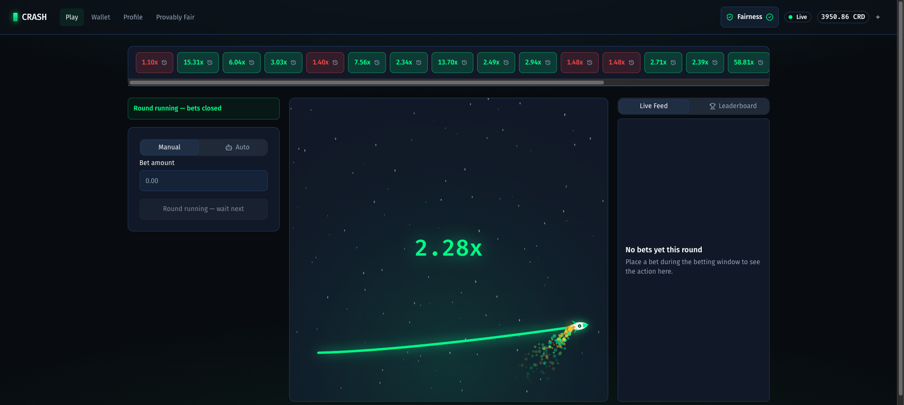
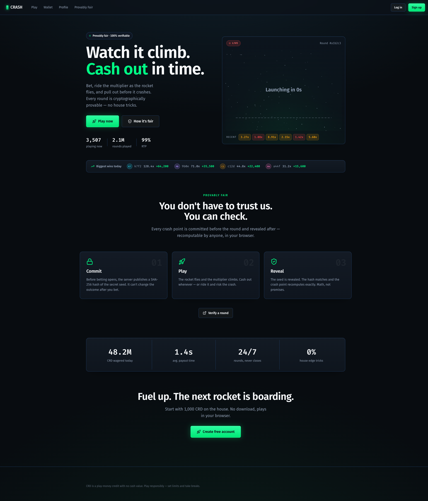
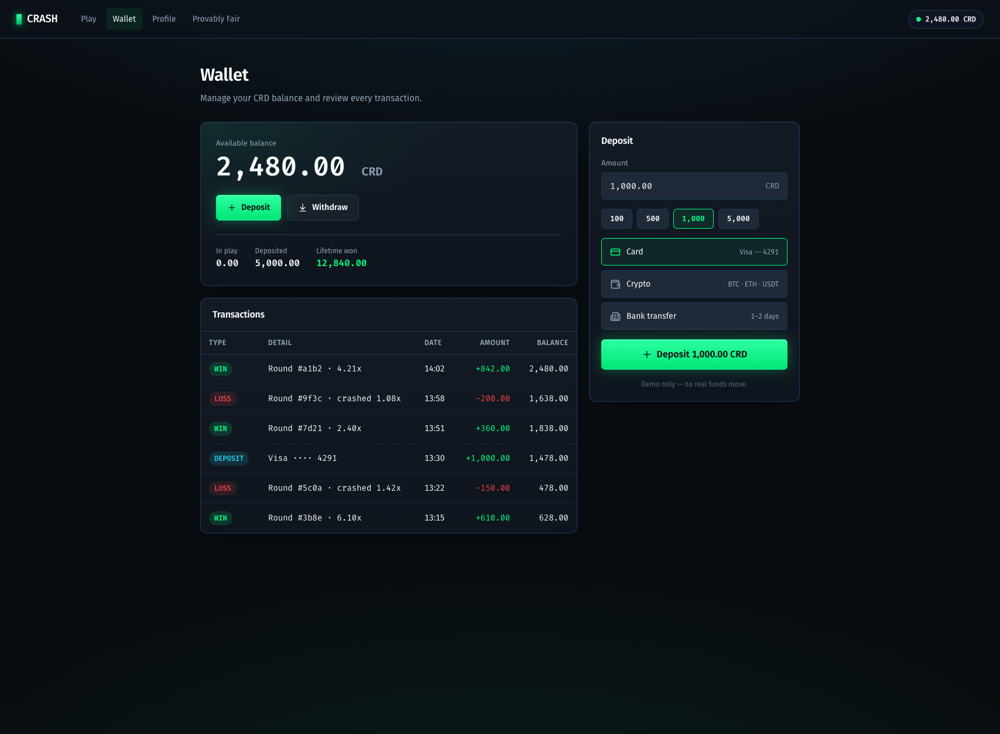
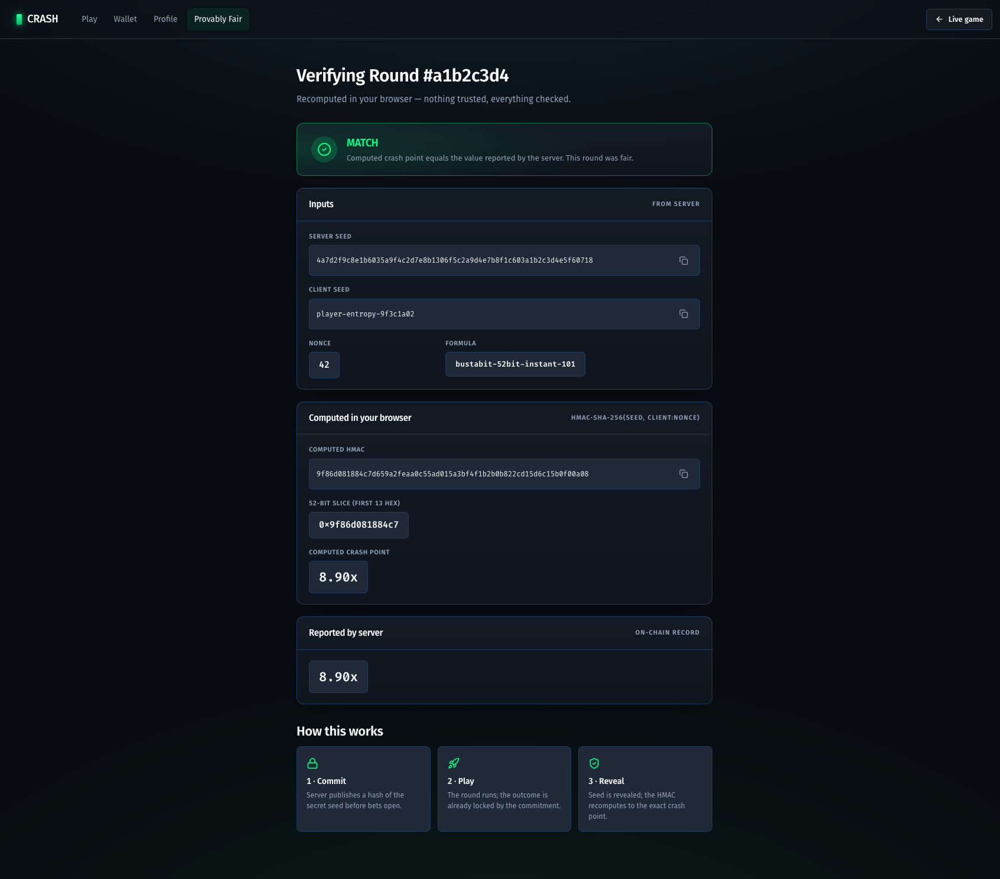
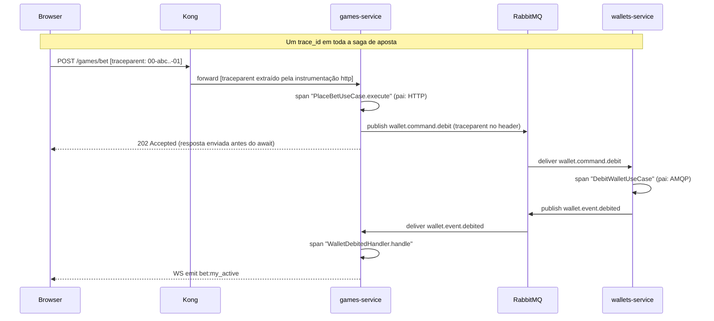

<div align="center">

# 🚀 Crash

**Jogo de crash multiplayer em tempo real — provably fair, server-authoritative e totalmente observável.**

[](https://github.com/pedropaulobrasca/fullstack-challenge/actions/workflows/ci.yml)
&nbsp;·&nbsp; Bun · NestJS 11 · TanStack Start · PostgreSQL 18 · RabbitMQ · Keycloak · Socket.IO

<br/>



</div>

<br/>

Um foguete sobe, o multiplicador cresce, e você saca antes de explodir. Faça uma aposta, veja a curva em Canvas 60fps renderizar o multiplicador ao vivo, e retire (ou perca) em tempo real. Toda rodada é **provably fair** — você consegue re-derivar o ponto de crash em qualquer shell com `openssl`, sem precisar confiar no servidor. Dinheiro nunca usa `number`: todo valor é um value object `Money` (cents em bigint, Dinero v2). O multiplicador é server-authoritative; o cliente interpola localmente e reconcilia com os ticks do servidor a 30 Hz.

---

## ⚡ Início rápido

```bash
git clone https://github.com/pedropaulobrasca/fullstack-challenge.git
cd fullstack-challenge
bun install
cp frontend/.env.example frontend/.env
bun run docker:up          # stack completa + healthchecks (~2 min no primeiro pull)
cd frontend && bun run dev  # serve em :3000 — obrigatório para o OIDC
```

Abra **[localhost:3000](http://localhost:3000)** → entre como **`player` / `player123`** → a carteira provisiona automático com **1000 CRD**.

> ⚠️ **A porta 3000 é obrigatória.** O Keycloak só libera `localhost:3000` para o redirect do OIDC. Se o Vite cair em outra porta você verá *"Authentication is currently unavailable"* — libere a porta 3000 (`lsof -ti:3000 | xargs kill`) e rode de novo.

| Superfície | URL |
|---|---|
| 🎮 Jogo | [localhost:3000](http://localhost:3000) |
| 🔭 Jaeger (traces) | [localhost:16686](http://localhost:16686) |
| 📊 Grafana (dashboards) | [localhost:3001](http://localhost:3001) |
| 📈 Prometheus | [localhost:9090](http://localhost:9090) |
| 🔐 Keycloak | [localhost:8080](http://localhost:8080) |

---

## ✨ Destaques

|  |  |
|---|---|
| 🚀 **Curva estilo Aviator** | Foguete em Canvas 2D a 60fps com rastro de propulsão + campo de estrelas. O cliente calcula o multiplicador localmente e reconcilia com os ticks do servidor via EWMA — sem saltos. |
| 🔒 **Provably fair** | Cadeia de hash HMAC-SHA-256 estilo Bustabit, comprometida antes de cada rodada. Re-verifique qualquer rodada no seu próprio shell ou no browser via `crypto.subtle`. |
| ⚙️ **Auto-bet + leaderboard** | Auto-cashout forçado pelo servidor (sobrevive a desconexão), estratégias Martingale/Fixed com stop-loss/win, leaderboard 24h ao vivo via light CQRS. |
| 🧱 **DDD + saga** | Dois serviços NestJS, outbox/inbox transacional feito à mão, filas quorum + DLX no RabbitMQ, saga de aposta orquestrada cruzando HTTP/AMQP/WS. |
| 🔭 **Observabilidade completa** | Traces OpenTelemetry de HTTP→AMQP→WS, métricas de domínio no Prometheus, Grafana pré-provisionado, logs estruturados pino — tudo já no primeiro `docker:up`. |
| ✅ **CI comprova** | O GitHub Actions sobe toda a stack `docker:up` num clone limpo e roda testes unit + integração + Playwright E2E de ponta a ponta. |

<table>
<tr>
<td width="50%"><div align="center"><sub><b>Landing</b></sub></div></td>
<td width="50%"><div align="center"><sub><b>Carteira</b></sub></div></td>
</tr>
<tr>
<td width="50%"><div align="center"><sub><b>Provably Fair</b></sub></div></td>
<td width="50%"><div align="center"><sub><b>Jogo ao vivo</b></sub></div></td>
</tr>
</table>

---

## 🏗️ Arquitetura


Dois serviços de backend compartilham uma instância Postgres e um broker RabbitMQ. O Kong é o único ingress para HTTP + WebSocket. O Keycloak guarda o realm OIDC; ambos os serviços validam JWT contra o JWKS em cache. A saga de aposta é orquestrada pelo `games-service` — `POST /games/bet` retorna `202 Accepted` no instante em que a linha do outbox commita, e o jogador descobre o estado final via WebSocket. Um único `trace_id` amarra a saga inteira no Jaeger.

<details>
<summary><b>Diagrama de sequência da saga</b></summary>


</details>

---

## 🔒 Provably Fair — verifique de qualquer shell

Toda rodada liquidada pode ser re-derivada de forma independente com `openssl` + `python3` — sem app, sem confiar no servidor. Este exemplo usa a fixture canônica (`serverSeed = 0x0…01`, `clientSeed = "test"`, `nonce = 0`) pra você confirmar que a toolchain produz **`2.94`** em qualquer máquina:

```bash
SERVER_SEED="0000000000000000000000000000000000000000000000000000000000000001"
CLIENT_SEED="test"; NONCE="0"

# Passo A — commitment do seedHash (o servidor hex-DECODIFICA a seed antes de hashear)
echo -n "$SERVER_SEED" | xxd -r -p | openssl dgst -sha256
# → ec4916dd28fc4c10d78e287ca5d9cc51ee1ae73cbfde08c6b37324cbfaac8bc5

# Passo B — ponto de crash (chave do HMAC = a string hex como bytes UTF-8, NÃO decodificada)
HMAC=$(echo -n "$CLIENT_SEED:$NONCE" | openssl dgst -sha256 -hmac "$SERVER_SEED" -hex | awk '{print $NF}')
python3 -c "H=int('${HMAC:0:13}',16); E=2**52; print('crashPoint =', 1.00 if H%101==0 else max(1.0,((100*E-H)//(E-H))/100))"
# → crashPoint = 2.94
```

O mesmo `2.94` está travado em código pela suíte de testes do contracts e pelo E2E de determinismo. Para verificar uma rodada **ao vivo**, faça `curl $BASE/games/rounds/$ID/verify` e alimente `serverSeed`/`clientSeed`/`nonce` nos mesmos dois passos. O **drawer de Fairness** + a rota `/verify/:roundId` no app rodam esse mesmo algoritmo no browser via `crypto.subtle`.

<details>
<summary><b>A pegadinha nº1: duas codificações da mesma string hex</b></summary>

A `serverSeed` de 64 chars é entregue ao SHA-256 de **duas formas diferentes**:
- **Commitment (Passo A)** — `createHash("sha256").update(seed, "hex")` → hex-**decodifica** para 32 bytes primeiro (`xxd -r -p`).
- **HMAC do crash (Passo B)** — `createHmac("sha256", seed)` → a chave string é consumida como seus **bytes UTF-8** (os 64 chars). **Não** hex-decodifique; **não** use `-macopt hexkey:` (isso dá `3.02` no lugar de `2.94` nesta fixture).

Inverter essas duas codificações é a causa nº1 de `matches: false` numa implementação correta. Busybox sem `xxd`? Troque o Passo A por `python3 -c "import sys,binascii; sys.stdout.buffer.write(binascii.unhexlify(sys.stdin.read().strip()))"`.
</details>

---

## 🔭 Observabilidade

`bun run docker:up` sobe o tripé completo — sem setup extra:

- **Jaeger** ([:16686](http://localhost:16686)) — busque `games-service`; uma aposta mostra um trace cruzando o controller HTTP → round-trip AMQP `wallet.command.debit` → `WalletDebitedHandler` → emit WS `bet:my_active`.
- **Prometheus** ([:9090](http://localhost:9090)) — métricas de domínio customizadas: `bet_volume_total{status}`, `crash_rtp_window`, `multiplier_drift_seconds`, `ws_broadcast_latency_seconds`, `active_ws_connections`.
- **Grafana** ([:3001](http://localhost:3001), Viewer anônimo) — 3 dashboards pré-provisionados (games, wallets, crash-domain).
- **Logs** — JSON estruturado via `pino` enriquecido com `traceId` + `spanId` + `correlationId`; um grep num `correlationId` segue uma aposta pelos dois serviços.

---

<details>
<summary><b>📜 Scripts</b></summary>

| Script | Propósito |
|--------|---------|
| `bun run docker:up` | Sobe a stack completa e bloqueia até todo healthcheck passar. |
| `bun run docker:down` | Para a stack, mantém os volumes. |
| `bun run docker:prune` | Reset total — remove containers, volumes e imagens locais. |
| `bun run smoke:health` | 47 probes de liveness de infra (`scripts/smoke-health.sh`). |
| `bun run lint` / `bun run typecheck` / `bun test` | Lint / typecheck / testes unit do workspace. |
| `bun run docs:adr-index` | Regenera a tabela de ADRs abaixo. |

Por serviço (`services/games` ou `services/wallets`): `bun run start:dev`, `bun test tests/unit`, `INTEGRATION=1 bun test tests/integration`.
</details>

<details>
<summary><b>⚙️ Variáveis de ambiente</b></summary>

Toda constante de negócio vive em env — nada hardcoded. Defaults no `.env.example` de cada serviço; tabela completa em `.planning/REQUIREMENTS.md` § "Open Configuration Values". Adições de observabilidade da Phase 10:

| Variável | Default | Descrição |
|----------|---------|-------------|
| `OTEL_EXPORTER_OTLP_ENDPOINT` | `http://jaeger:4318/v1/traces` | Endpoint OTLP HTTP de export de traces (ADR-035). |
| `OTEL_SERVICE_NAME` | `games-service` / `wallets-service` | Nome do recurso no Jaeger. |
| `LOG_LEVEL` | `info` | Nível do pino. |
| `PINO_PRETTY` | `0` | `1` habilita o transport pretty em dev. |
| `CRASH_RTP_WINDOW_ROUNDS` | `1000` | Janela móvel do gauge `crash_rtp_window`. |
</details>

<details>
<summary><b>🛟 Troubleshooting</b></summary>

- **`Authentication is currently unavailable`** — o Vite não conseguiu a porta `:3000`; o Keycloak só libera essa porta. `lsof -ti:3000 | xargs kill -9 && cd frontend && bun run dev`, depois limpe o storage de `localhost` no browser e recarregue.
- **`bun run dev` sai com `VITE_KEYCLOAK_ISSUER is required`** — você pulou o `cp frontend/.env.example frontend/.env`.
- **`docker:up` trava/falha na primeira vez** — `docker compose pull` antes (~10GB no frio); `bun run docker:prune` se o disco estiver apertado.
- **Jaeger sem spans** — confirme que `import "./tracing"` é a primeira linha literal do `main.ts` de cada serviço (ordem de init do OTel, ADR-035): `head -1 services/games/src/main.ts`.
- **Painéis do Grafana vazios** — [localhost:9090/targets](http://localhost:9090/targets) deve mostrar os dois serviços UP; senão `curl -s http://localhost:4001/metrics | head`.
- **Saldo travado em `0.00`** — a carteira provisiona no primeiro `POST /wallets` autenticado (o FE dispara após o login). Manual: pegue um token via password-grant e `curl -X POST -H "Authorization: Bearer $TOKEN" http://localhost:8000/wallets`.
</details>

<details>
<summary><b>🗂️ Estrutura do projeto</b></summary>

```
fullstack-challenge/
├── docker-compose.yml        # Postgres, RabbitMQ, Keycloak, Kong, games, wallets, Jaeger, Prometheus, Grafana
├── packages/
│   ├── shared-kernel/        # Money VO, erros, envelope de evento, IDs brandeados, schema de env
│   ├── contracts/            # Schemas de wire + subpath provably-fair browser-safe
│   ├── messaging-spine/      # Outbox/inbox à mão + @IdempotentSubscribe + topologia DLX
│   └── eslint-plugin/        # Regra custom @crash/no-number-for-money
├── services/
│   ├── games/                # Round loop, apostas, provably-fair, gateway WS, projetor de leaderboard
│   └── wallets/              # Agregados de carteira + transação, consumidores AMQP de débito/crédito
├── frontend/                 # TanStack Start — jogo, painel de aposta, drawer de fairness, replay, leaderboard, páginas do site
├── scripts/                  # smoke-health.sh (47 probes) + build-adr-index.ts
├── .github/workflows/ci.yml  # CI full-stack (ADR-037)
└── .planning/                # PROJECT / REQUIREMENTS / ROADMAP + 37 ADRs + planos por fase
```
</details>

---

## 📐 Architecture Decision Records

37 decisões, um arquivo cada em `.planning/adrs/`. Tabela auto-gerada pelo `scripts/build-adr-index.ts` e validada no CI via `bun run docs:adr-index:check` (ADR-036).

<details>
<summary><b>Ver os 37 ADRs</b></summary>

<!-- ADR-INDEX:START -->
| # | Title | Phase | Date | Status |
| --- | --- | --- | --- | --- |
| ADR-001 | [ORM selection — MikroORM 7](.planning/adrs/ADR-001-orm-mikroorm.md) | 1 | 2026-05-24 | Accepted |
| ADR-002 | [Money representation — Dinero.js v2 wrapped in local VO](.planning/adrs/ADR-002-money-dinero-vo.md) | 1 | 2026-05-24 | Accepted |
| ADR-003 | [Bun + NestJS pinning strategy](.planning/adrs/ADR-003-bun-pinning.md) | 1 | 2026-05-24 | Accepted |
| ADR-004 | [Configuration source-of-truth shape](.planning/adrs/ADR-004-config-source-of-truth.md) | 1 | 2026-05-24 | Accepted |
| ADR-005 | [Wallet seed strategy — first-login provisioning](.planning/adrs/ADR-005-wallet-seed-strategy.md) | 1 | 2026-05-24 | Accepted |
| ADR-006 | [ESLint money-guard plugin location and authoring approach](.planning/adrs/ADR-006-eslint-plugin-location.md) | 1 | 2026-05-24 | Accepted |
| ADR-007 | [Hand-rolled `@crash/messaging-spine` over `nestjs-outbox` / `pg-transactional-outbox`](.planning/adrs/ADR-007-hand-rolled-outbox-inbox-package.md) | 2 | 2026-05-24 | Accepted |
| ADR-008 | [`amqplib` raw publisher + `@golevelup/nestjs-rabbitmq` consumer split](.planning/adrs/ADR-008-amqplib-publisher-golevelup-consumer-split.md) | 2 | 2026-05-24 | Accepted |
| ADR-009 | [DLX topology with `x-delivery-limit` on the DLQ itself (quorum queues, RabbitMQ 4.2)](.planning/adrs/ADR-009-dlx-with-delivery-limit-on-dlq.md) | 2 | 2026-05-24 | Accepted |
| ADR-010 | [Dedicated `pg.Client` for LISTEN/NOTIFY, separate from MikroORM pool](.planning/adrs/ADR-010-listen-notify-dedicated-pg-client.md) | 2 | 2026-05-24 | Accepted |
| ADR-011 | [Ledger model — Wallet snapshot + immutable Transaction aggregate over event sourcing](.planning/adrs/ADR-011-ledger-model-wallet-snapshot.md) | 3 | 2026-05-25 | Accepted |
| ADR-012 | [JWT validation via `jose` + cached JWKS at each service over passport-jwt + Kong JWT plugin](.planning/adrs/ADR-012-jwt-validation-via-cached-jwks.md) | 3 | 2026-05-25 | Accepted |
| ADR-013 | [`@IdempotentSubscribe` propagates `txEm` to the handler signature](.planning/adrs/ADR-013-idempotent-subscribe-propagates-tx-em.md) | 3 | 2026-05-25 | Accepted |
| ADR-014 | [Bet is its own aggregate — not nested inside Round](.planning/adrs/ADR-014-bet-as-own-aggregate.md) | 4 | 2026-05-25 | Accepted |
| ADR-015 | [Crash-point formula (Bustabit canon) and per-round client-seed derivation](.planning/adrs/ADR-015-crash-point-formula-and-client-seed-derivation.md) | 4 | 2026-05-25 | Accepted |
| ADR-016 | [Hash chain pre-generation at bootstrap (1M rounds) over lazy generation](.planning/adrs/ADR-016-hash-chain-pre-generation-depth.md) | 4 | 2026-05-25 | Accepted |
| ADR-017 | [Round loop — recursive `setTimeout` + `OnApplicationBootstrap` over `setInterval` / worker thread](.planning/adrs/ADR-017-round-loop-recursive-settimeout-and-on-application-bootstrap.md) | 4 | 2026-05-25 | Accepted |
| ADR-018 | [`Money.multiplyRounded` shared-kernel extension for banker's rounding cashout](.planning/adrs/ADR-018-money-multiply-rounded-bankers-extension.md) | 4 | 2026-05-25 | Accepted |
| ADR-019 | [Orchestration over choreography — Game service owns the bet saga FSM](.planning/adrs/ADR-019-orchestration-over-choreography.md) | 5 | 2026-05-27 | Accepted |
| ADR-020 | [Bet placement asymmetry — `202 Accepted` for bet, synchronous `200 OK` for cashout](.planning/adrs/ADR-020-bet-202-cashout-200-asymmetry.md) | 5 | 2026-05-27 | Accepted |
| ADR-021 | [Single global `lobby` room over per-round rooms](.planning/adrs/ADR-021-single-global-lobby-room.md) | 6 | 2026-05-28 | Accepted |
| ADR-022 | [30 Hz server tick + 60 fps client interpolation](.planning/adrs/ADR-022-30hz-server-tick-60fps-client-interpolation.md) | 6 | 2026-05-28 | Accepted |
| ADR-023 | [Server-authoritative `cashoutAcceptedAt` at the HTTP controller's first executable line](.planning/adrs/ADR-023-server-authoritative-cashout-accepted-at.md) | 6 | 2026-05-28 | Accepted |
| ADR-024 | [TanStack Start + `oidc-spa` for OIDC Authorization Code + PKCE (S256)](.planning/adrs/ADR-024-tanstack-start-oidc-spa-pkce.md) | 7 | 2026-05-29 | Accepted |
| ADR-025 | [Canvas 2D (rAF + `devicePixelRatio` + `clearRect`) for the crash curve over SVG / WebGL](.planning/adrs/ADR-025-canvas-2d-crash-curve.md) | 7 | 2026-05-29 | Accepted |
| ADR-026 | [Zustand slice-per-concern with the rAF multiplier loop isolated to its own store](.planning/adrs/ADR-026-zustand-isolated-multiplier-store.md) | 7 | 2026-05-29 | Accepted |
| ADR-027 | [Multi-tab token refresh via `oidc-spa`'s built-in `BroadcastChannel` over hand-rolled cross-tab coordination](.planning/adrs/ADR-027-oidc-spa-broadcastchannel-multi-tab-refresh.md) | 7 | 2026-05-29 | Accepted |
| ADR-028 | [Client-Seed Derivation — Deterministic from Previous Round Close (Reaffirmed)](.planning/adrs/ADR-028-client-seed-derivation-deterministic.md) | 8 | 2026-05-30 | Accepted |
| ADR-029 | [Replay Reuses Production Canvas Renderer via Driver Injection](.planning/adrs/ADR-029-replay-reuses-canvas-renderer.md) | 8 | 2026-05-30 | Accepted |
| ADR-030 | [Browser-Safe `@crash/contracts/provably-fair-browser` Subpath with `crypto.subtle` (HMAC + SHA-256)](.planning/adrs/ADR-030-browser-safe-contracts-subpath-crypto-subtle.md) | 8 | 2026-05-30 | Accepted |
| ADR-031 | [Replay Modal Over Live Game with 1x/2x/4x Speed Selector](.planning/adrs/ADR-031-replay-modal-speed-selector.md) | 8 | 2026-05-30 | Accepted |
| ADR-032 | [Light CQRS Leaderboard Read Model (Projector-Populated, No Event Sourcing)](.planning/adrs/ADR-032-light-cqrs-leaderboard-read-model.md) | 9 | 2026-05-30 | Accepted |
| ADR-033 | [Server-Enforced Auto-Cashout via In-Process ROUND_TICK + AutoCashoutTickService (Ratifies ADR-023)](.planning/adrs/ADR-033-server-enforced-auto-cashout.md) | 9 | 2026-05-30 | Accepted |
| ADR-034 | [Per-Session Auto-Bet Config — Zustand No-Persist + FE-Driven Stops + Server-Stateless](.planning/adrs/ADR-034-per-session-auto-bet-no-persist.md) | 9 | 2026-05-30 | Accepted |
| ADR-035 | [OpenTelemetry SDK + nestjs-otel + Jaeger All-in-One](.planning/adrs/ADR-035-otel-jaeger-stack.md) | 10 | 2026-05-31 | Accepted |
| ADR-036 | [ADR Catalogue Lives in README via Generator Script + CI Sync Gate](.planning/adrs/ADR-036-adr-catalogue-in-readme.md) | 10 | 2026-05-31 | Accepted |
| ADR-037 | [CI Runs Full `docker:up` Stack on Every Push and PR](.planning/adrs/ADR-037-ci-runs-full-stack.md) | 10 | 2026-05-31 | Accepted |
<!-- ADR-INDEX:END -->
</details>

---

<div align="center">
<sub>Construído em 10 fases GSD · usuário demo <code>player / player123</code> · todas as decisões defensáveis em <code>.planning/</code></sub>
</div>
