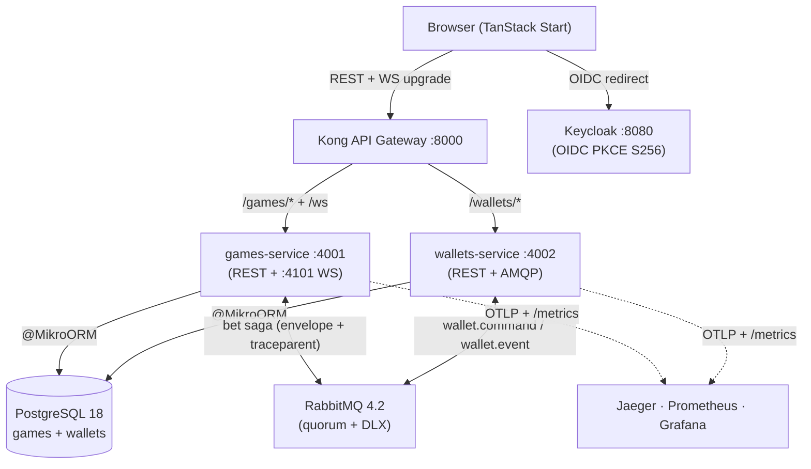
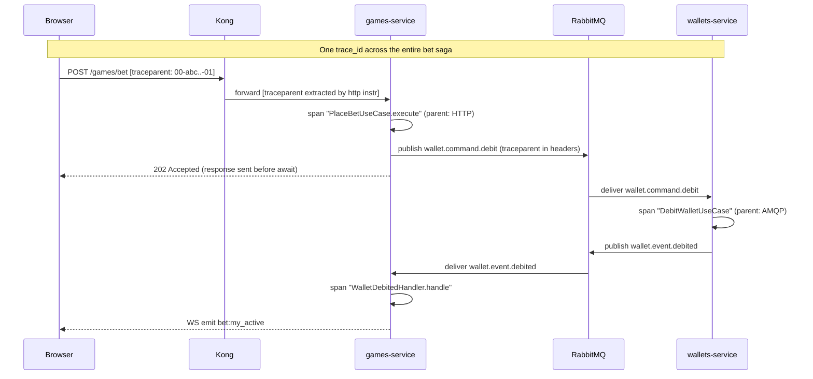

<div align="center">

# 🚀 Crash

**Multiplayer real-time crash game — provably fair, server-authoritative, fully observable.**

[](https://github.com/pedropaulobrasca/fullstack-challenge/actions/workflows/ci.yml)
&nbsp;·&nbsp; Bun · NestJS 11 · TanStack Start · PostgreSQL 18 · RabbitMQ · Keycloak · Socket.IO

<br/>


</div>

<br/>

A rocket climbs, the multiplier rises, and you cash out before it crashes. Place a bet, watch a 60fps Canvas curve render the live multiplier, and pull out (or lose) in real time. Every round is **provably fair** — you can re-derive the crash point from any shell with `openssl`, no server trust required. Money never touches `number`: every amount is a `Money` value object (bigint cents, Dinero v2). The multiplier is server-authoritative; clients interpolate locally and reconcile to 30 Hz server ticks.

---

## ⚡ Quick Start

```bash
git clone https://github.com/pedropaulobrasca/fullstack-challenge.git
cd fullstack-challenge
bun install
cp frontend/.env.example frontend/.env
bun run docker:up          # full stack + healthchecks (~2 min cold pull)
cd frontend && bun run dev  # serves on :3000 — required for OIDC
```

Open **[localhost:3000](http://localhost:3000)** → log in as **`player` / `player123`** → a wallet auto-provisions with **1000 CRD**.

> ⚠️ **Port 3000 is required.** Keycloak whitelists `localhost:3000` for OIDC redirects. If Vite falls back to another port you'll see *"Authentication is currently unavailable"* — free port 3000 (`lsof -ti:3000 | xargs kill`) and retry.

| Surface | URL |
|---|---|
| 🎮 Game | [localhost:3000](http://localhost:3000) |
| 🔭 Jaeger (traces) | [localhost:16686](http://localhost:16686) |
| 📊 Grafana (dashboards) | [localhost:3001](http://localhost:3001) |
| 📈 Prometheus | [localhost:9090](http://localhost:9090) |
| 🔐 Keycloak | [localhost:8080](http://localhost:8080) |

---

## ✨ Highlights

|  |  |
|---|---|
| 🚀 **Aviator-style live curve** | 60fps Canvas 2D rocket with exhaust trail + starfield. Client computes the multiplier locally and reconciles to server ticks via EWMA — never snaps. |
| 🔒 **Provably fair** | Bustabit-style HMAC-SHA-256 hash chain, committed before each round. Re-verify any round in your own shell or in-browser via `crypto.subtle`. |
| ⚙️ **Auto-bet + leaderboard** | Server-enforced auto-cashout (survives disconnect), Martingale/Fixed strategies with stop-loss/win, live 24h leaderboard via light CQRS. |
| 🧱 **DDD + saga** | Two NestJS services, hand-rolled transactional outbox/inbox, RabbitMQ quorum queues + DLX, orchestrated bet saga across HTTP/AMQP/WS. |
| 🔭 **Full observability** | OpenTelemetry traces across HTTP→AMQP→WS, Prometheus custom domain metrics, pre-provisioned Grafana, structured pino logs — all on first `docker:up`. |
| ✅ **CI proves it** | GitHub Actions boots the entire `docker:up` stack on a fresh clone and runs unit + integration + Playwright E2E end-to-end. |

<table>
<tr>
<td width="50%"><div align="center"><sub><b>Landing</b></sub></div></td>
<td width="50%"><div align="center"><sub><b>Wallet</b></sub></div></td>
</tr>
<tr>
<td width="50%"><div align="center"><sub><b>Provably Fair</b></sub></div></td>
<td width="50%"><div align="center"><sub><b>Live game</b></sub></div></td>
</tr>
</table>

---

## 🏗️ Architecture



Two backend services share a Postgres instance and a RabbitMQ broker. Kong is the single ingress for HTTP + WebSocket. Keycloak holds the OIDC realm; both services validate JWTs against cached JWKS. The bet saga is orchestrated by `games-service` — `POST /games/bet` returns `202 Accepted` the instant the outbox row commits, and the player learns the terminal state over WebSocket. A single `trace_id` ties the whole saga together in Jaeger.

<details>
<summary><b>Saga flow sequence diagram</b></summary>


</details>

---

## 🔒 Provably Fair — verify from any shell

Every settled round can be re-derived independently with `openssl` + `python3` — no app, no server trust. This worked example hardcodes the canonical fixture (`serverSeed = 0x0…01`, `clientSeed = "test"`, `nonce = 0`) so you can confirm the toolchain produces **`2.94`** on any machine:

```bash
SERVER_SEED="0000000000000000000000000000000000000000000000000000000000000001"
CLIENT_SEED="test"; NONCE="0"

# Step A — seedHash commitment (server hex-DECODES the seed before hashing)
echo -n "$SERVER_SEED" | xxd -r -p | openssl dgst -sha256
# → ec4916dd28fc4c10d78e287ca5d9cc51ee1ae73cbfde08c6b37324cbfaac8bc5

# Step B — crash point (HMAC key = the hex string as UTF-8 bytes, NOT decoded)
HMAC=$(echo -n "$CLIENT_SEED:$NONCE" | openssl dgst -sha256 -hmac "$SERVER_SEED" -hex | awk '{print $NF}')
python3 -c "H=int('${HMAC:0:13}',16); E=2**52; print('crashPoint =', 1.00 if H%101==0 else max(1.0,((100*E-H)//(E-H))/100))"
# → crashPoint = 2.94
```

The same `2.94` is locked in source by the contracts test suite and the determinism E2E. To verify a **live** round, `curl $BASE/games/rounds/$ID/verify` and feed `serverSeed`/`clientSeed`/`nonce` into the same two steps. The in-app **Fairness drawer** + `/verify/:roundId` route run this identical algorithm in-browser via `crypto.subtle`.

<details>
<summary><b>The #1 gotcha: two encodings of the same hex string</b></summary>

The 64-char `serverSeed` is fed to SHA-256 **two different ways**:
- **Commitment (Step A)** — `createHash("sha256").update(seed, "hex")` → hex-**decode** to 32 bytes first (`xxd -r -p`).
- **Crash HMAC (Step B)** — `createHmac("sha256", seed)` → the string key is consumed as its **UTF-8 bytes** (all 64 chars). Do **not** hex-decode it; do **not** use `-macopt hexkey:` (that yields `3.02` instead of `2.94` for this fixture).

Reversing these two encodings is the #1 cause of `matches: false` on an otherwise correct implementation. Busybox without `xxd`? Swap Step A for `python3 -c "import sys,binascii; sys.stdout.buffer.write(binascii.unhexlify(sys.stdin.read().strip()))"`.
</details>

---

## 🔭 Observability

`bun run docker:up` brings up the full triad — no extra setup:

- **Jaeger** ([:16686](http://localhost:16686)) — search `games-service`; a placed bet shows one trace spanning the HTTP controller → `wallet.command.debit` AMQP round-trip → `WalletDebitedHandler` → WS `bet:my_active` emit.
- **Prometheus** ([:9090](http://localhost:9090)) — custom domain metrics: `bet_volume_total{status}`, `crash_rtp_window`, `multiplier_drift_seconds`, `ws_broadcast_latency_seconds`, `active_ws_connections`.
- **Grafana** ([:3001](http://localhost:3001), anonymous Viewer) — 3 pre-provisioned dashboards (games, wallets, crash-domain).
- **Logs** — structured `pino` JSON enriched with `traceId` + `spanId` + `correlationId`; grep one `correlationId` to follow a bet across both services.

---

<details>
<summary><b>📜 Scripts</b></summary>

| Script | Purpose |
|--------|---------|
| `bun run docker:up` | Bring up the full stack and block until every healthcheck passes. |
| `bun run docker:down` | Stop the stack, keep volumes. |
| `bun run docker:prune` | Full reset — remove containers, volumes, local images. |
| `bun run smoke:health` | 47 infra-liveness probes (`scripts/smoke-health.sh`). |
| `bun run lint` / `bun run typecheck` / `bun test` | Workspace lint / typecheck / unit tests. |
| `bun run docs:adr-index` | Regenerate the ADR catalogue table below. |

Per service (`services/games` or `services/wallets`): `bun run start:dev`, `bun test tests/unit`, `INTEGRATION=1 bun test tests/integration`.
</details>

<details>
<summary><b>⚙️ Environment variables</b></summary>

Every business constant lives in env — nothing hardcoded. Defaults in each service's `.env.example`; full table in `.planning/REQUIREMENTS.md` § "Open Configuration Values". Phase 10 observability additions:

| Variable | Default | Description |
|----------|---------|-------------|
| `OTEL_EXPORTER_OTLP_ENDPOINT` | `http://jaeger:4318/v1/traces` | OTLP HTTP trace export (ADR-035). |
| `OTEL_SERVICE_NAME` | `games-service` / `wallets-service` | Resource name in Jaeger. |
| `LOG_LEVEL` | `info` | Pino level. |
| `PINO_PRETTY` | `0` | `1` enables pretty transport in dev. |
| `CRASH_RTP_WINDOW_ROUNDS` | `1000` | Rolling window for the `crash_rtp_window` gauge. |
</details>

<details>
<summary><b>🛟 Troubleshooting</b></summary>

- **`Authentication is currently unavailable`** — Vite didn't bind to `:3000`; Keycloak only whitelists that port. `lsof -ti:3000 | xargs kill -9 && cd frontend && bun run dev`, then clear `localhost` browser storage and reload.
- **`bun run dev` exits with `VITE_KEYCLOAK_ISSUER is required`** — you skipped `cp frontend/.env.example frontend/.env`.
- **`docker:up` hangs/fails first time** — `docker compose pull` first (~10GB cold); `bun run docker:prune` if disk is tight.
- **Jaeger shows no spans** — confirm `import "./tracing"` is the literal first line of each service's `main.ts` (OTel init-order, ADR-035): `head -1 services/games/src/main.ts`.
- **Grafana panels empty** — [localhost:9090/targets](http://localhost:9090/targets) should show both services UP; else `curl -s http://localhost:4001/metrics | head`.
- **Balance stuck at `0.00`** — the wallet auto-provisions on first authenticated `POST /wallets` (the FE issues it after login). Manual: password-grant a token then `curl -X POST -H "Authorization: Bearer $TOKEN" http://localhost:8000/wallets`.
</details>

<details>
<summary><b>🗂️ Project structure</b></summary>

```
fullstack-challenge/
├── docker-compose.yml        # Postgres, RabbitMQ, Keycloak, Kong, games, wallets, Jaeger, Prometheus, Grafana
├── packages/
│   ├── shared-kernel/        # Money VO, errors, event envelope, branded IDs, env schema
│   ├── contracts/            # Wire schemas + browser-safe provably-fair subpath
│   ├── messaging-spine/      # Hand-rolled outbox/inbox + @IdempotentSubscribe + DLX
│   └── eslint-plugin/        # Custom @crash/no-number-for-money rule
├── services/
│   ├── games/                # Round loop, bets, provably-fair, WS gateway, leaderboard projector
│   └── wallets/              # Wallet + transaction aggregates, AMQP debit/credit consumers
├── frontend/                 # TanStack Start — game, bet panel, fairness drawer, replay, leaderboard, site pages
├── scripts/                  # smoke-health.sh (47 probes) + build-adr-index.ts
├── .github/workflows/ci.yml  # Full-stack CI (ADR-037)
└── .planning/                # PROJECT / REQUIREMENTS / ROADMAP + 37 ADRs + per-phase plans
```
</details>

---

## 📐 Architecture Decision Records

37 decisions, one file each in `.planning/adrs/`. Table auto-generated by `scripts/build-adr-index.ts` and CI-gated via `bun run docs:adr-index:check` (ADR-036).

<details>
<summary><b>Show all 37 ADRs</b></summary>

<!-- ADR-INDEX:START -->
| # | Title | Phase | Date | Status |
| --- | --- | --- | --- | --- |
| ADR-001 | [ORM selection — MikroORM 7](.planning/adrs/ADR-001-orm-mikroorm.md) | 1 | 2026-05-24 | Accepted |
| ADR-002 | [Money representation — Dinero.js v2 wrapped in local VO](.planning/adrs/ADR-002-money-dinero-vo.md) | 1 | 2026-05-24 | Accepted |
| ADR-003 | [Bun + NestJS pinning strategy](.planning/adrs/ADR-003-bun-pinning.md) | 1 | 2026-05-24 | Accepted |
| ADR-004 | [Configuration source-of-truth shape](.planning/adrs/ADR-004-config-source-of-truth.md) | 1 | 2026-05-24 | Accepted |
| ADR-005 | [Wallet seed strategy — first-login provisioning](.planning/adrs/ADR-005-wallet-seed-strategy.md) | 1 | 2026-05-24 | Accepted |
| ADR-006 | [ESLint money-guard plugin location and authoring approach](.planning/adrs/ADR-006-eslint-plugin-location.md) | 1 | 2026-05-24 | Accepted |
| ADR-007 | [Hand-rolled `@crash/messaging-spine` over `nestjs-outbox` / `pg-transactional-outbox`](.planning/adrs/ADR-007-hand-rolled-outbox-inbox-package.md) | 2 | 2026-05-24 | Accepted |
| ADR-008 | [`amqplib` raw publisher + `@golevelup/nestjs-rabbitmq` consumer split](.planning/adrs/ADR-008-amqplib-publisher-golevelup-consumer-split.md) | 2 | 2026-05-24 | Accepted |
| ADR-009 | [DLX topology with `x-delivery-limit` on the DLQ itself (quorum queues, RabbitMQ 4.2)](.planning/adrs/ADR-009-dlx-with-delivery-limit-on-dlq.md) | 2 | 2026-05-24 | Accepted |
| ADR-010 | [Dedicated `pg.Client` for LISTEN/NOTIFY, separate from MikroORM pool](.planning/adrs/ADR-010-listen-notify-dedicated-pg-client.md) | 2 | 2026-05-24 | Accepted |
| ADR-011 | [Ledger model — Wallet snapshot + immutable Transaction aggregate over event sourcing](.planning/adrs/ADR-011-ledger-model-wallet-snapshot.md) | 3 | 2026-05-25 | Accepted |
| ADR-012 | [JWT validation via `jose` + cached JWKS at each service over passport-jwt + Kong JWT plugin](.planning/adrs/ADR-012-jwt-validation-via-cached-jwks.md) | 3 | 2026-05-25 | Accepted |
| ADR-013 | [`@IdempotentSubscribe` propagates `txEm` to the handler signature](.planning/adrs/ADR-013-idempotent-subscribe-propagates-tx-em.md) | 3 | 2026-05-25 | Accepted |
| ADR-014 | [Bet is its own aggregate — not nested inside Round](.planning/adrs/ADR-014-bet-as-own-aggregate.md) | 4 | 2026-05-25 | Accepted |
| ADR-015 | [Crash-point formula (Bustabit canon) and per-round client-seed derivation](.planning/adrs/ADR-015-crash-point-formula-and-client-seed-derivation.md) | 4 | 2026-05-25 | Accepted |
| ADR-016 | [Hash chain pre-generation at bootstrap (1M rounds) over lazy generation](.planning/adrs/ADR-016-hash-chain-pre-generation-depth.md) | 4 | 2026-05-25 | Accepted |
| ADR-017 | [Round loop — recursive `setTimeout` + `OnApplicationBootstrap` over `setInterval` / worker thread](.planning/adrs/ADR-017-round-loop-recursive-settimeout-and-on-application-bootstrap.md) | 4 | 2026-05-25 | Accepted |
| ADR-018 | [`Money.multiplyRounded` shared-kernel extension for banker's rounding cashout](.planning/adrs/ADR-018-money-multiply-rounded-bankers-extension.md) | 4 | 2026-05-25 | Accepted |
| ADR-019 | [Orchestration over choreography — Game service owns the bet saga FSM](.planning/adrs/ADR-019-orchestration-over-choreography.md) | 5 | 2026-05-27 | Accepted |
| ADR-020 | [Bet placement asymmetry — `202 Accepted` for bet, synchronous `200 OK` for cashout](.planning/adrs/ADR-020-bet-202-cashout-200-asymmetry.md) | 5 | 2026-05-27 | Accepted |
| ADR-021 | [Single global `lobby` room over per-round rooms](.planning/adrs/ADR-021-single-global-lobby-room.md) | 6 | 2026-05-28 | Accepted |
| ADR-022 | [30 Hz server tick + 60 fps client interpolation](.planning/adrs/ADR-022-30hz-server-tick-60fps-client-interpolation.md) | 6 | 2026-05-28 | Accepted |
| ADR-023 | [Server-authoritative `cashoutAcceptedAt` at the HTTP controller's first executable line](.planning/adrs/ADR-023-server-authoritative-cashout-accepted-at.md) | 6 | 2026-05-28 | Accepted |
| ADR-024 | [TanStack Start + `oidc-spa` for OIDC Authorization Code + PKCE (S256)](.planning/adrs/ADR-024-tanstack-start-oidc-spa-pkce.md) | 7 | 2026-05-29 | Accepted |
| ADR-025 | [Canvas 2D (rAF + `devicePixelRatio` + `clearRect`) for the crash curve over SVG / WebGL](.planning/adrs/ADR-025-canvas-2d-crash-curve.md) | 7 | 2026-05-29 | Accepted |
| ADR-026 | [Zustand slice-per-concern with the rAF multiplier loop isolated to its own store](.planning/adrs/ADR-026-zustand-isolated-multiplier-store.md) | 7 | 2026-05-29 | Accepted |
| ADR-027 | [Multi-tab token refresh via `oidc-spa`'s built-in `BroadcastChannel` over hand-rolled cross-tab coordination](.planning/adrs/ADR-027-oidc-spa-broadcastchannel-multi-tab-refresh.md) | 7 | 2026-05-29 | Accepted |
| ADR-028 | [Client-Seed Derivation — Deterministic from Previous Round Close (Reaffirmed)](.planning/adrs/ADR-028-client-seed-derivation-deterministic.md) | 8 | 2026-05-30 | Accepted |
| ADR-029 | [Replay Reuses Production Canvas Renderer via Driver Injection](.planning/adrs/ADR-029-replay-reuses-canvas-renderer.md) | 8 | 2026-05-30 | Accepted |
| ADR-030 | [Browser-Safe `@crash/contracts/provably-fair-browser` Subpath with `crypto.subtle` (HMAC + SHA-256)](.planning/adrs/ADR-030-browser-safe-contracts-subpath-crypto-subtle.md) | 8 | 2026-05-30 | Accepted |
| ADR-031 | [Replay Modal Over Live Game with 1x/2x/4x Speed Selector](.planning/adrs/ADR-031-replay-modal-speed-selector.md) | 8 | 2026-05-30 | Accepted |
| ADR-032 | [Light CQRS Leaderboard Read Model (Projector-Populated, No Event Sourcing)](.planning/adrs/ADR-032-light-cqrs-leaderboard-read-model.md) | 9 | 2026-05-30 | Accepted |
| ADR-033 | [Server-Enforced Auto-Cashout via In-Process ROUND_TICK + AutoCashoutTickService (Ratifies ADR-023)](.planning/adrs/ADR-033-server-enforced-auto-cashout.md) | 9 | 2026-05-30 | Accepted |
| ADR-034 | [Per-Session Auto-Bet Config — Zustand No-Persist + FE-Driven Stops + Server-Stateless](.planning/adrs/ADR-034-per-session-auto-bet-no-persist.md) | 9 | 2026-05-30 | Accepted |
| ADR-035 | [OpenTelemetry SDK + nestjs-otel + Jaeger All-in-One](.planning/adrs/ADR-035-otel-jaeger-stack.md) | 10 | 2026-05-31 | Accepted |
| ADR-036 | [ADR Catalogue Lives in README via Generator Script + CI Sync Gate](.planning/adrs/ADR-036-adr-catalogue-in-readme.md) | 10 | 2026-05-31 | Accepted |
| ADR-037 | [CI Runs Full `docker:up` Stack on Every Push and PR](.planning/adrs/ADR-037-ci-runs-full-stack.md) | 10 | 2026-05-31 | Accepted |
<!-- ADR-INDEX:END -->
</details>

---

<div align="center">
<sub>Built across 10 GSD phases · Demo user <code>player / player123</code> · all decisions defensible in <code>.planning/</code></sub>
</div>
